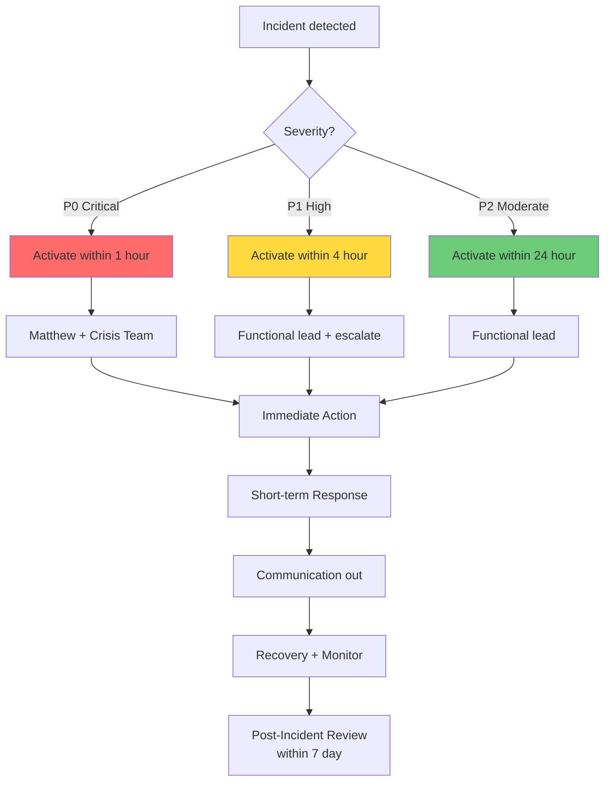
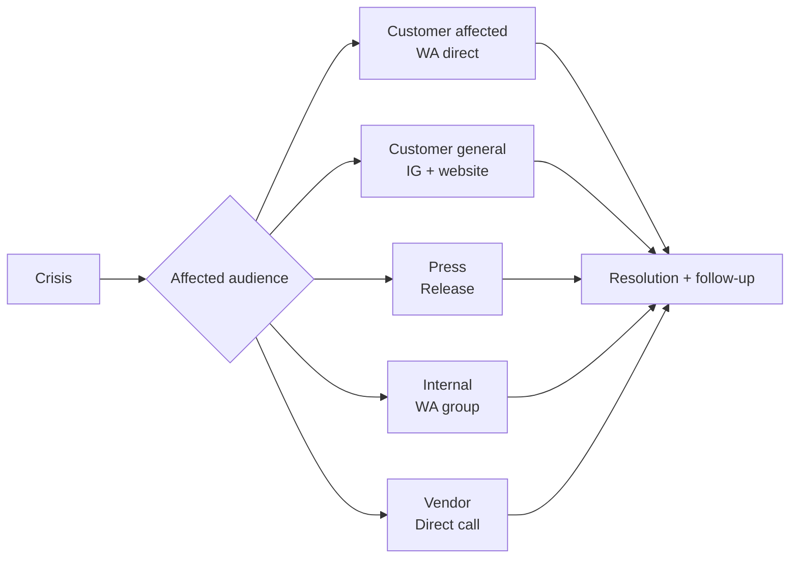

# Contingency Plan (Crisis Response Playbook)

Design crisis response playbook per scenario: trigger, immediate action, escalation path, recovery protocol, communication template. Cover operational, financial, brand crisis.

## Triggers

Primary:
- "contingency plan"
- "crisis playbook"
- "emergency response"

Secondary:
- "rencana darurat"
- "incident response"

## Input Required

| Field | Type | Required | Default |
|---|---|---|---|
| scenario | string | yes | (specific crisis or general playbook) |
| severity | enum | yes | (P0/P1/P2) |
| context | string | no | - |

## Output Template

```markdown
# Contingency Plan: {SCENARIO}

**Severity:** {P0 critical / P1 high / P2 moderate}
**Activation owner:** {Role}
**Response team:** {Roles}

## Severity Classification

### P0 Critical (immediate response <1 hour)
- Showroom kebakaran / banjir major
- Data breach customer leak
- Founder/Door Expert emergency unavailable
- Wave 1 launch postponed mandatory
- Legal injunction / shutdown order

### P1 High (response <4 hour)
- Critical vendor (AMK) delay impacting S7-S8
- Cash flow gap requiring immediate action
- Public customer complaint viral (Google review, social)
- Tim Pusat key role resign mendadak
- IT system down >2 hour

### P2 Moderate (response <24 hour)
- Minor inventory shortage
- Single customer dispute escalating
- Vendor pricing dispute
- Marketing campaign underperforming significantly
- Internal staff conflict

## Scenario Playbook 1: Showroom Fire/Flood (P0)

### Trigger
- Smoke alarm activated atau visible fire/flood
- Damage assessment >Rp 50jt impact

### Immediate Action (0-1 hour)
1. **Safety first:** evacuate customer + staff
2. **Call:**
   - Pemadam Kebakaran 113 / Police 110
   - Matthew direct (founder)
   - Insurance hotline
3. **Document:** photo / video damage (for insurance)
4. **Secure perimeter:** prevent further damage

### Short-term Response (1-24 hour)
- Insurance claim filed within 24 jam
- Inventory salvage assessment
- Temporary alternative location (kalau showroom unusable)
- Communication ke customer pending (delay protocol)
- Vendor expedited restock initiated

### Recovery (Day 1-30)
- Construction repair plan
- Insurance payout timeline
- Temporary showroom (pop-up atau partner space)
- Operations continuity remote (Door Expert Zoom only)
- Customer communication transparent

### Communication Template

**Internal (immediate):**
```
Tim Gerai,

Showroom Balikpapan mengalami {kebakaran/banjir} hari ini pukul {WIB}.
Customer + staff selamat semua. Asesmen damage berlangsung.

Operations: Switch ke remote consultation only via Zoom.
Lokasi temporary: TBD update besok.

Komunikasi customer: pause sampai konfirmasi.

Matthew
```

**External customer (Day 1):**
```
Tempat Gerai 1000 Pintu sementara tidak dapat dikunjungi karena {peristiwa}.

Door Expert tetap melayani konsultasi via Zoom seperti biasa.
Update progress kami sampaikan via WhatsApp / email.

Terima kasih atas pengertian Anda.

Salam hangat,
Gerai 1000 Pintu
```

## Scenario Playbook 2: Door Expert Emergency Unavailable (P0)

### Trigger
- Door Expert sakit / accident mendadak
- Resign tanpa notice
- Unable to perform konsultasi >3 hari

### Immediate Action (0-1 hour)
1. Cancel / reschedule konsultasi hari itu (WA customer langsung)
2. MA Senior activate backup mode (basic consultation)
3. Matthew assess situation
4. Freelance Door Expert contact (pool 2-person standby)

### Short-term Response (1-7 hari)
- Reschedule konsultasi minggu ini
- Freelance Door Expert onboard cepat (1 week ramp dengan knowledge base)
- Matthew direct handle critical project
- Customer communication transparent

### Recovery (Day 7-30)
- Permanent replacement recruitment (kalau resign)
- Knowledge handoff complete
- Performance review post-recovery
- Process improvement (apa yang bisa prevent recurrence)

### Communication Template

**To customer pending konsultasi:**
```
Customer {nama},

Mohon maaf, sesi konsultasi {tanggal} terpaksa kami reschedule
karena Door Expert berhalangan. 

Slot alternatif:
- {Tanggal + waktu}
- {Tanggal + waktu}

Saya tim MA akan dampingi sementara kalau urgent.

Salam hangat,
{MA name}
Gerai 1000 Pintu
```

## Scenario Playbook 3: AMK Critical Sprint Delay (P1)

### Trigger
- AMK confirm delay >2 minggu sprint S6-S8
- Quantity tidak mencukupi Wave 1 launch

### Immediate Action (0-4 hour)
1. Vendor sync emergency call AMK
2. Assess actual impact (which SKU, how much short)
3. Activate backup vendor short-list (3 alternative)
4. Sprint plan adjust

### Short-term Response (1-7 hari)
- PO partial backup vendor (gap fill)
- Customer pipeline adjust (manage expectation kalau spesifik AMK)
- Marketing pivot kalau AMK hero product
- Sprint S7-S8 reschedule

### Recovery (Day 7-30)
- Vendor performance review (AMK + backup)
- Contract clause review (penalty / SLA strengthen)
- Buffer increase next cycle (3 month → 4 month)
- Diversification ratio increase

### Communication Template

**To Matthew + Pusat:**
```
[URGENT] AMK delay confirmation:
- SKU affected: {list}
- Quantity short: {N}
- Original ETA: {date}
- New ETA: {date}
- Wave 1 impact: {assessment}

Action initiated:
1. Backup vendor PO {vendor} for {quantity}
2. Sprint S7-S8 timeline adjust
3. Marketing pivot {detail}

Decision needed by Matthew: {specific question}
```

## Scenario Playbook 4: Customer Review Viral Negative (P1)

### Trigger
- Google review 1-2 star + screenshot viral
- Social media post complaint with engagement
- Comment thread spreading

### Immediate Action (0-4 hour)
1. Internal alert (CCO + CMO + CEO)
2. Review situation: legitimate or troll
3. Customer direct contact (apologize + understand)
4. Public response prep (draft CCO + CMO approve)

### Short-term Response (4-24 hour)
- Public response posted (premium hangat tone, no defensive)
- Customer resolution (refund / replace / extra service)
- Document case for learning
- Monitoring escalation

### Recovery (Day 1-30)
- Post-resolution follow-up
- Brand sentiment monitoring
- Process improvement (what triggered)
- Internal training kalau staff issue
- Customer testimonial conversion (kalau resolved well)

### Public Response Template

```
{Customer name},

Terima kasih atas masukan Anda. Pengalaman yang Anda sampaikan
{tidak sesuai dengan / berbeda dari} standar yang ingin kami tawarkan.

Tim kami akan segera menghubungi Anda secara personal untuk
memahami detail dan mencari resolusi yang tepat.

Salam hangat,
Gerai 1000 Pintu
```

(NO em-dash, NO defensive, NO blame customer)

## Scenario Playbook 5: Cash Flow Gap Critical (P1)

### Trigger
- Cash balance <1 month operating cost
- Major receivable delayed >60 days
- Unexpected expense >Rp 50jt

### Immediate Action (0-4 hour)
1. CFO + Matthew sync emergency
2. Receivable chase aggressive
3. Working capital line activation (bank standby)
4. Non-essential expense freeze

### Short-term Response (1-30 hari)
- Customer payment plan negotiate
- Vendor payment delay request (where possible)
- Marketing budget review (cut non-critical)
- Revenue acceleration push (sprint sale legit dengan canon)

### Recovery (1-90 hari)
- Cash reserve rebuild target
- Customer credit policy tighten (DP 50% strict)
- Working capital permanent vs one-time
- Lessons learn document

## Scenario Playbook 6: Data Breach (P0)

### Trigger
- Unauthorized access CRM detected
- Customer data exposure suspected/confirmed

### Immediate Action (0-1 hour)
1. **System isolation:** disconnect affected system
2. **Forensic preserve:** log + snapshot evidence
3. **Legal counsel** consult immediately
4. **Authorities notify** kalau required (UU PDP)
5. Matthew + CTO alert

### Short-term Response (1-72 hour)
- Affected customer notification (within 72 jam per UU PDP)
- Public statement (legal-approved)
- Security audit + patching
- Authority cooperation

### Recovery (1-90 hari)
- Customer remediation (credit monitoring kalau perlu)
- Security infrastructure overhaul
- Compliance audit + certification
- Insurance claim cyber

## Communication Protocol Architecture

### Decision Authority

| Severity | Spokesperson | Approval before public |
|---|---|---|
| P0 | Matthew direct | Legal + CCO |
| P1 | CCO atau CMO | Matthew + Legal |
| P2 | Functional lead | CCO |

### Channel Strategy

| Audience | Primary channel | Backup |
|---|---|---|
| Customer affected | WhatsApp direct | Email |
| Customer general | Instagram + website | Email blast |
| Press | Press release | Direct call |
| Internal | WhatsApp group | Email |
| Vendor partner | Direct call | Email |

## Crisis Team Roster

| Role | Name | Contact Primary | Backup |
|---|---|---|---|
| Crisis Lead | Matthew | {WA} | - |
| Operations | COO agent + MA Senior | {WA} | {WA} |
| Communication | CCO + CMO | {WA} | {WA} |
| Financial | CFO + Accountant | {WA} | {WA} |
| Legal | Legal counsel external | {phone} | - |
| IT/Tech | CTO + DevOps | {WA} | - |

## Recovery Metrics

### Per Crisis Scenario
- Time to detection: target <1 hour
- Time to response: target <4 hour (P1) / <1 hour (P0)
- Time to resolution: target per scenario
- Customer impact: minimize (count affected)
- Reputation impact: monitor sentiment 30 day post

### Post-Incident Review (within 7 day)
- What happened (timeline)
- What worked (strength)
- What failed (gap)
- Improvement actions (specific + owner)
- Updated playbook
```

## Visual Output

Crisis response decision tree:



Communication flow:



## Knowledge Dependency

- BP Chapter 16 (Crisis Management)
- risk-register skill (linked scenario)
- Brand Canon (communication tone)
- 5 Nilai (Pelayanan Nyaman + Aftersales applied di crisis)
- CCO + CMO + CFO + CEO skills

## Mode

Default: EXECUTION
Switch: NEED_CLARIFICATION jika scenario novel (tidak di playbook)

## Tools Required

- file-search
- artifacts (decision tree + flow diagram)
- web-search (kalau scenario industry reference)

## Validation Criteria

- Severity classification 3-tier (P0/P1/P2)
- Min 5 scenario playbook
- Each scenario: trigger + immediate action + short-term + recovery
- Communication template per audience
- Crisis team roster + contact
- Decision authority matrix
- Recovery metrics defined
- Post-incident review process
- Brand canon di komunikasi
- Aligned dengan risk-register

## Sample I/O

**Input:** "Contingency plan full untuk Wave 1 launch + steady operations"

**Output summary:**
- 6 scenario playbook: Showroom fire/flood, Door Expert unavailable, AMK delay, Customer review viral, Cash flow gap, Data breach
- Severity 3-tier: P0 (<1h), P1 (<4h), P2 (<24h)
- Each playbook: Immediate (0-4h) + Short-term (1-7 day) + Recovery (7-90 day)
- Communication template per scenario (internal + external)
- Crisis team roster: Matthew + C-Level + Legal + Tech standby
- Decision authority matrix by severity
- Recovery metrics: time to detection, response, resolution
- Post-incident review within 7 day
- Decision tree + communication flow embedded

## Handoff

- risk-register (cross-reference scenario)
- CCO Brand Voice (communication tone validation)
- CFO Gerai (financial scenario)
- Legal counsel (data breach + regulatory)
- weekly-ops-report (incident tracking)
