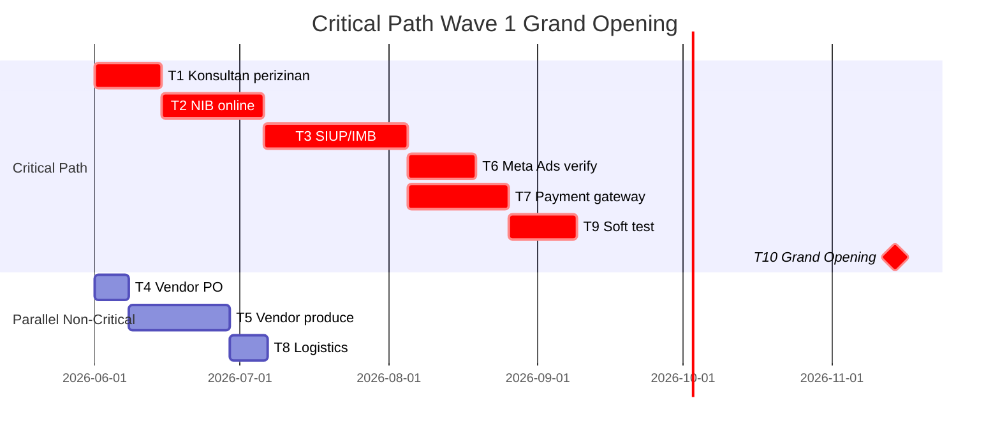
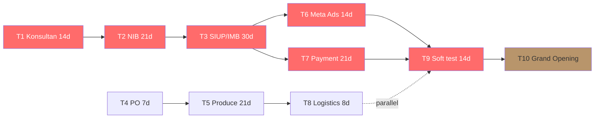

# Critical Path Analysis

Identify dependency chain yang blocking timeline. Output: task graph + critical path highlight + slack identification + risk per stage.

## Triggers

Primary:
- "critical path"
- "blocking dependency"
- "chain task"

Secondary:
- "PERT analysis"
- "task dependency"

## Input Required

| Field | Type | Required | Default |
|---|---|---|---|
| project | string | yes | - |
| deadline | date | yes | - |
| task_list | array | no | (auto-derive from sprint S1-S12) |

## Output Template

```markdown
# Critical Path: {PROJECT} → {DEADLINE}

**Total duration:** {N} hari
**Critical path duration:** {N} hari (= shortest possible time)
**Slack total:** {N} hari

## Task Graph

### Task Node Definition
| Task | Duration | Predecessor | Earliest Start | Latest Start | Slack | Critical? |
|---|---|---|---|---|---|---|
| T1: Konsultan perizinan | 14d | None (start S1) | Day 0 | Day 0 | 0 | 🔴 YES |
| T2: NIB online | 21d | T1 | Day 14 | Day 14 | 0 | 🔴 YES |
| T3: SIUP/IMB | 30d | T2 | Day 35 | Day 35 | 0 | 🔴 YES |
| T4: Vendor PO sign | 7d | None (parallel) | Day 0 | Day 21 | 21 | 🟢 |
| T5: Vendor produce | 21d | T4 | Day 7 | Day 28 | 21 | 🟢 |
| T6: Meta Ads verify | 14d | T2 (NIB) | Day 35 | Day 35 | 0 | 🔴 YES |
| T7: Payment gateway onboard | 21d | T2+T3 | Day 65 | Day 65 | 0 | 🔴 YES |
| T8: Logistics Jawa-Kaltim | 8d | T5 | Day 28 | Day 49 | 21 | 🟢 |
| T9: Soft test transaksi riil | 14d | T7+T8 | Day 86 | Day 86 | 0 | 🔴 YES |
| T10: Grand Opening | 1d | T9 | Day 100 | Day 100 | 0 | 🔴 YES |

## Critical Path Identified

**Path:** T1 → T2 → T3 → T6+T7 → T9 → T10
**Sequence:**
1. Konsultan perizinan S1 (14d)
2. NIB online S2-S4 (21d)
3. SIUP/IMB S4-S6 (30d)
4. Meta Ads verify + Payment Gateway onboard parallel S7-S9 (21d)
5. Soft test S10-S11 (14d)
6. Grand Opening S12

**Total critical:** 100 hari (~14 minggu) = align dengan 12 sprint × 2 minggu

## Non-Critical Tasks (have slack)
- T4-T5-T8 (Vendor production + logistics) = 21 hari slack
- T4 bisa delay 21 hari tanpa block T10
- **Caveat:** Slack disappears kalau vendor delay >21 hari, jadi tetap watch

## Slip Sensitivity

| Stage | Slip 1 minggu | Slip 2 minggu | Slip 4 minggu |
|---|---|---|---|
| T1 Konsultan | Cost of delay Rp 39jt | Rp 78jt + miss Q4 stage 1 | Rp 156jt + miss Q4 + Imlek |
| T2 NIB | Same | Same | Same |
| T6 Meta Ads | Marketing scramble | Reduce reach 30% | Pivot organic only |
| T9 Soft test | Compress to 7d | Compress to 3d (risk) | Skip soft test (reject) |

## Overload Sprint (where critical path converge)

### Sprint S5 (27 Jul - 9 Agu): SEVERE
- NIB deadline (31 Jul)
- Vendor sistem kontrak
- Brand guideline final
- SIUP/IMB parallel
- Matthew PIC di 3 dari 4 milestone

### Sprint S7 (24 Agu - 6 Sep): HIGH
- Build out toko mulai
- Hiring open
- Content calendar lock
- 3 sektor aktif paralel

## Risk Per Stage

| Stage | Risk type | Likelihood | Impact | Mitigation |
|---|---|---|---|---|
| T1 Konsultan | Konsultan default | Low | High | Backup 2 konsultan parallel outreach |
| T2 NIB | Online system down | Med | High | Manual filing backup |
| T3 SIUP/IMB | Approval delay | High | High | Konsultan local connection + outreach Mei |
| T6 Meta Ads | Account verify reject | Low | Med | Pre-prep documentation |
| T7 Payment gateway | Approval review 3 minggu | Med | High | Start parallel Xendit + Midtrans |
| T9 Soft test | Bug critical | Med | Med | Internal test wave 0 (Sep) before soft test |

## Recommendation
- **Don't compress critical path tasks** (T1, T2, T3, T6, T7, T9). Add buffer instead.
- **Use non-critical slack** untuk parallel non-blocking work (marketing prep, brand asset production)
- **Watch T3 SIUP/IMB closely** — historical slip 4-8 minggu lumrah di Balikpapan
- **Soft test wave 0 di Sep** untuk de-risk T9
- **Hire freelance support** untuk T6+T7 (verify + onboard processes)
```

## Visual Output

Critical path Gantt + dependency graph:



Plus dependency network:



## Knowledge Dependency

- 12 Sprint S1-S12 reverse calendar
- BP Chapter 11 (timeline + perizinan)
- vendor-scorecard skill output
- Cost of Delay framework
- Capacity planning skill output

## Mode

Default: EXECUTION
Switch: DISCUSSION jika sequence debate

## Tools Required

- file-search
- code-interpreter (PERT calculation, slack identification)
- artifacts (Gantt + flowchart)

## Validation Criteria

- All task ada predecessor + duration
- Critical path identified clearly (shortest sequence)
- Slack calculated per non-critical task
- Slip sensitivity tabular
- Overload sprint flagged
- Risk per critical stage min 1 risk
- Mitigation actionable
- Brand canon compliance

## Sample I/O

**Input:** "Critical path analysis Grand Opening 14 Nov 2026"

**Output summary:**
- 10 task analyzed, critical path 6 task (Konsultan → NIB → SIUP/IMB → Meta+Payment → Soft test → GO)
- Total critical 100 hari = 12 sprint × 2 minggu
- 3 task parallel non-critical (PO → Produce → Logistics) dengan 21 hari slack
- Overload SEVERE Sprint S5, HIGH Sprint S7
- Cost of delay: Rp 39jt/minggu T1-T3, Rp 78jt/minggu T6-T9
- Recommendation: don't compress critical, soft test wave 0 Sep, freelance support T6+T7
- Gantt + dependency graph embedded

## Handoff

- timeline-risk-audit (untuk audit gap)
- capacity-planning (resource allocation per critical task)
- contingency-plan (kalau critical task at risk)
- CFO Gerai (cost of delay validation)
