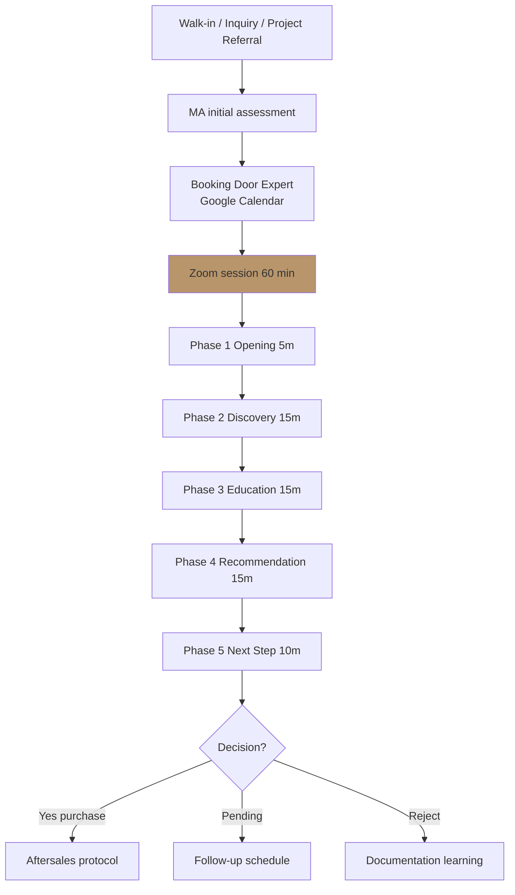
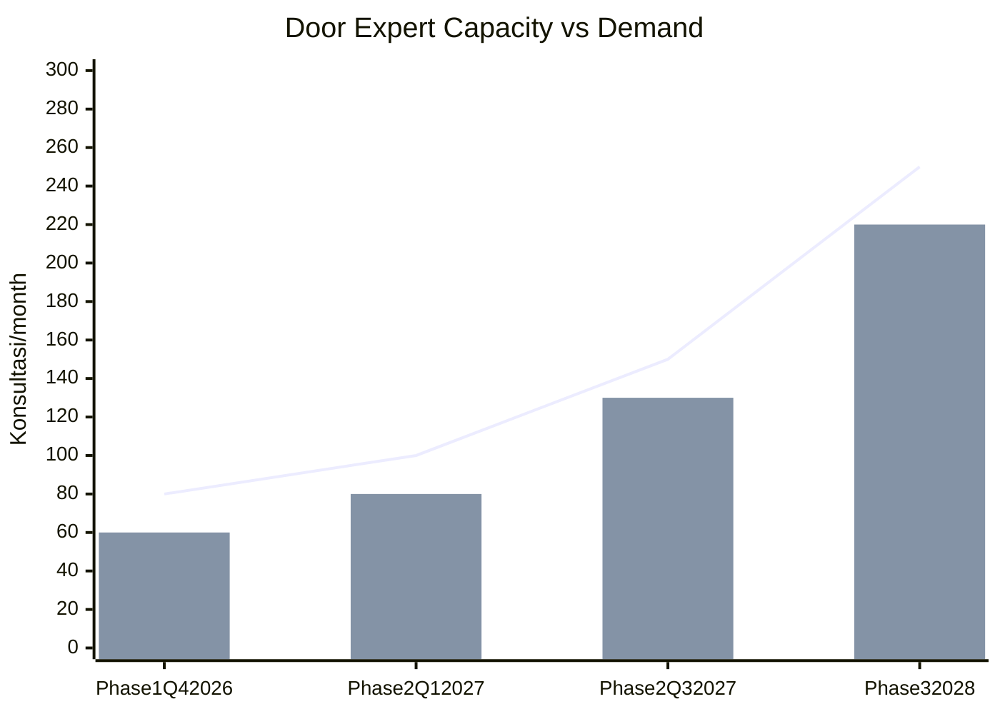

# Door Expert Operating Model (Centralized Consultation)

Define Door Expert role: 5 kompetensi, remote consultation workflow via Zoom dari Tim Pusat, multi-cabang coverage, knowledge ecosystem.

## Triggers

Primary:
- "Door Expert operating"
- "konsultasi workflow"
- "remote consultation"

Secondary:
- "Door Expert role"
- "consultation booking"

## Input Required

| Field | Type | Required | Default |
|---|---|---|---|
| context | string | yes | - |
| scope | enum | no | "full-model" or specific aspect |

## Output Template

```markdown
# Door Expert Operating Model

**Concept:** Centralized expert konsultan dari Tim Pusat, support multi-cabang via Zoom.
**Status:** 🔒 LOCKED concept

## Door Expert Identity

### Role Definition
Door Expert adalah generalist konsultan dengan 5 kompetensi yang menemani customer Gerai dalam memilih pintu yang aligned dengan tempat impian mereka. Bukan sales agresif, bukan order-taker. Konsultan dengan tone hangat dan otoritas.

### 5 Kompetensi (locked)
1. **Katalog Mastery**
   - Deep product knowledge AMK + brand-brand expansion
   - Material understanding (kayu solid, engineered, brass, dll)
   - Functional spec (dimension, weight, fitting requirement)

2. **Industri Konstruksi & Arsitektur**
   - Site condition awareness
   - Fitting compatibility (kosen existing, dll)
   - Coordination dengan tukang/aplikator/kontraktor
   - Project lifecycle understanding (design → install)

3. **Indonesia & Feng Shui Foundation**
   - Cultural context Indonesia (rumah adat, modern, hybrid)
   - Feng shui basic untuk pintu (arah hadap, ukuran auspicious, material harmoni)
   - Filosofi 4-Dunia application per customer context
   - Regional preference (Kaltim, Jawa, Sumatera context)

4. **Soft Skills + Communication**
   - Active listening (customer first)
   - Customer journey navigation (Mengenal → After)
   - Empathy + de-escalation
   - Cross-cultural communication (Bahasa Indonesia varied register)
   - Brand voice premium hangat consistency

5. **Aftersales + Long-term Relationship**
   - Post-install follow-up protocol
   - Issue resolution + warranty
   - Referral cultivation
   - Customer journey continuation

## Operating Workflow

### Trigger: Konsultasi Booking

#### Source 1: MA Showroom Walk-in
- MA initial assessment (intent + persona)
- Schedule Door Expert slot (Google Calendar)
- Customer wait di konsultasi pod ATAU schedule kembali

#### Source 2: Online Inquiry
- CRM lead capture
- MA respond + offer konsultasi (free 30-60 min Zoom)
- Booking confirmation via WhatsApp

#### Source 3: Project Referral
- Arsitek/Designer kirim project info
- Door Expert review pre-session
- Booking scheduled dengan Arsitek + customer

### Konsultasi Session Flow (60 min default)

#### Phase 1: Opening (5 min)
- Welcome + introduce Door Expert role
- Confirm customer context (project, tempat, timeline, budget)
- Set expectation session outcome

#### Phase 2: Discovery (15 min)
- Deep listening customer story (tempat archetype yang mereka envision)
- Pain points + concern
- Existing preference + reference
- Constraint (budget, timeline, site)

#### Phase 3: Education (15 min)
- Filosofi 4-Dunia introduction kalau relevant
- Product narrative (cocok untuk customer story)
- Material understanding
- Trade-off (price vs feature)

#### Phase 4: Recommendation (15 min)
- Curated suggestion (3-5 option max)
- Reasoning per option
- Comparison transparent
- Customer co-decision (bukan top-down recommend)

#### Phase 5: Next Step (10 min)
- Decision atau pending decision
- Aftersales preview (kalau decide)
- Documentation + photo
- Follow-up scheduling

### Post-Session
- Documentation di CRM (full transcript + decision)
- Photo product recommended (kalau approved)
- Aftersales schedule (kalau purchase)
- Knowledge contribution (kalau learning baru, document)

## Multi-Cabang Coverage Architecture

### Cabang #1 Phase 1 (Balikpapan only)
- Door Expert × 1 cover semua walk-in + inquiry
- Capacity: 5 konsultasi/day × 5 hari = 25/week, monthly 100
- Buffer: 25% (peak season)
- Effective: 75-80 konsultasi/month

### Phase 2 Scale (Cabang #2-3)
- Door Expert × 1 cover 3-4 cabang (Balikpapan + Samarinda + Bontang)
- Capacity stretched ke 35/week (with optimization)
- Trigger hire Door Expert #2: konsultasi >120/month sustained 2 quarter

### Phase 3 Mature (Cabang #4+)
- Door Expert pool 2-3 person
- Specialty: Senior + Junior tier
- Geographic + persona allocation

## Knowledge Ecosystem

### Door Expert Knowledge Base (Notion + Internal)
- Filosofi 4-Dunia full content
- Product spec AMK + competitor catalog
- Industry trend update (monthly)
- Customer case study (anonymized) — for learning
- Feng shui reference (Indonesian context curated)

### Continuous Learning
- Weekly: 1 case study review (best + edge case)
- Monthly: External resource (industry magazine, design book)
- Quarterly: External course (Rp 3jt budget)
- Annually: Industry event (HDII, IAI, furniture fair)

## KPI Door Expert

| KPI | Target | Frequency |
|---|---|---|
| Konsultasi count | 80-100/quarter | Quarterly |
| Customer satisfaction | 9/10+ | Per session |
| Conversion to purchase | 50%+ | Per session funnel |
| Average session duration | 50-60 min | Real-time |
| Aftersales follow-through | 100% within 30 day | Monthly |
| Specialty competency demonstration | All 5 kompetensi weekly | Mentor review |
| MA mentor activity | Weekly | Documented |
| Knowledge contribution | 1+ entry/month | Knowledge base |

## Compensation Door Expert

### Base + KPI
- Base salary: Rp 8-12jt (Senior level Indonesia 2026)
- KPI bonus: Rp 2-3jt target (quality-based)
- Total package: Rp 10-15jt/bulan

### NOT commission-based
- LOCKED: bukan agresif sales tactics
- Quality + customer success focus

## Tool Stack Door Expert

### Communication
- Zoom Pro (HD video, screen share, recording)
- WhatsApp Business (chat customer pre/post session)
- Google Calendar (scheduling shared dengan MA)

### Documentation
- CRM Gerai Modul Retail (session log + decision)
- Notion (knowledge base + learning)
- Photo library (curated product photo untuk session)

### Hardware
- Workstation pusat: laptop premium + dual monitor
- Webcam HD + ring light (Zoom quality)
- Headset noise-cancelling
- Tablet untuk catalog show (kalau visual heavy)

## Brand Canon Integration

Setiap konsultasi WAJIB:
- Tone calm refined premium hangat
- "tempat" not "rumah"
- "Gerai 1000 Pintu" lengkap
- No em-dash di documentation
- Filosofi 4-Dunia integration kalau relevant
- Aesop + DWR reference vocabulary

## Risk + Mitigation

| Risk | Mitigation |
|---|---|
| Door Expert single point of failure | MA Senior train as backup, knowledge documentation thorough |
| Burnout (high konsultasi load) | Capacity buffer + workload tracking, peak season Door Expert #2 |
| Skill drift (kompetensi tidak balanced) | Quarterly self-assessment + 5 kompetensi audit |
| Customer perception "remote = impersonal" | Zoom quality high + warm tone + photo + screen share |

## Edge Cases

### Customer NOT respond positive to konsultasi
- Reframe value: "Saya Door Expert untuk Anda, gratis 60 menit, no commitment"
- Kalau still resist: MA handle dengan basic recommendation, document customer preference

### Customer minta visit langsung (site)
- Phase 1: Not standard (Lean Store concept)
- Edge case Senior project >Rp 100jt: Door Expert visit possible, fee Rp 2jt + transport
- Phase 2 scale: Door Expert site visit subsidized untuk Arsitek/Designer collab

### Complex multi-room project
- Schedule extended session 2 hour
- Pre-session: customer kirim floor plan + photo
- Multi-session approach: 3-5 session over 2 minggu
```

## Visual Output

Door Expert workflow + capacity diagram:



Capacity scaling chart:



## Knowledge Dependency

- BP Chapter 8 (Door Expert role LOCKED)
- 5 Nilai Gerai
- Brand Canon (premium hangat tone)
- Filosofi 4-Dunia
- training-curriculum skill (Door Expert curriculum)
- lean-store-design skill

## Mode

Default: EXECUTION
Switch: NEED_CLARIFICATION jika scope ambigu

## Tools Required

- file-search
- artifacts (flowchart + capacity chart)

## Validation Criteria

- 5 kompetensi all defined dengan detail
- Workflow 5-phase session structure
- Multi-cabang coverage logic Phase 1-3
- KPI 8 metric measurable
- Compensation NOT commission (quality-based)
- Edge case handling explicit
- Risk + mitigation min 3
- Brand canon strict

## Sample I/O

**Input:** "Door Expert operating model full untuk Phase 1 Cabang Balikpapan"

**Output summary:**
- 5 kompetensi: Katalog mastery + Industri konstruksi + Indonesia/Feng Shui + Soft skills + Aftersales
- Session flow 60 min (5 phase: Opening → Discovery → Education → Recommendation → Next step)
- Capacity Phase 1: 80-100 konsultasi/month single Door Expert
- Scale trigger: >120/month sustained 2 quarter → hire Door Expert #2
- Compensation Rp 10-15jt/bulan quality-based (NOT commission)
- Tool stack: Zoom Pro + Google Calendar + CRM + Notion knowledge base
- Edge cases handled: customer resist konsultasi, site visit request, multi-room project
- Workflow flowchart + capacity chart embedded

## Handoff

- training-curriculum (Door Expert 12-week curriculum)
- performance-review-framework (KPI assessment)
- showroom-experience-design (integrate konsultasi pod)
- workflow-design (MA + Door Expert + Customer cross-functional)
