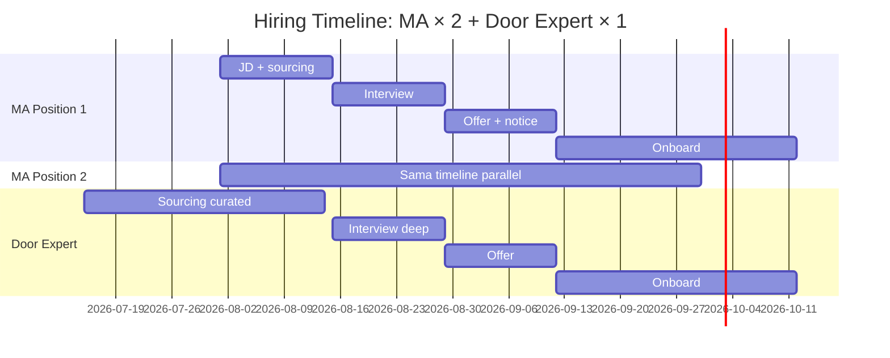
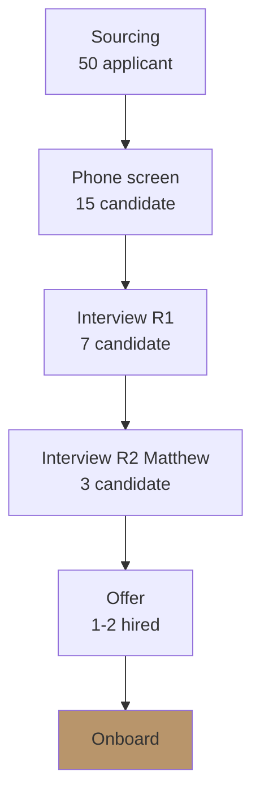

# Hiring Plan & Recruitment Strategy

Plan recruitment: role definition, skill profile, salary range, sourcing channel, timeline, evaluation criteria.

## Triggers

Primary:
- "hiring plan"
- "rekrutmen [role]"
- "JD baru"

Secondary:
- "headcount plan"
- "talent acquisition"

## Input Required

| Field | Type | Required | Default |
|---|---|---|---|
| role | string | yes | (e.g., MA, Door Expert, Marketing Lead) |
| count | number | yes | - |
| start_date_needed | date | yes | - |
| budget_monthly | number Rp | no | (auto from BP) |

## Output Template

```markdown
# Hiring Plan: {ROLE} × {COUNT}

**Start date needed:** {date}
**Budget per person/month:** Rp {amount}
**Total budget Q4:** Rp {amount}

## Role Definition

### Lean Store Context
Posisi ini support Lean Store 2-staf concept (LOCKED). Tidak boleh deviate ke "konsentrik staffing" pattern.

### Reports to
{Manager / Founder direct}

### Direct reports
{None for entry / Number for management}

### Job Type
- [ ] Full-time
- [ ] Part-time
- [ ] Freelance / Contract
- [ ] Project-based

## Skill Profile

### Hard Skills Required
- {Skill 1}: {level: beginner/intermediate/advanced}
- {Skill 2}: {level}
- {Skill 3}: {level}

### Soft Skills Required
- {Skill}: 5 Nilai Gerai alignment (Inspirasi/Keahlian/Pelayanan Nyaman/Inovasi/Aftersales)

### Experience Range
- Minimum: {years in similar role}
- Preferred: {years + specific industry}

### Education
- Minimum: {SMA/D3/S1}
- Preferred: {specific major}

## Salary Range (Indonesia 2026 retail Kaltim)

| Tier | Range | When applicable |
|---|---|---|
| Entry | Rp X jt | <2 years exp |
| Mid | Rp Y jt | 2-5 years exp |
| Senior | Rp Z jt | 5+ years exp |

**Recommended for role:** Tier {tier}, Rp {amount} base + KPI bonus

## Compensation Package
- Base salary: Rp {amount}
- BPJS Kesehatan + Ketenagakerjaan
- THR (Lebaran)
- KPI bonus (quality-based, NOT commission agresif): Rp {amount} target
- Training budget: Rp {amount}/year
- Career path: {progression}

## Sourcing Channel (Ranked by ROI)

### Channel 1: Local network referral (Balikpapan/Kaltim)
- Method: Door Expert + Aplikator + community
- Cost: Rp 500K referral bonus per hire
- Speed: 2-4 weeks
- Quality: High (warm lead)

### Channel 2: LinkedIn + JobStreet
- Method: Job posting + active sourcing
- Cost: Rp 2-5jt/post
- Speed: 4-6 weeks
- Quality: Mixed

### Channel 3: Vocational school partnership (untuk Aplikator)
- Method: SMK furniture/woodworking partnership Kaltim
- Cost: Rp 1-2jt event sponsorship
- Speed: 6-8 weeks
- Quality: Trainable fresh

### Channel 4: Industry community (untuk Door Expert)
- Method: HDII, IAI, asosiasi furniture
- Cost: Rp 0-1jt (event attend)
- Speed: Variable
- Quality: Very high (curated)

## Recruitment Timeline

| Week | Activity | Output |
|---|---|---|
| W1 | JD finalize + sourcing channel kick off | JD published |
| W2 | Application review + shortlist | 10-15 candidate |
| W3 | Initial screening (phone) | 5-7 candidate |
| W4 | Interview round 1 (skill + culture fit) | 3-4 candidate |
| W5 | Interview round 2 (Matthew final) | 1-2 candidate |
| W6 | Offer + negotiation | Hired |
| W7-8 | Notice period (kalau ada) | Pre-onboard |
| W9 | Start date | Onboarding begin |

## Evaluation Criteria

### Skill Assessment
- Technical test: {specific task}
- Portfolio review: {what to look at}
- Reference check: {contact previous employer/client}

### Culture Fit (5 Nilai Gerai)
- Inspirasi: {how to assess}
- Keahlian: {assessment method}
- Pelayanan Nyaman: {role-play test}
- Inovasi: {scenario question}
- Aftersales: {long-term commitment indicator}

### Scoring Matrix
| Criteria | Weight | Score 1-10 |
|---|---|---|
| Hard skill match | 30% | |
| Soft skill (5 Nilai) | 30% | |
| Experience relevance | 15% | |
| Cultural alignment | 15% | |
| Growth potential | 10% | |
| **Total** | 100% | |

Pass threshold: 7.5/10 minimum

## Risk Register

| Risk | Likelihood | Mitigation |
|---|---|---|
| Talent pool tipis di Kaltim | High | Multi-channel + remote-friendly option |
| Salary inflation 2026 | Med | Benchmark quarterly + flexible negotiation |
| Wrong hire (90-day fail) | Med | Probation period + early KPI checkpoint |
| Notice period delay | Med | Start hiring 2 bulan earlier than need date |

## Onboarding Plan (post-hire)
- Day 1: Welcome + tools setup + 5 Nilai induction
- Week 1: Shadow existing staff (kalau ada) atau Matthew direct
- Month 1: First independent project + checkpoint
- Day 90: Full review + KPI calibration
- Hand off to onboarding-roadmap skill untuk detail

## Brand Canon Compliance
- JD tone: premium hangat, not corporate flat
- "Gerai 1000 Pintu" lengkap di JD posting
- Avoid jargon empty (e.g., "rockstar", "ninja", "synergize")
- Emphasize 5 Nilai alignment
- No em-dash di JD copy
```

## Visual Output

Hiring funnel + timeline Gantt:



Plus hiring funnel:



## Knowledge Dependency

- BP Chapter 14 (Struktur Organisasi & SDM)
- BP Chapter 8 (Lean Store)
- 5 Nilai Gerai
- Door Expert 5 kompetensi
- capacity-planning skill output

## Mode

Default: EXECUTION
Switch: DISCUSSION jika role definition ambigu vs Lean Store

## Tools Required

- file-search
- web-search (salary benchmark Indonesia 2026, JobStreet/LinkedIn rate)
- artifacts (Gantt + funnel)

## Validation Criteria

- Role definition align Lean Store LOCKED
- Skill profile concrete (bukan generic)
- Salary range justified (benchmark)
- Sourcing channel ranked by ROI
- Timeline realistic 6-9 weeks
- Evaluation scoring matrix explicit
- 5 Nilai integration di assessment
- Brand canon strict di JD

## Sample I/O

**Input:** "Hiring plan untuk MA × 2 + Door Expert × 1 untuk launch wave 1 Oktober"

**Output summary:**
- 3 hire, start date 12 Sep (8 minggu lead time)
- MA: tier mid Rp 4.5jt + KPI bonus quality 1jt + benefit, sourcing referral + LinkedIn
- Door Expert: senior Rp 8jt + KPI bonus + benefit, sourcing IAI/HDII + curated
- Timeline: sourcing Aug 1 → onboard Sep 12 → fully ramped Oct 12
- Budget Q4: 2 × MA + 1 × DE = Rp 18jt/bulan × 3 bulan = Rp 54jt + bonus pool
- 5 Nilai integration di interview (role-play Pelayanan Nyaman + scenario Inovasi)
- Hiring funnel + Gantt timeline embedded

## Handoff

- job-description (detail JD per role)
- onboarding-roadmap (post-hire 90-day plan)
- training-curriculum (skill development per role)
- CFO Gerai (validate budget annual)
