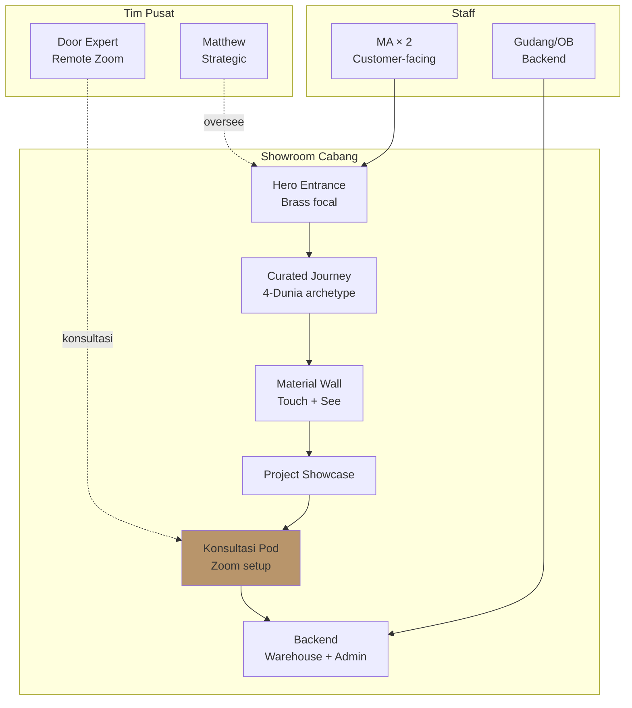

# Lean Store Design (2-staff Cabang Model)

Design + maintain Lean Store concept: 2 staf per toko (MA + Gudang/OB), supported by Door Expert remote consultation. LOCKED concept — no deviation.

## Triggers

Primary:
- "lean store design"
- "operating model cabang"
- "2-staf concept"

Secondary:
- "store layout operations"
- "staffing per cabang"

## Input Required

| Field | Type | Required | Default |
|---|---|---|---|
| store_location | string | yes | (e.g., Balikpapan) |
| store_phase | enum | yes | (initial/replicate) |
| capacity_target | number | no | (40 walk-in/week) |

## Output Template

```markdown
# Lean Store Design: {LOCATION}

**Status:** 🔒 LOCKED concept (LEAN — no deviation)
**Phase:** {Initial / Replicate}

## Lean Store Core Principle

### Why Lean (2-staf + Door Expert remote)
- Cost efficiency: Rp 9-12jt/bulan staff cost per cabang (vs 5-staff Rp 25jt+)
- Quality control: 2 staf = manageable supervision + culture
- Scalability: Replicate cabang baru tanpa linear cost
- Brand consistency: Door Expert centralized = uniform service standard

### Anti-pattern (yang JANGAN dilakukan)
- ❌ Hire 3-5 staff per cabang ("more is better")
- ❌ Sales agresif KPI commission
- ❌ Multiple Door Expert per cabang (centralized cukup)
- ❌ Manager standalone per cabang (Matthew direct or Senior MA tier 2)

## Staff Composition per Cabang

### MA (Marketing Advisor) × 2
**Role:** Customer-facing
**Responsibilities:**
- Welcome + showroom tour
- Initial intent identification
- Product introduction (high-level)
- Schedule Door Expert konsultasi
- Documentation CRM
- Aftersales follow-up basic

**Skills:** Refer ke training-curriculum MA
**KPI:** Refer ke performance-review-framework
**Salary:** Rp 4.5jt + benefit (Tier mid Indonesia 2026 retail Kaltim)

### Gudang/OB (Operations + Backend) × 1 (atau MA #2 rangkap)
**Note Phase 1:** Gudang/OB function bisa di-handle MA #2 rangkap. Hire dedicated kalau scale Phase 2.

**Responsibilities:**
- Inventory management
- Receiving + QC incoming
- Showroom display maintenance
- Backend admin support

**Skills:** Detail-oriented, fisik, system literacy
**Salary:** Rp 3.5jt + benefit (kalau dedicated)

### Door Expert × 1 (centralized, support multi-cabang)
**Role:** Remote consultation via Zoom
**Coverage:** Multi-cabang dari pusat
**Responsibilities:**
- Deep konsultasi customer (per booking)
- Product recommendation specialized
- Filosofi 4-Dunia application per project
- Mentor MA
- Aftersales escalation

**Skills:** 5 Kompetensi (katalog, industri, Indonesia/feng shui, soft skills, aftersales)
**Salary:** Rp 8-12jt + benefit (Senior level)
**Schedule:** Available booking slot per MA request, 9-5 schedule

## Physical Layout Cabang (Showroom)

### Footprint
- Total area: 100-150 m² typical
- Display: 60% area
- Konsultasi space (private): 15% area
- Backend (warehouse + admin): 25% area

### Layout Principles
1. **Hero entrance:** Brass detail focal point pintu, customer first impression
2. **Curated journey:** Walk-through path mengikuti 4-Dunia archetype
3. **Konsultasi pod:** Private space untuk Door Expert remote session (Zoom setup)
4. **Material wall:** Touch + see (kayu sample, brass swatch, finish texture)
5. **Project showcase:** Photo wall completed project Arsitek collaboration
6. **Demo area:** Pintu functional working (open close brass handle experience)

### Visual Direction (refer CCO Brand Canon)
- Palette: Brass 10% + Charcoal 60% + Ivory 30%
- Lighting: natural + warm 3000K accent
- Typography di sign: serif + sans matched brand
- Music: ambient calm (jangan loud commercial)

## Daily Operations Rhythm

### Opening (08:30-09:00)
- Showroom clean + display check
- System login (CRM + WhatsApp)
- Daily briefing (5-10 min): yesterday recap + today priority

### Operating Hours (09:00-18:00)
- Customer walk-in handling (MA primary)
- Konsultasi booking (MA schedule, Door Expert execute remote)
- Documentation realtime CRM
- Aftersales follow-up (between walk-in)

### Closing (17:30-18:00)
- Showroom reset + display refresh
- System log + reports
- Tomorrow prep
- Communication WA group end-of-day

### Weekly
- Monday: Goal alignment + sprint review
- Wednesday: Mid-week check + adjustment
- Friday: Recap + content recap + retrospective

## Communication Architecture

### Internal WA Group
- "Gerai Operations" (Matthew + Senior MA + Door Expert + Tim Pusat)
- "Gerai Showroom Balikpapan" (MA × 2 + Gudang + Door Expert)
- "Gerai Tim Pusat" (Matthew + Marketing + Brand + dll)

### Escalation Path
```
Customer issue → MA handle
  ↓ kalau complex
Door Expert konsultasi (remote)
  ↓ kalau strategic / financial impact
Matthew direct
```

### Decision Authority
| Decision | MA | Door Expert | Matthew |
|---|---|---|---|
| Pricing standard | Apply | - | Set |
| Diskon "reward" within program | Apply (≤10%) | Apply (≤15%) | Approve >15% |
| Product recommendation | Initial | Final detailed | - |
| Customer complaint | Handle minor | Escalate | Major resolution |
| Display change | - | - | Approve |

## Capacity Math (Walk-in handling)

### Per MA capacity
- Avg interaction time: 30 min per customer
- Daily customer handled: 12-15 (full focus)
- Buffer: 25% (for breaks, documentation, edge case)
- Effective: 9-11 customer/day per MA

### 2 MA team
- Effective: 18-22 customer/day
- Weekly: 100-130 walk-in capacity
- Monthly: 400-520 walk-in capacity

### Wave 1 demand (8-12 walk-in/week)
- Well within capacity ✅
- Headroom untuk grow without re-hire until 80+ walk-in/week

## Tool Stack

### Software
- CRM: Custom Gerai Modul Retail (Day 1 live target Nov)
- Inventory: Inventory System (Day 1 live)
- Kiosk: Display catalog interactive (Day 1 live)
- Web: gerai.mahewwork.com (Day 1 live)
- Communication: WhatsApp Business + email
- Calendar: Google Calendar shared (untuk konsultasi booking)
- Video: Zoom Pro (untuk Door Expert konsultasi)
- POS: TBD (Moka, Olsera evaluation)

### Hardware
- 2 × workstation (laptop / tablet per MA)
- 1 × konsultasi pod (Zoom setup: webcam + mic + screen)
- 1 × POS terminal
- 1 × printer (struk + invoice + warranty card)

## Brand Canon Integration

Setiap aspek Lean Store WAJIB compliance:
- Customer-facing tone: premium hangat (audience-first)
- Physical environment: palette Timeless Foundation
- Communication: no em-dash, "tempat", "Gerai 1000 Pintu" lengkap
- Service standard: Aesop + Design Within Reach reference

## Scaling Phase 2

### Cabang #2 (Q2-Q3 2027 target)
- Replicate Lean Store dengan adaptation lokasi
- Same 2-staf + remote Door Expert (centralized at Pusat)
- Door Expert capacity: support 3-4 cabang max (then hire Door Expert #2)
- Tim Pusat structure unchanged

### Multi-cabang Coordination
- Senior MA per cabang (lead role)
- Door Expert pool (2-3 person at scale)
- Tim Pusat Matthew → CEO + scale roles

## Risk + Mitigation

| Risk | Mitigation |
|---|---|
| MA burnout (rangkap rangkap) | Hire Gudang dedicated saat scale, weekly retro |
| Door Expert single point of failure | Train MA Senior as backup, knowledge documentation |
| Cabang quality drift | Quarterly audit + canon refresher training |
| Customer perception "kekurangan staf" | Reframe Lean = curated service, not understaffed |
```

## Visual Output

Lean Store layout + operating rhythm:



Operating rhythm timeline:

```mermaid
gantt
    title Daily Operations Rhythm Cabang
    dateFormat HH:mm
    axisFormat %H:%M
    section MA
    Opening cleanup :08:30, 30m
    Walk-in handle peak1 :09:00, 180m
    Lunch break :12:00, 60m
    Walk-in handle peak2 :13:00, 240m
    Closing reset :17:00, 60m
    section Door Expert
    Konsultasi slot 1 :10:00, 60m
    Konsultasi slot 2 :11:00, 60m
    Konsultasi slot 3 :13:30, 60m
    Konsultasi slot 4 :15:00, 60m
    Konsultasi slot 5 :16:00, 60m
```



## Knowledge Dependency

- BP Chapter 8 (Lean Store LOCKED concept)
- BP Chapter 14 (Struktur Organisasi)
- 5 Nilai Gerai
- Brand Canon (visual identity)
- 6 Persona spec
- hiring-plan + training-curriculum skills

## Mode

Default: EXECUTION
Switch: NEED_CLARIFICATION jika ada deviation request (3+ staf, dll) — FLAG karena LOCKED

## Tools Required

- file-search
- artifacts (layout diagram + rhythm Gantt)

## Validation Criteria

- Lean concept 2-staf + Door Expert remote NOT violated
- Anti-pattern explicit (jangan 3+ staf, jangan sales agresif KPI)
- Layout principle premium retail (no commercial overload)
- Operating rhythm sustainable (no burnout)
- Decision authority matrix clear
- Scaling Phase 2 thought through
- Risk + mitigation min 3
- Brand canon strict

## Sample I/O

**Input:** "Lean Store design Cabang #1 Balikpapan launch wave 1"

**Output summary:**
- 2 MA + 1 Gudang (rangkap MA #2 Phase 1) + Door Expert remote pusat
- Layout 100-150 m²: 60% display, 15% konsultasi pod, 25% backend
- Capacity 18-22 walk-in/day (well above Wave 1 demand 8-12)
- Daily rhythm: opening 08:30, peak 09-12 + 13-17, closing 17:30
- 3 WA group + escalation MA → Door Expert → Matthew
- Decision matrix authority per role
- Tool stack: CRM Modul Retail + Inventory + Kiosk + Zoom (Door Expert)
- Phase 2 ready: replicate cabang dengan Door Expert support max 3-4 cabang
- Layout flowchart + rhythm Gantt embedded

## Handoff

- door-expert-operating-model (detail Door Expert workflow)
- showroom-experience-design (detail physical experience)
- hiring-plan (staff requirement)
- workflow-design (cross-functional process)
