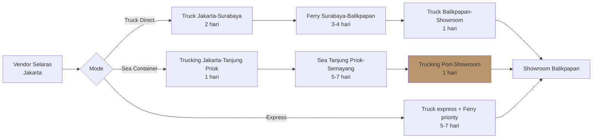
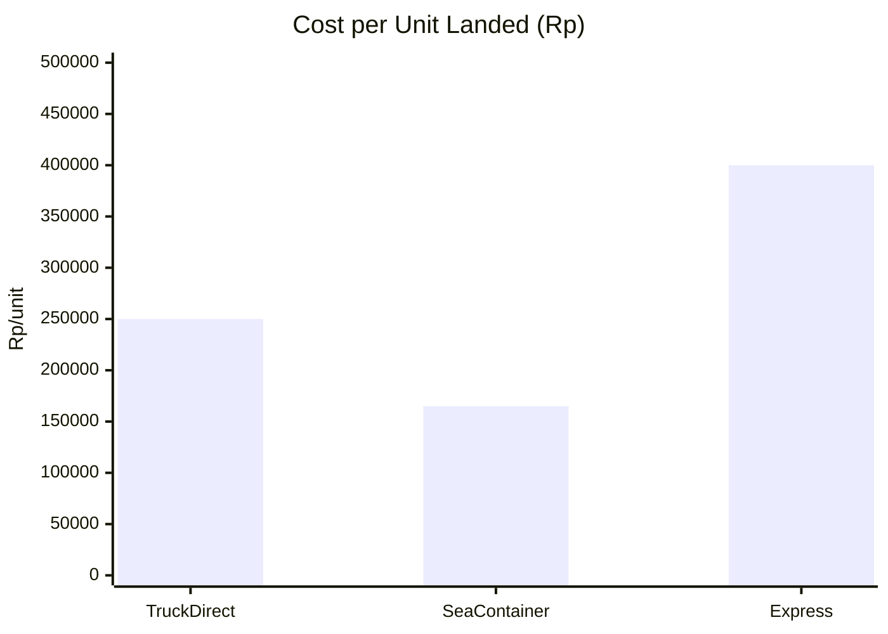

# Logistics Optimization (Jawa-Kaltim)

Optimize route, mode, lead time, cost untuk shipping Jawa-Kaltim. Critical karena geographic offset adds +5-10 hari di luar vendor lead time.

## Triggers

Primary:
- "logistik"
- "kirim Jawa-Kaltim"
- "shipping cost"

Secondary:
- "freight optimizer"
- "delivery route"
- "lead time logistik"

## Input Required

| Field | Type | Required | Default |
|---|---|---|---|
| origin | string | yes | (typical Jakarta/Semarang/Surabaya) |
| destination | string | no | "Balikpapan showroom" |
| cargo_type | string | yes | (door 800x2100x40 mm) |
| quantity | number | yes | - |
| deadline | date | yes | - |

## Output Template

```markdown
# Logistics Plan: {ORIGIN} → {DESTINATION}

**Cargo:** {N} unit pintu AMK Premium (dimension + weight)
**Deadline:** {date}
**Recommended mode:** {Truck/Container/Air}

## Route Options

### Option A: Truck Direct (Jakarta-Balikpapan)
- Mode: Truck 6-wheel + container 20ft
- Distance: ~1,800 km via Surabaya-Pelabuhan-Balikpapan
- Lead time: 8-10 hari (truck Jakarta-Surabaya 2 hari + ferry 3-4 hari + truck Balikpapan-showroom 1 hari + buffer)
- Cost estimate: Rp 18-22jt per container 20ft (~80 unit)
- Cost per unit: Rp 220-275K
- Risk: Ferry schedule, weather, road quality

### Option B: Sea Freight Container
- Mode: Container 20ft via sea
- Origin port: Tanjung Priok (Jakarta)
- Destination port: Semayang (Balikpapan)
- Lead time: 5-7 hari port-to-port + 1 hari clearing + 1 hari last-mile = 7-9 hari
- Cost: Rp 12-15jt per container 20ft
- Cost per unit: Rp 150-188K
- Risk: Port congestion, customs delay

### Option C: Express (urgent only)
- Mode: Truck express + ferry priority
- Lead time: 5-7 hari
- Cost: Rp 28-35jt per container
- Cost per unit: Rp 350-440K
- Use case: Critical replenish, miss-prevent

## Recommended Option

**For Wave 1 (Q4 2026):** Option B Sea Freight Container
**Reasoning:**
- Most cost-efficient per unit (Rp 150K vs Rp 220K truck)
- Lead time acceptable (8 hari) untuk planning H-45
- Container size optimal untuk 80 unit batch
- Reliability higher than truck (no road weather risk)

**For Replenish (Q1+):** Option A Truck (kalau urgent)

## Total Landed Cost Calculation
| Item | Cost |
|---|---|
| Vendor FOB Jakarta | Rp 175jt (80 unit × Rp 2.2jt) |
| Trucking Jakarta → Tanjung Priok | Rp 1.5jt |
| Port handling Jakarta | Rp 800K |
| Sea freight | Rp 13jt |
| Port handling Balikpapan | Rp 600K |
| Customs (kalau ada) | Rp 0 (domestic) |
| Trucking port → showroom | Rp 900K |
| Insurance 0.3% | Rp 540K |
| **Total landed Q4 wave 1** | **Rp 192.3jt** |
| **Cost per unit landed** | **Rp 2.4jt** |

## Lead Time Buffer

| Stage | Time | Buffer |
|---|---|---|
| Vendor production | 21 hari | +2 hari |
| Vendor → Jakarta port | 1 hari | +1 hari |
| Sea freight Jakarta-Balikpapan | 5-7 hari | +3 hari (weather) |
| Customs + port handling | 1-2 hari | +1 hari |
| Port → showroom | 1 hari | +0 hari |
| **Total** | **29-32 hari** | **+7 hari buffer** |
| **Order H-45 from delivery date** | | |

## Forwarder Partner Recommendation

| Forwarder | Specialty | Reliability | Cost | Recommend |
|---|---|---|---|---|
| Sapindo Logistics | Sea freight Jawa-Kalimantan | High | Med | ✅ Primary |
| Spil (Pelni cargo) | Sea direct | Med | Low | Backup |
| Indoport | Multimodal | High | High | Express only |

## Risk Register
| Risk | Likelihood | Impact | Mitigation |
|---|---|---|---|
| Weather sea route monsoon (Nov-Feb) | High | Med | Buffer +5 hari Q4 + Q1 |
| Port congestion Tanjung Priok | Med | Med | Book slot ASAP (2 minggu ahead) |
| Cargo damage in transit | Low | High | Insurance 0.3% + double crate |
| Forwarder default | Low | High | Multi-forwarder POC + escrow payment |

## KPI Tracking
- Lead time adherence: 90% on-time
- Cost per unit landed: <Rp 2.5jt
- Damage rate in transit: <0.5%
- Forwarder responsiveness: <24h SLA

## SOP Trigger
- PO sent → forwarder briefed parallel
- Vendor ship-ready → forwarder pickup scheduled <48h
- In-transit weekly update from forwarder
- Receive showroom → photo + sign-off + invoice trigger
```

## Visual Output

Route comparison diagram:



Plus cost comparison bar:



## Knowledge Dependency

- Geographic constraint Jawa-Kaltim
- po-management skill output
- Unit Economics Q4 2026
- vendor-scorecard skill output

## Mode

Default: EXECUTION
Switch: NEED_CLARIFICATION jika deadline conflict semua mode

## Tools Required

- web-search (forwarder rate update)
- file-search
- code-interpreter (cost calculation)
- artifacts (route diagram + cost chart)

## Validation Criteria

- 3 mode option compared (Truck Direct, Sea, Express)
- Cost per unit calculated full landed
- Lead time + buffer explicit
- Forwarder recommendation justified
- Risk + mitigation min 4 risk
- Monsoon season note untuk Q4-Q1
- KPI tracking setup
- SOP trigger workflow

## Sample I/O

**Input:** "Logistik wave 1 80 unit AMK Premium dari Jakarta ke Balikpapan, deadline 1 Oktober 2026"

**Output summary:**
- Recommended Option B Sea Freight Container 20ft via Sapindo Logistics
- Lead time 8 hari + buffer 7 hari = order H-45 from delivery
- Cost landed Rp 192.3jt = Rp 2.4jt per unit
- Risk: weather monsoon Nov-Feb (buffer 5 hari), port congestion (book 2 minggu ahead)
- Insurance 0.3% covered damage in transit
- SOP: PO → forwarder brief parallel, pickup <48h post-ready
- Route diagram + cost chart embedded

## Handoff

- po-management (sync delivery schedule)
- buffer-calculator (kalau perlu adjust buffer)
- CFO Gerai (validate landed cost vs GM 38% target)
- contingency-plan (kalau weather/congestion critical)
