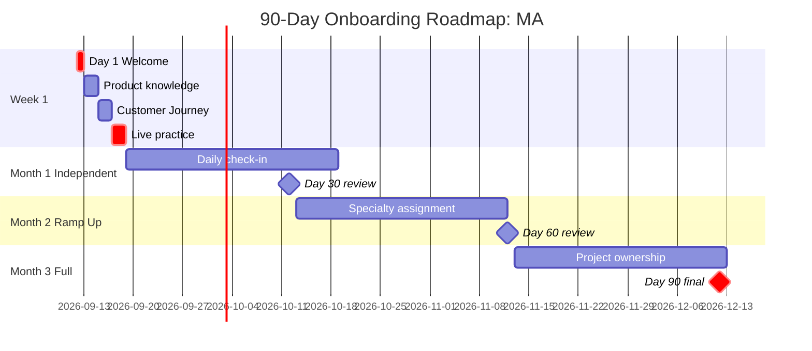
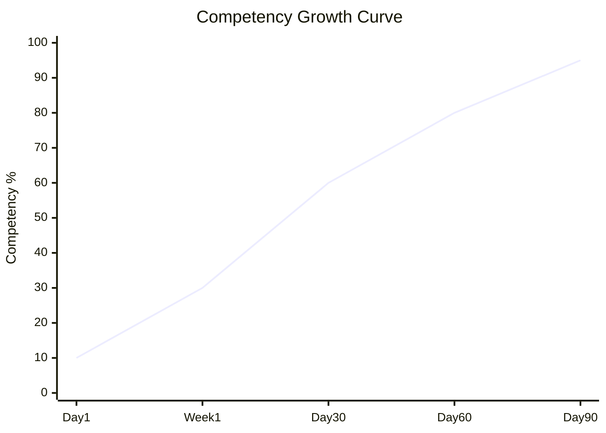

# Onboarding Roadmap (90-day Plan)

Design 90-day onboarding plan per new hire: Day 1, Week 1, Month 1-3 milestone + skill development checkpoint + culture immersion.

## Triggers

Primary:
- "onboarding [role]"
- "90-day plan"
- "new hire training"

Secondary:
- "induction program"
- "ramp-up plan"

## Input Required

| Field | Type | Required | Default |
|---|---|---|---|
| role | string | yes | - |
| level | enum | yes | (entry/mid/senior) |
| start_date | date | yes | - |
| mentor | string | no | (auto-assign based role) |

## Output Template

```markdown
# Onboarding Roadmap: {NAME / ROLE}

**Start date:** {date}
**Mentor:** {Door Expert / Senior MA / Matthew direct}
**Probation period:** 90 hari
**Checkpoint:** Day 1, Week 1, Day 30, Day 60, Day 90

## Day 1: Welcome & Setup

### Morning (3 jam)
- 09:00 Welcome + team introduction
- 09:30 5 Nilai Gerai induction (Inspirasi, Keahlian, Pelayanan Nyaman, Inovasi, Aftersales)
- 10:00 Brand Canon overview (filosofi Dunia Pintu (4-negara cultural context), tagline, palette, tone)
- 10:30 Tour showroom + Door Expert konsultasi observe
- 11:30 Tools setup (CRM access, WA group, email, dll)

### Afternoon (4 jam)
- 13:00 Read material Day 1: BP Chapter 1-3 (positioning + brand canon)
- 14:00 Shadow Matthew atau Door Expert lead (live customer interaction)
- 15:30 Q&A + reflection
- 16:30 Day 1 wrap-up + mentor assign confirm

### Day 1 Outcomes
- [ ] 5 Nilai memorized + ada example application per nilai
- [ ] Brand canon basic understood (no em-dash, "tempat" rule, dll)
- [ ] Tools access verified
- [ ] Mentor pairing confirmed
- [ ] Day 2 plan clear

## Week 1: Foundation

### Day 2-3: Product Knowledge
- AMK Premium spec deep dive
- Material guide (kayu solid vs engineered, brass finish)
- Filosofi Dunia Pintu (4-negara cultural context) narrative per archetype
- Product comparison vs kompetitor (Mitra10, Informa)

### Day 4-5: Customer Journey
- 5-stage Customer Journey learned
- 6 Persona Gerai (Retail, Mitra, Developer, Arsitek, Kontraktor, Aplikator)
- Door Expert konsultasi protocol observe
- Edge case scenario walkthrough

### Day 6-7: Live Practice
- Role-play customer interaction (3 scenario)
- Solo handle inquiry under mentor supervision
- First documentation entry CRM
- Week 1 review with mentor

## Month 1: Independent Work

### Goals
- [ ] Handle 90% inquiry/customer independently
- [ ] Documentation accuracy 95%+
- [ ] 5 Nilai application observed in real interaction
- [ ] Brand canon compliance 100% di customer-facing

### Activities
- Daily check-in dengan mentor (15 min)
- Weekly review showroom data
- Bi-weekly Matthew session (career + question)
- Month 1 retrospective Day 30

### Day 30 Checkpoint Criteria
| Metric | Target | Actual | Status |
|---|---|---|---|
| Customer interaction count | 30+ | | |
| Customer satisfaction rating | 8/10+ | | |
| Documentation accuracy | 95%+ | | |
| 5 Nilai compliance observed | All 5 nilai | | |
| Independent handling % | 90%+ | | |

## Month 2: Ramping Up

### Goals
- [ ] Take on specialty area (e.g., specific persona expertise)
- [ ] Contribute improvement idea (process or service)
- [ ] Mentor junior atau peer kalau MA #2 baru hire

### Activities
- Specialty assignment per persona (e.g., MA #1 focus Arsitek, MA #2 focus Retail)
- Weekly cross-learning Door Expert konsultasi
- First contribution idea log (template provided)

### Day 60 Checkpoint
| Metric | Target | Actual |
|---|---|---|
| Specialty expertise depth | Demonstrated | |
| Improvement idea submitted | 1+ | |
| Cross-functional contribution | Documented | |
| Performance trend | Improving | |

## Month 3: Full Productivity

### Goals
- [ ] Independent + senior judgment
- [ ] Mentor capability emerging
- [ ] First major project ownership

### Activities
- Lead one initiative (e.g., showroom layout refresh, persona campaign content review)
- Peer mentoring kalau ada MA junior
- Career conversation Matthew Day 90

### Day 90 Final Review
| Dimension | Pass criteria | Notes |
|---|---|---|
| Technical competency | All required skill demonstrated | |
| Cultural fit | 5 Nilai consistent demonstrated | |
| Customer satisfaction | 8.5/10+ sustained | |
| Documentation rigor | 98%+ accuracy | |
| Brand canon compliance | 100% customer-facing | |
| Initiative + judgment | Independent senior thinking | |
| **Overall** | Pass / Pass with development / Fail | |

## Outcomes by Day 90

### Pass (continue + confirm)
- Probation passed
- Salary adjustment (kalau ada)
- New role expansion atau specialty deepen
- Career path conversation

### Pass with Development (improvement plan)
- 30-day improvement plan
- Specific skill gap addressed
- Re-evaluation Day 120

### Fail (off-boarding)
- Last day determined
- Knowledge transfer
- Reference plan

## Training Resource

### Mandatory Read
- BP Chapter 1-3 (positioning + brand canon) — Day 1
- BP Chapter 8 (Lean Store + Door Expert model) — Week 1
- 5 Nilai Gerai deep dive material — Day 2
- AMK Premium product catalog — Week 1
- Editorial Rules — Day 3

### Optional Enrichment
- Filosofi Dunia Pintu (4-negara cultural context) (extended reading)
- BP Latest reference brand reference
- Customer service masterclass (online)
- Sales psychology basic

### External Training Budget
- Rp 2jt/year per staff
- Recommended: customer experience masterclass + Indonesian premium retail seminar

## Mentor Responsibilities
- Daily check-in Week 1 (15 min)
- Weekly review Month 1
- Bi-weekly Month 2
- Monthly Month 3
- Provide feedback structured + caring
- Escalate concern early kalau ada gap

## New Hire Responsibilities
- Read assigned material punctually
- Ask questions actively (no "kalau gak tau, diam")
- Document learning + improvement idea
- Honest feedback weekly retro

## Brand Canon Compliance During Onboarding
- All training material no em-dash
- Reference "Gerai 1000 Pintu" lengkap di komunikasi
- "tempat" not "rumah" di role-play scenario
- Tone premium hangat sebagai north star
```

## Visual Output

90-day journey timeline:



Plus competency growth chart:



## Knowledge Dependency

- hiring-plan skill output (role context)
- 5 Nilai Gerai
- BP Chapter 8, 14
- Brand Canon
- Editorial Rules
- training-curriculum skill (skill development detail)

## Mode

Default: EXECUTION
Switch: NEED_CLARIFICATION jika role complexity ambigu (entry vs senior beda plan)

## Tools Required

- file-search
- artifacts (Gantt + growth chart)

## Validation Criteria

- 4 milestone clear (Day 1, Week 1, Month 1-3)
- Specific checkpoint criteria measurable
- Mentor + new hire responsibility tabular
- Day 90 outcome 3-tier (Pass/Pass-with-dev/Fail)
- Training resource categorized (mandatory vs optional)
- Brand canon compliance dimensi explicit
- Realistic timeline (no compressed)

## Sample I/O

**Input:** "Onboarding roadmap MA × 2 start 12 September 2026"

**Output summary:**
- 90-day plan: Day 1 welcome + 5 Nilai induction, Week 1 product + Customer Journey, Month 1 independent, Month 2 specialty (Arsitek + Retail), Month 3 project ownership
- Day 30 checkpoint: 30+ interaction, 8/10 CSAT, 95% doc accuracy
- Day 90 final: 3-tier outcome (Pass/Pass-with-dev/Fail)
- Training Rp 2jt/year budget per MA
- Mentor: Senior MA (kalau ada) atau Matthew direct
- Gantt timeline + competency curve embedded

## Handoff

- training-curriculum (detail skill development per role)
- performance-review-framework (post-90 assessment ongoing)
- hiring-plan (validate role expectations align)
