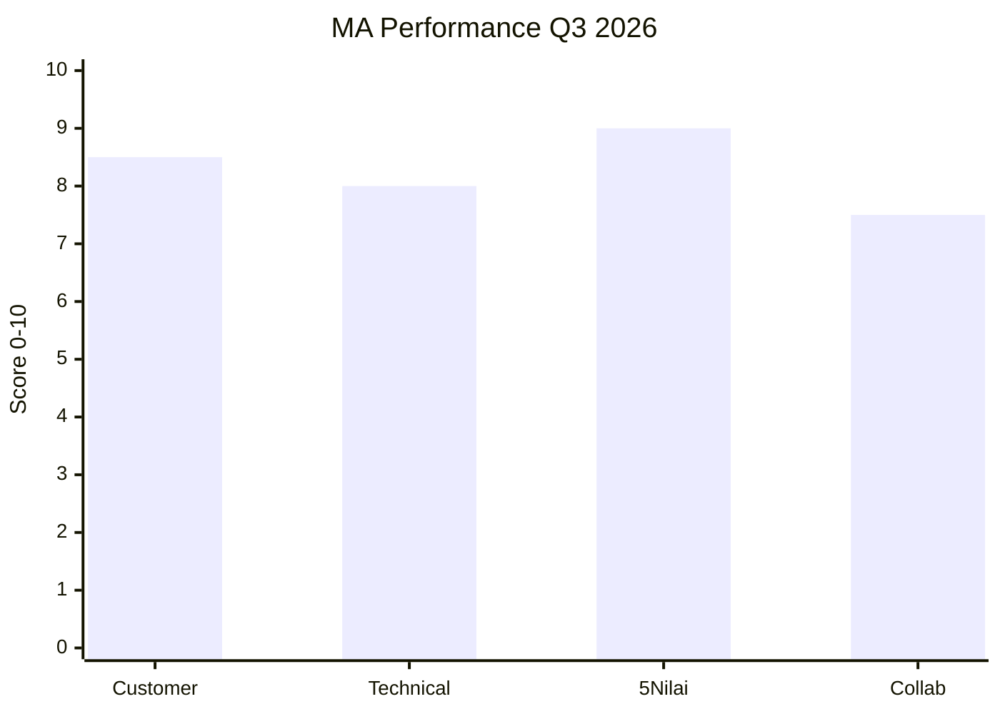
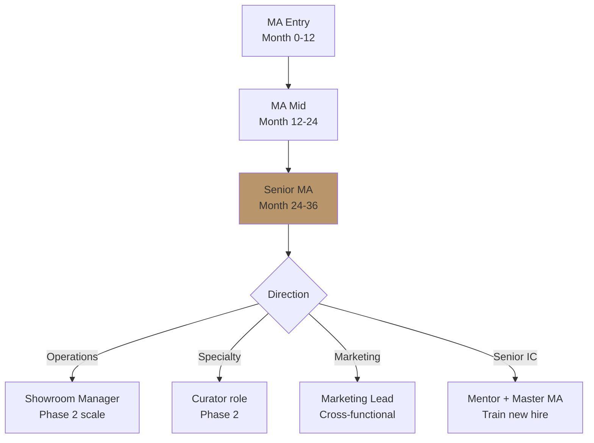

# Performance Review Framework

Design performance assessment system per role: KPI tier, review cadence, scoring rubric, calibration, career path mapping.

## Triggers

Primary:
- "performance review"
- "evaluasi karyawan"
- "KPI framework"

Secondary:
- "appraisal system"
- "compensation review"

## Input Required

| Field | Type | Required | Default |
|---|---|---|---|
| role | string | yes | - |
| review_purpose | enum | yes | (quarterly/annual/probation/role-change) |
| level | enum | no | (entry/mid/senior) |

## Output Template

```markdown
# Performance Review Framework: {ROLE}

**Review type:** {Quarterly / Annual / Probation / Role-change}
**Cadence:** {Quarterly Q1/Q2/Q3/Q4 or specific event}

## Performance Dimension

### Dimension 1: Customer Outcomes (40% weight)
- Customer satisfaction (CSAT) rating
- Repeat visit / referral rate
- Customer complaint resolution
- Customer journey completion

### Dimension 2: Technical Competency (25% weight)
- Product knowledge depth
- System utilization (CRM, tools)
- Documentation accuracy
- Process adherence

### Dimension 3: 5 Nilai Gerai (20% weight)
- **Inspirasi:** Story-telling capability demonstrated
- **Keahlian:** Detail + accuracy maintained
- **Pelayanan Nyaman:** Tone consistency under pressure
- **Inovasi:** Improvement ideas contributed
- **Aftersales:** Follow-through rigor

### Dimension 4: Collaboration & Growth (15% weight)
- Cross-functional contribution
- Mentor capability (kalau senior)
- Self-development initiative
- Brand canon compliance

## KPI Scorecard (Quarterly)

### MA (Marketing Advisor) KPI
| KPI | Target | Weight | Tracking source |
|---|---|---|---|
| Customer interaction count | 100+/quarter | 10% | CRM |
| Customer satisfaction rating | 8.5/10+ | 25% | Feedback form |
| Walk-in to consultation conversion | 60%+ | 15% | CRM funnel |
| Documentation accuracy | 95%+ | 10% | Audit sample |
| 5 Nilai demonstrated | All 5 weekly | 20% | Mentor observation |
| Improvement idea submitted | 1+/quarter | 5% | Idea log |
| Cross-functional contribution | Documented | 10% | Manager note |
| Brand canon compliance | 100% customer-facing | 5% | Editorial Reviewer audit |

### Door Expert KPI
| KPI | Target | Weight |
|---|---|---|
| Konsultasi count | 80+/quarter | 15% |
| Customer satisfaction | 9/10+ | 25% |
| Conversion konsultasi to purchase | 50%+ | 20% |
| Specialty depth (5 kompetensi) | All demonstrated | 15% |
| Knowledge update participation | Quarterly attend | 5% |
| Mentor activity (MA support) | Weekly | 10% |
| Aftersales follow-through | 100% within 30-day | 10% |

### Marketing Lead KPI
| KPI | Target | Weight |
|---|---|---|
| Campaign delivery on-time | 95%+ | 20% |
| Channel performance vs target | 90%+ | 25% |
| Budget adherence | ±5% | 15% |
| Content quality (brand canon) | 100% pass | 15% |
| Team management (kalau ada FL) | Tracked | 10% |
| Strategic contribution | Documented | 15% |

## Rating Rubric

### 5-tier rating
| Rating | Label | Description |
|---|---|---|
| 5 | Exceptional | Exceed all KPI + role-model 5 Nilai + senior thinking |
| 4 | Strong | Meet all KPI + 5 Nilai consistent + reliable |
| 3 | Solid | Meet most KPI + 5 Nilai mostly + steady contributor |
| 2 | Developing | Below 70% KPI + 5 Nilai inconsistent + need support |
| 1 | Unsatisfactory | Significant gap, performance improvement plan needed |

### Distribution Target (calibration)
- Exceptional: 10% maks
- Strong: 30%
- Solid: 50%
- Developing: 8%
- Unsatisfactory: 2% maks

## Calibration Process

### Step 1: Self-assessment
Staff complete self-rating per dimension dengan example specific.

### Step 2: Manager assessment
Manager (Matthew atau Senior MA / Door Expert) rate dengan evidence.

### Step 3: Calibration meeting
- Compare self vs manager rating
- Discuss gap dengan example
- Align rating final
- Document agreement

### Step 4: Career conversation
- Strength identified
- Development area
- Next quarter goal
- Career path discussion

### Step 5: Compensation impact
- Annual review: salary adjustment based rating + market benchmark
- Bonus calculation: KPI achievement × multiplier
- Promotion consideration: 3+ consecutive Strong/Exceptional

## Compensation Linkage

### Salary Adjustment (Annual)
| Rating | Adjustment range |
|---|---|
| Exceptional | +15-25% |
| Strong | +8-12% (above inflation) |
| Solid | +5-7% (match inflation) |
| Developing | +2-3% (below inflation, PIP) |
| Unsatisfactory | No adjustment + PIP |

### Quarterly Bonus
- Bonus pool: {Rp amount Q4}
- Distribution per rating × multiplier
- NOT commission-based (LOCKED — bukan agresif sales)
- Quality-based (CSAT + 5 Nilai)

## Career Path Framework

### MA Career Progression
```
MA Entry → MA Mid (after 12-18 months) → Senior MA (24-30 months)
       → Showroom Manager (kalau scale Phase 2)
       → Mentor for new hire batch
```

### Door Expert Career Progression
```
Door Expert Junior → Senior (after 18-24 months)
                  → Master (3+ years, trainer role)
                  → Head of Consultation (kalau Phase 2)
```

### Cross-functional Move
- MA → Marketing Lead (kalau strong marketing instinct)
- MA → Curator (kalau curation interest)
- Door Expert → Brand Strategist (rare, exceptional case)

## Performance Improvement Plan (PIP)

### Trigger
- Rating Developing 2 quarter consecutive
- Specific critical issue (customer complaint, brand canon violation systemic)

### Structure
- 30-day PIP dengan clear improvement goal
- Weekly check-in
- Re-evaluation Day 30
- Outcome: pass → continue, fail → role change atau exit

## Brand Canon Compliance Track

### Audit Sample (per staff per quarter)
- 10 customer interaction sample (CRM transcript or observation)
- Scored for canon compliance: tone, vocabulary, em-dash, etc.
- Target: 100% pass customer-facing

### Continuous Improvement
- Editorial Reviewer agent monthly feedback to staff
- Brand canon training refresher quarterly
```

## Visual Output

Performance dashboard + career path tree:



Career path diagram:



## Knowledge Dependency

- 5 Nilai Gerai
- BP Chapter 8, 14
- hiring-plan skill (KPI alignment)
- onboarding-roadmap skill (Day 90 outcome continuation)
- training-curriculum skill

## Mode

Default: EXECUTION
Switch: DISCUSSION jika rating calibration debate

## Tools Required

- file-search
- artifacts (chart + career tree)

## Validation Criteria

- 4 dimension covered + weight sum 100%
- KPI per role specific + measurable
- 5-tier rating dengan distribution target
- Calibration process 5-step explicit
- Compensation linkage clear (annual + quarterly)
- Career path mapped per role
- PIP framework explicit
- Brand canon audit included
- NOT commission-based (Lean Store + premium curated standard)

## Sample I/O

**Input:** "Performance review framework MA quarterly + Door Expert quarterly"

**Output summary:**
- MA scorecard 8 KPI: customer interaction 100+, CSAT 8.5+, walk-in conversion 60%+, 5 Nilai all 5 weekly, brand canon 100%, dst
- Door Expert scorecard 7 KPI: konsultasi 80+, CSAT 9+, conversion 50%+, mentor activity weekly
- 5-tier rating (Exceptional → Unsatisfactory) dengan distribution calibrated
- Salary adjustment annual: Exceptional +15-25%, Strong +8-12%, Solid +5-7%
- Quarterly bonus quality-based (NOT commission)
- Career path MA → Senior → Showroom Manager / Marketing Lead / Master
- PIP 30-day trigger setelah 2 quarter Developing
- Performance dashboard + career tree embedded

## Handoff

- onboarding-roadmap (continuity from Day 90)
- training-curriculum (skill development gap address)
- compensation review (CFO + HR alignment)
- hiring-plan (kalau PIP fail → backfill)
