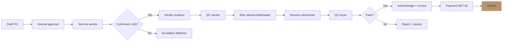
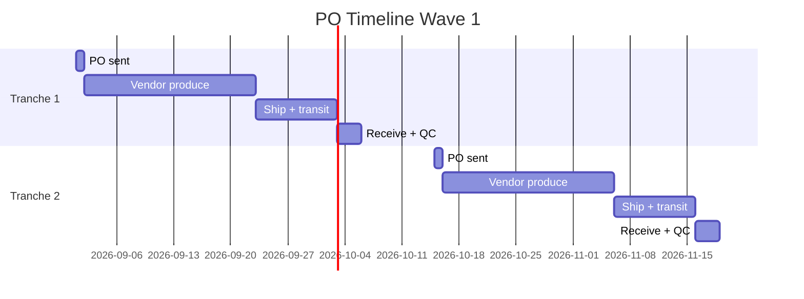

# Purchase Order Management

Generate PO structure: timing, quantity, item spec, delivery schedule. Plus tracking workflow PO lifecycle (open → confirmed → produced → shipped → received → closed).

## Triggers

Primary:
- "PO generate"
- "purchase order [vendor]"
- "release PO"

Secondary:
- "order vendor"
- "po batch [period]"

## Input Required

| Field | Type | Required | Default |
|---|---|---|---|
| vendor | string | yes | - |
| product_category | string | yes | - |
| quantity_target | number | yes | - |
| delivery_target | date | yes | - |
| budget | number Rp | no | (auto from price × qty) |

## Output Template

```markdown
# Purchase Order: {PO_NUMBER}

**Vendor:** {Vendor name}
**PO Date:** {date}
**Delivery target:** {date}
**Total value:** Rp {amount}
**Payment term:** NET 30 (default Selaras)

## PO Header
- PO Number: PO-{YYYYMM}-{seq}
- Buyer: PT Sumber Lawang Sentosa (PT SLS)
- Buyer address: {Balikpapan}
- Ship to: {Showroom address}
- Bill to: {Office Balikpapan}

## Line Items
| Line | SKU | Description | Qty | Unit Price | Subtotal | Notes |
|---|---|---|---|---|---|---|
| 1 | AMK-PINTU-001 | AMK Premium Door Type A 800x2100 brass finish | 50 | Rp 3.5jt | Rp 175jt | Display unit 10 + first batch sales 40 |
| 2 | AMK-PINTU-002 | AMK Premium Door Type B 900x2100 brass finish | 30 | Rp 4.2jt | Rp 126jt | First batch sales |

**Subtotal:** Rp {amount}
**PPN 11%:** Rp {amount}
**Total:** Rp {amount}

## Delivery Schedule
| Tranche | Qty | Delivery target | Mode | Notes |
|---|---|---|---|---|
| Tranche 1 | 30 (display + initial) | {date} | Truck Jakarta-Balikpapan | Critical untuk grand opening |
| Tranche 2 | 50 (replenish) | {date+45d} | Same mode | Buffer untuk demand ramp |

## Quality Acceptance Criteria
- Brass finish: even color, no oxidation, 0 dent
- Wood material: AMK spec sheet compliant
- Dimension tolerance: ±2mm
- Packaging: ply wood crate + corner protector
- Hardware: AMK standard handle included

## Payment Schedule
- DP 30% on PO confirmation: Rp {30%}
- Balance 70% NET 30 post delivery + QC pass: Rp {70%}

## Risk Register
| Risk | Likelihood | Impact | Mitigation |
|---|---|---|---|
| Lead time slip 1 week | Med | High | Buffer 20% built-in + backup vendor on stand-by |
| Quality reject 5%+ | Low | Med | QC checkpoint 2 stage (vendor + warehouse) |
| Logistics delay Jawa-Kaltim | Med | Med | Forwarder commitment + tracking SLA |

## Communication Plan
| Milestone | Action | Channel |
|---|---|---|
| PO sent | Vendor confirm receipt < 24 jam | Email + WA |
| Production start | Vendor send photo update | WA group |
| 50% production | Mid-production photo + ETA confirm | WA + email |
| Ready to ship | Final QC vendor + photo + ship date | Email |
| In-transit | Forwarder tracking number | Email |
| Received | Buyer QC + acknowledge | Email |
| Payment trigger | Invoice + payment scheduled | Email |

## PO Lifecycle Tracker
- [ ] Status: Draft → Approved → Sent → Confirmed → Producing → Shipped → Received → QC Pass → Invoiced → Paid → Closed
- Current status: {status}
- Days since open: {N}
- ETA to close: {date}
```

## Visual Output



Plus Gantt PO timeline:



## Knowledge Dependency

- Vendor Master Agreement (MSA)
- vendor-scorecard skill output
- BP Chapter 7 (supply schedule)
- Unit Economics Q4 (budget validation)
- Lean Store inventory baseline

## Mode

Default: EXECUTION
Switch: NEED_CLARIFICATION jika quantity ambigu vs demand projection

## Tools Required

- file-search
- code-interpreter (subtotal + PPN calculation)
- artifacts (flowchart + Gantt)

## Validation Criteria

- PO number unique format
- All line items dengan SKU + spec + qty + price
- Subtotal + PPN + total mathematically correct
- Delivery tranche aligned dengan demand ramp
- Quality criteria explicit
- Payment schedule align dengan NET terms vendor
- Risk register min 3 risk
- Communication plan checkpoint complete
- Brand canon compliance (no em-dash, "Gerai 1000 Pintu" lengkap di doc)

## Sample I/O

**Input:** "Generate PO Selaras Lawang Sewu untuk wave 1: 80 unit AMK Premium, delivery target 1 Oktober 2026"

**Output summary:**
- PO-202609-001 untuk PT Selaras Lawang Sewu
- 2 line item: Type A 50 unit Rp 175jt, Type B 30 unit Rp 126jt
- Subtotal Rp 301jt + PPN 11% Rp 33.1jt = Total Rp 334.1jt
- 2 tranche delivery (30 unit display + initial Oct 1, 50 unit replenish Nov 15)
- DP 30% on confirm + NET 30 post delivery
- Risk: lead time slip mitigation buffer 20% + backup vendor B
- Communication plan 7 checkpoint
- Flowchart lifecycle + Gantt timeline embedded

## Handoff

- quality-control (untuk QC checkpoint setup)
- logistics-optimizer (untuk Jakarta-Balikpapan route)
- CFO Gerai (validate payment scheduling vs cashflow)
- risk-register (kalau PO critical path)
