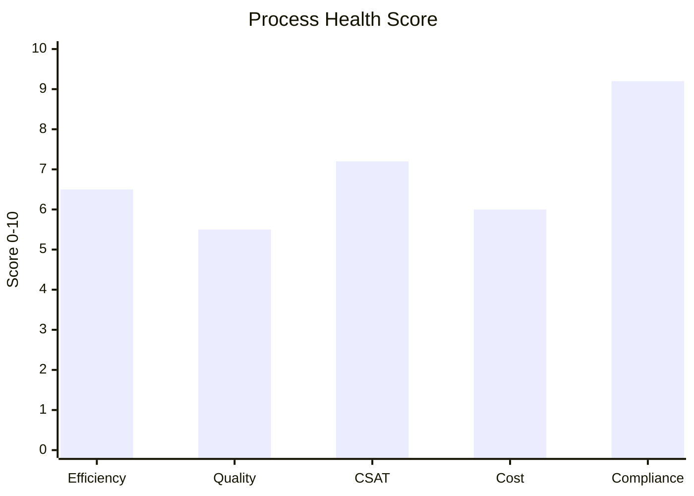
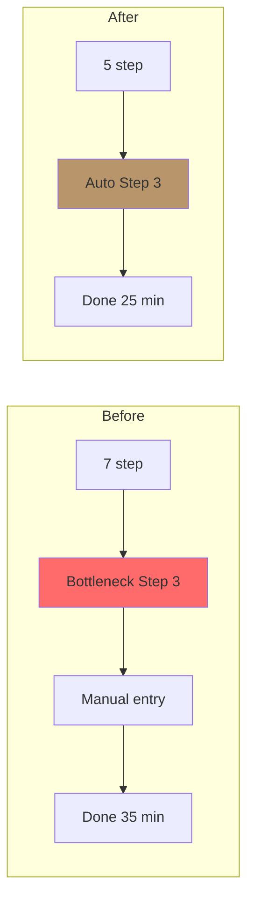

# Process Audit & Improvement

Audit existing process: identify inefficiency, bottleneck, error rate, quality gap. Output: improvement recommendation ranked.

## Triggers

Primary:
- "audit process"
- "process review"
- "improve workflow X"

Secondary:
- "efficiency check"
- "bottleneck analysis"

## Input Required

| Field | Type | Required | Default |
|---|---|---|---|
| process_target | string | yes | - |
| audit_period | string | no | "last 30 day" |
| data_source | object | no | (log + interview) |

## Output Template

```markdown
# Process Audit: {PROCESS}

**Audit period:** {date range}
**Audit method:** {Data analysis + interview + observation}

## Health Score
- **Efficiency:** {score}/10
- **Quality:** {score}/10
- **Customer satisfaction:** {score}/10
- **Cost:** {score}/10
- **Overall:** {score}/10 — {status}

## Process Performance vs Target

| Metric | Current | Target | Variance | Status |
|---|---|---|---|---|
| Cycle time | 35 min | 30 min | +17% | 🟠 |
| Error rate | 8% | <5% | +60% | 🔴 |
| Customer satisfaction | 7.2/10 | 8.5/10 | -15% | 🟠 |
| Cost per cycle | Rp 50K | Rp 40K | +25% | 🟠 |
| Compliance rate | 92% | 100% | -8% | 🟡 |

## Issue Identified

### 🔴 Critical Issues
1. **{Issue name}**
   - **Detail:** {What's happening}
   - **Root cause:** {Why}
   - **Impact:** {Quantified}
   - **Frequency:** {How often}

2. **{...}**

### 🟠 High Priority
3. {...}

### 🟡 Medium
4. {...}

## Root Cause Analysis (5 Whys per critical issue)

### Issue: {Critical 1}
- Why 1: {Surface cause}
- Why 2: {Deeper}
- Why 3: {...}
- Why 4: {...}
- Why 5: {Root cause}

**Root cause:** {Final answer}
**Action target:** {Where to intervene}

## Improvement Recommendation

### Recommendation #1 (Highest ROI)
**Action:** {Specific change}
**Expected impact:** {Quantified}
**Effort:** Low / Med / High
**Cost:** Rp {amount}
**Risk:** {Low/Med/High}
**Timeline:** {N} weeks
**Owner:** {role}

### Recommendation #2
{Same structure}

### Recommendation #3
{Same structure}

## Quick Wins (deploy this week)
1. {Action} — Expected lift 
- Internal documentation compliance: {%}
- Top 3 violation found: {list}
- Recommended training: {topic}
```

## Visual Output

Audit dashboard + before/after process:



Before-After flowchart:



## Knowledge Dependency

- sop-generator skill (current SOP yang di-audit)
- workflow-design skill
- BP Chapter 8 (Lean Store benchmark)
- 5 Nilai Gerai

## Mode

Default: EXECUTION
Switch: DISCUSSION jika improvement direction debate

## Tools Required

- file-search
- code-interpreter (variance + cost calculation)
- artifacts (dashboard + flowchart)

## Validation Criteria

- Health score quantified
- Variance vs target tabular
- 5 Whys per critical issue
- Recommendation ranked by ROI
- Quick wins explicit (deployable today)
- KPI tracking post-implementation setup
- Brand canon audit included
- Process redesign (kalau major change)

## Sample I/O

**Input:** "Audit process inquiry online ke walk-in showroom 30 hari terakhir"

**Output summary:**
- Health 6.8/10 🟠 — efficiency low, error rate 8% (target <5%)
- 3 critical issue: (1) MA response inquiry 4 jam avg (target <2 jam), (2) Door Expert konsultasi schedule conflict 20% reschedule, (3) Documentation missed 8% lead (no CRM entry)
- Root cause: WA group manual (no auto-routing), Door Expert overbooked Friday peak, CRM training gap
- Recommendation top 3: (1) WA auto-responder + assign template (Low effort), (2) Door Expert Friday slot capacity 2x (Med), (3) CRM training week 1 (Low)
- Quick wins: WA auto-greet message deploy today, Friday slot expand week ini
- Health dashboard + before-after flow embedded

## Handoff

- workflow-design (kalau redesign needed)
- sop-generator (update SOP post-fix)
- training-curriculum (kalau skill gap)
- visual-summary (untuk render audit summary)
