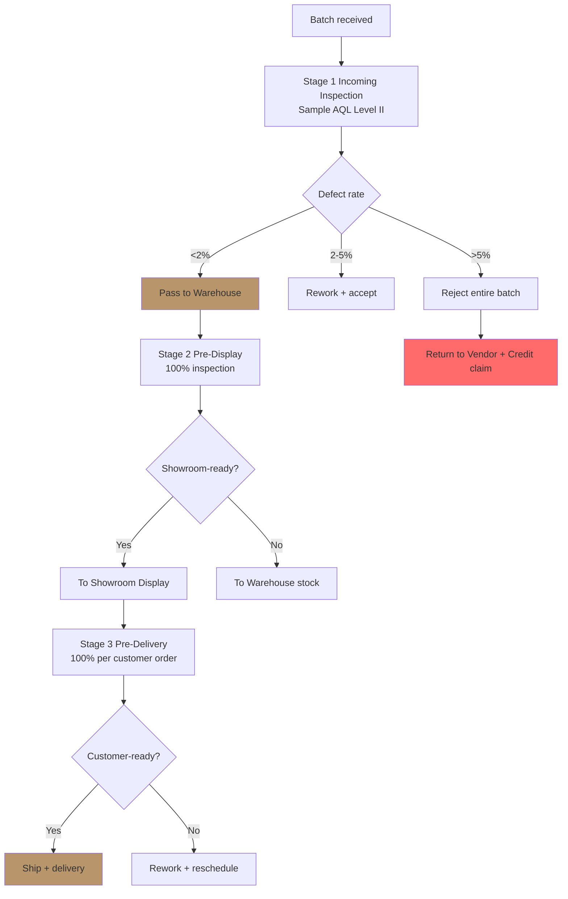

# Quality Control Framework

Design QC checkpoint untuk incoming goods + production batch + customer delivery. Output: QC spec + checklist + acceptance criteria + reject workflow.

## Triggers

Primary:
- "QC checkpoint"
- "quality control"
- "inspect batch"

Secondary:
- "defect rate"
- "quality audit"

## Input Required

| Field | Type | Required | Default |
|---|---|---|---|
| product_category | string | yes | - |
| stage | enum | yes | (incoming/production/pre-delivery) |
| batch_size | number | no | - |

## Output Template

```markdown
# QC Framework: {PRODUCT_CATEGORY} — {STAGE}

**QC objective:** Ensure premium curated standard maintained
**Target defect rate:** <2%
**Acceptable rework:** <5%
**Reject threshold:** >5% defect → return entire batch

## QC Checkpoint Stages

### Stage 1: Incoming Inspection (Vendor → Warehouse)
**Sample size:** AQL Level II (n=8 per 100 unit, MIL-STD-105E)
**Inspector:** Warehouse QC staff (trained)
**Duration per unit:** 5-10 min
**Tools:** Caliper, color spectrometer, moisture meter, lighting standard

### Stage 2: Pre-Display Inspection (Warehouse → Showroom)
**Sample size:** 100% (all unit going to showroom)
**Inspector:** Showroom MA + Door Expert review
**Duration per unit:** 15-20 min
**Focus:** Visual perfection (no minor defect tolerable di display)

### Stage 3: Pre-Delivery Inspection (Showroom → Customer)
**Sample size:** 100% (every unit shipped)
**Inspector:** MA + final approval Door Expert
**Duration per unit:** 30 min (with photo documentation)
**Focus:** Match customer order spec + delivery packaging

## QC Checklist per Stage

### Incoming Inspection Checklist
| # | Item | Pass criteria | Defect category | Severity |
|---|---|---|---|---|
| 1 | Dimension | ±2mm tolerance | Major if >5mm | High |
| 2 | Wood material | AMK spec compliant | Major | High |
| 3 | Brass finish | Even color, no oxidation | Major | Med |
| 4 | Hardware fit | AMK standard handle locked | Major | High |
| 5 | Surface finish | No scratch >2mm | Minor | Low |
| 6 | Packaging | Crate intact, corner protector | Minor | Low |
| 7 | Documentation | Cert quality + spec sheet attached | Major | Med |
| 8 | Hidden defect | Tap test (loose component) | Major | High |

### Pre-Display Inspection Checklist
| # | Item | Pass criteria |
|---|---|---|
| 1-8 | Same as incoming + | - |
| 9 | Visual perfection | Zero scratch visible, finish uniform |
| 10 | Functional test | Hinge smooth, lock click |
| 11 | Photogenic check | Ready for showroom photography |

### Pre-Delivery Inspection Checklist
| # | Item | Pass criteria |
|---|---|---|
| 1-11 | Same as pre-display + | - |
| 12 | Customer order match | SKU + quantity + spec match |
| 13 | Packaging quality | Bubble wrap + corner + label clear |
| 14 | Delivery doc | Surat jalan + warranty card + manual |
| 15 | Photo documentation | 6-angle photo before shipping |

## Defect Categorization

### Critical (Reject + Return)
- Structural integrity compromised
- Dimension off >5mm
- Hardware incompatible
- Hidden defect (cracks, loose component)

### Major (Rework before pass)
- Visible surface scratch >2mm
- Brass oxidation patchy
- Documentation incomplete
- Packaging compromised

### Minor (Note + accept)
- Surface scratch <2mm (low-traffic area)
- Minor color variation acceptable AMK spec
- Packaging shabby tapi product intact

## Reject Workflow

```
Defect found
   ↓
Severity classify (Critical/Major/Minor)
   ↓
IF Critical → Hold batch + photo + report vendor + return entire tranche
IF Major → Hold unit + rework attempt (vendor onsite atau return)
IF Minor → Note + accept (deduct from premium tier inventory ke "regular")
```

## KPI Tracking

| Metric | Target | Tracking source |
|---|---|---|
| Incoming defect rate | <2% | QC log Stage 1 |
| Rework rate | <5% | Production tracking |
| Customer reject rate | <0.5% | Aftersales log |
| Vendor SLA penalty trigger | >5% defect | MSA clause |
| QC duration per unit | <30 min | Time log |

## Brand Canon Alignment
- "premium curated" standard = strict QC
- Tone calm refined = no "asal jadi" tolerance
- Door Expert authority validate final pre-delivery
- No em-dash di QC report

## Reject Communication Template (ke Vendor)

```
Subject: QC Report Batch {PO Number} — {N} unit rejected

Bapak/Ibu {Vendor contact},

Hasil QC batch PO {number} tanggal {date}:
- Total inspect: {N} unit
- Pass: {N} unit
- Rework needed: {N} unit
- Critical reject: {N} unit (return)

Detail defect terlampir (photo + spec breakdown).

Sesuai MSA clause {X}:
- Critical reject: full credit Rp {amount}
- Rework option: vendor send teknisi atau ganti unit (deadline {date})

Mohon respond <24 jam.

Salam,
COO Gerai 1000 Pintu
```
```

## Visual Output

QC workflow flowchart:



Plus defect severity heatmap:

```markdown
| Defect type \ Severity | Critical (reject) | Major (rework) | Minor (accept) |
|---|---|---|---|
| Dimension off | >5mm | 2-5mm | <2mm |
| Surface | Crack | Scratch >2mm | Scratch <2mm |
| Finish | Patchy oxidation | Uneven brass | Color variation OK |
| Hardware | Incompatible | Stuck hinge | - |
| Hidden | Loose component | - | - |
```

## Knowledge Dependency

- AMK product spec sheet
- BP Chapter 7 (Quality standard)
- vendor-scorecard skill output
- Brand Canon (premium curated definition)

## Mode

Default: EXECUTION
Switch: NEED_CLARIFICATION jika spec product belum ada

## Tools Required

- file-search
- artifacts (flowchart + heatmap)

## Validation Criteria

- 3 stage QC checkpoint complete
- Sample size statistically valid (AQL standard)
- Checklist concrete per item (pass criteria measurable)
- Defect categorization 3-tier (Critical/Major/Minor)
- Reject workflow explicit
- KPI tracking setup
- Brand canon "premium curated" standard maintained
- Communication template ready-to-use

## Sample I/O

**Input:** "QC framework untuk batch wave 1 80 unit AMK Premium dari Selaras Lawang Sewu"

**Output summary:**
- 3-stage QC: Incoming AQL Level II (n=8 sample), Pre-display 100%, Pre-delivery 100% + photo doc
- 8 checkpoint criteria incoming + 11 pre-display + 15 pre-delivery
- Defect tier: Critical (>5mm dimension, crack, hardware incompat) reject; Major (scratch >2mm, patchy oxidation) rework; Minor (<2mm scratch) accept
- KPI target: incoming <2% defect, rework <5%, customer reject <0.5%
- Workflow flowchart + severity heatmap + communication template embedded

## Handoff

- po-management (kalau reject → claim)
- vendor-onboarding (kalau vendor consistently issue → re-evaluate)
- showroom-experience-design (post-QC ke display)
- customer-research (kalau customer reject feedback → vendor improvement)
