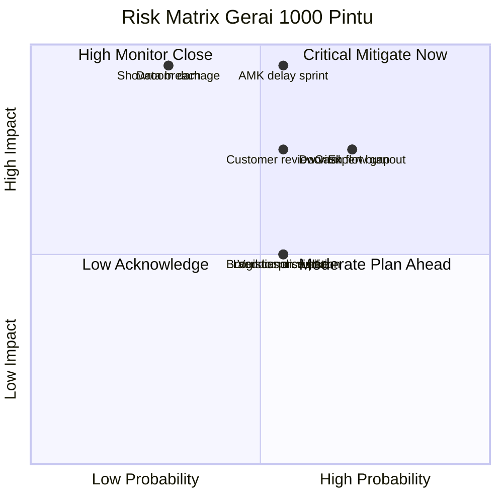
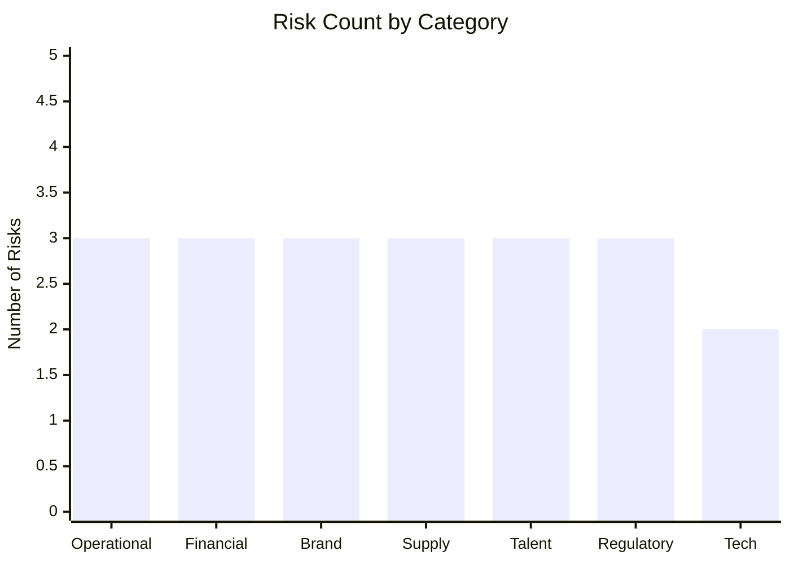

# Risk Register

Maintain comprehensive risk register Gerai 1000 Pintu: identifikasi, probabilitas, impact, mitigation owner, monitoring cadence. Cover operational, financial, brand, supply, talent, regulatory risk.

## Triggers

Primary:
- "risk register"
- "daftar risiko"
- "risk assessment"

Secondary:
- "manajemen risiko"
- "risk matrix"

## Input Required

| Field | Type | Required | Default |
|---|---|---|---|
| scope | enum | yes | (full / category-specific) |
| time_horizon | string | no | (e.g., "Q4 2026" or "Wave 1 launch") |
| context | string | no | (specific situation triggering review) |

## Output Template

```markdown
# Risk Register: {SCOPE}

**Period:** {Time horizon}
**Last review:** {Date}
**Next review:** {Date}
**Owner:** Matthew (CEO) + Risk owner per category

## Risk Matrix (Probability × Impact)

| Probability \ Impact | Low (1) | Medium (2) | High (3) | Critical (4) |
|---|---|---|---|---|
| Very High (5) | 5 | 10 | 15 | 20 |
| High (4) | 4 | 8 | 12 | 16 |
| Medium (3) | 3 | 6 | 9 | 12 |
| Low (2) | 2 | 4 | 6 | 8 |
| Very Low (1) | 1 | 2 | 3 | 4 |

**Threshold:**
- Score 12-20: 🔴 CRITICAL (immediate mitigation + Matthew oversight weekly)
- Score 6-11: 🟡 HIGH (mitigation plan + monthly review)
- Score 3-5: 🟢 MODERATE (monitoring + quarterly review)
- Score 1-2: ⚪ LOW (acknowledged, no active mitigation)

## Category 1: Operational Risk

### R-OP-001: Lean Store staf single point of failure
- **Description:** MA sakit / resign mendadak, cabang tidak ada coverage
- **Probability:** Medium (3) | **Impact:** High (3) | **Score:** 9 🟡
- **Mitigation:**
  - Cross-train MA #1 + MA #2 fully interchangeable
  - Backup contact list (freelance MA Senior pool 2 person)
  - SOP detail bisa di-onboard cepat
  - Door Expert remote sebagai supervisor virtual
- **Owner:** COO + HR
- **Review:** Monthly

### R-OP-002: Door Expert burnout (single person multi-cabang)
- **Description:** Konsultasi load >120/month sustained, fatigue
- **Probability:** High (4) | **Impact:** High (3) | **Score:** 12 🔴
- **Mitigation:**
  - Capacity tracking realtime dashboard
  - Cap konsultasi 100/month per Door Expert
  - Trigger hire Door Expert #2 saat 120+ sustained 2 quarter
  - Mandatory rest Wednesday afternoon
- **Owner:** COO + Door Expert direct
- **Review:** Weekly

### R-OP-003: Showroom physical damage (kebakaran, banjir)
- **Description:** Display rusak, customer experience impacted
- **Probability:** Low (2) | **Impact:** Critical (4) | **Score:** 8 🟡
- **Mitigation:**
  - Asuransi all-risk showroom Rp 500jt coverage
  - Fire safety: smoke detector + alarm + sprinkler
  - Inventory backup di gudang off-site
  - Vendor restock cepat (24-48 jam emergency)
- **Owner:** COO + Facility
- **Review:** Quarterly

## Category 2: Financial Risk

### R-FN-001: Cash flow gap (delayed customer payment)
- **Description:** Customer enterprise project bayar lambat 60-90 hari
- **Probability:** High (4) | **Impact:** High (3) | **Score:** 12 🔴
- **Mitigation:**
  - DP 50% upfront mandatory enterprise project
  - Cash reserve 3 month operating cost minimum
  - Working capital line dari bank (standby Rp 200jt)
  - Invoice factoring opsi (kalau perlu)
- **Owner:** CFO + COO
- **Review:** Monthly

### R-FN-002: Vendor harga naik tiba-tiba
- **Description:** Supplier kayu/brass naik 15-20% impacting margin
- **Probability:** Medium (3) | **Impact:** Medium (2) | **Score:** 6 🟡
- **Mitigation:**
  - Multi-vendor sourcing (min 2 alternative per category)
  - Price lock contract 6-12 month dengan vendor utama
  - Margin buffer 5% di pricing
  - Pass-through clause kalau material >10% naik
- **Owner:** CFO + Procurement
- **Review:** Quarterly

### R-FN-003: Wave 1 launch revenue di bawah target
- **Description:** Wave 1 actual <60% target Rp 800jt
- **Probability:** Medium (3) | **Impact:** High (3) | **Score:** 9 🟡
- **Mitigation:**
  - Conservative target setting (revenue based 6 persona realistic)
  - Buffer marketing budget Rp 50jt untuk push
  - Pipeline tracking weekly (visibility lead)
  - Pivot plan: extended soft-opening kalau readiness gap
- **Owner:** CMO + CEO
- **Review:** Weekly during Wave 1

## Category 3: Brand & Reputation Risk

### R-BR-001: Brand canon violation public (em-dash, "rumah", dll)
- **Description:** Caption / signage / press salah, brand integrity damaged
- **Probability:** Medium (3) | **Impact:** Medium (2) | **Score:** 6 🟡
- **Mitigation:**
  - Editorial Reviewer agent 100% pass before publish
  - Brand canon training quarterly refresher
  - Internal audit sample mingguan
  - Quick correction protocol kalau slip (within 24h)
- **Owner:** CCO + Marketing
- **Review:** Monthly

### R-BR-002: Customer review negative viral (Google, Instagram)
- **Description:** Customer kecewa post, screenshot viral
- **Probability:** Medium (3) | **Impact:** High (3) | **Score:** 9 🟡
- **Mitigation:**
  - 5 Nilai service standard high baseline
  - Issue escalation protocol within 4 hour
  - Public response professional tone (premium hangat)
  - Aftersales follow-up rigorous
  - Crisis playbook ready (refer contingency-plan)
- **Owner:** CMO + COO
- **Review:** Continuous monitoring

### R-BR-003: Influencer collab gagal / reputation mismatch
- **Description:** KOL/influencer associated dengan controversy
- **Probability:** Low (2) | **Impact:** Medium (2) | **Score:** 4 🟢
- **Mitigation:**
  - Influencer vetting strict (refer cmo.influencer-vetting)
  - Contract clause exit kalau controversy emerge
  - Backup influencer roster
  - Brand association audit quarterly
- **Owner:** CMO
- **Review:** Per campaign

## Category 4: Supply Chain Risk

### R-SC-001: AMK Premium delay critical sprint
- **Description:** Vendor inti delay >2 minggu sprint S6-S8
- **Probability:** Medium (3) | **Impact:** Critical (4) | **Score:** 12 🔴
- **Mitigation:**
  - PO lock S4 untuk delivery S7 (3-month buffer)
  - Alternative vendor short-list (3 backup)
  - Weekly sync AMK status update
  - Sprint flex plan kalau delay
- **Owner:** COO + Procurement
- **Review:** Weekly during S6-S8

### R-SC-002: Logistics Jakarta-Balikpapan disruption
- **Description:** Truck breakdown, cuaca, port congestion
- **Probability:** Medium (3) | **Impact:** Medium (2) | **Score:** 6 🟡
- **Mitigation:**
  - Multi-carrier (truck + sea + air opsi)
  - Buffer 7 hari di timeline
  - Insurance cargo Rp 200jt
  - Real-time tracking + escalation
- **Owner:** COO + Logistics
- **Review:** Per shipment

### R-SC-003: Container customs delay (kalau impor)
- **Description:** Customs clearance lambat, fitting impor stuck
- **Probability:** Low (2) | **Impact:** Medium (2) | **Score:** 4 🟢
- **Mitigation:**
  - Pre-clearance documentation lengkap
  - Customs broker terpercaya
  - Buffer 14 hari kalau impor critical
  - Domestic alternative siap
- **Owner:** COO + Procurement
- **Review:** Per import

## Category 5: Talent Risk

### R-TL-001: Door Expert resign sebelum Phase 2
- **Description:** Single Door Expert resign, knowledge loss
- **Probability:** Low (2) | **Impact:** Critical (4) | **Score:** 8 🟡
- **Mitigation:**
  - Compensation competitive Rp 10-15jt
  - Career path clear (Master path defined)
  - Knowledge documentation thorough
  - MA Senior train as backup
  - Notice period 60-day contract clause
- **Owner:** HR + CEO
- **Review:** Quarterly engagement check

### R-TL-002: MA quality drift (brand canon, 5 Nilai)
- **Description:** Performance gradually declining post-onboarding
- **Probability:** Medium (3) | **Impact:** Medium (2) | **Score:** 6 🟡
- **Mitigation:**
  - Quarterly performance review
  - Brand canon audit sample mingguan
  - Continuous training refresher
  - Mentor activity (Door Expert + Senior)
- **Owner:** COO + Door Expert
- **Review:** Quarterly

### R-TL-003: Tim Pusat key role resign (Marketing Lead, Brand)
- **Description:** Senior Pusat resign, momentum loss
- **Probability:** Low (2) | **Impact:** High (3) | **Score:** 6 🟡
- **Mitigation:**
  - Documentation playbook lengkap
  - Cross-training Pusat (2 person know each function)
  - Contractor freelance pool standby
  - Recruitment pipeline always warm
- **Owner:** HR + Matthew
- **Review:** Quarterly

## Category 6: Regulatory & Compliance Risk

### R-RG-001: Tax compliance gap (PPN, PPh)
- **Description:** Late filing atau salah perhitungan
- **Probability:** Low (2) | **Impact:** High (3) | **Score:** 6 🟡
- **Mitigation:**
  - Accountant external Rp 3jt/bulan retainer
  - Automated bookkeeping system
  - Quarterly tax planning review
  - Reserve 30% revenue untuk tax obligation
- **Owner:** CFO + External accountant
- **Review:** Monthly

### R-RG-002: Izin usaha + showroom (IMB, SIUP, dll)
- **Description:** Permit expire, izin lacking
- **Probability:** Low (2) | **Impact:** Medium (2) | **Score:** 4 🟢
- **Mitigation:**
  - Permit tracking calendar
  - Renewal 60-day before expire
  - Lawyer / konsultan permit standby
- **Owner:** COO + Legal advisor
- **Review:** Quarterly

### R-RG-003: Konsumen perlindungan (warranty dispute)
- **Description:** Customer claim warranty + tuntutan hukum
- **Probability:** Low (2) | **Impact:** Medium (2) | **Score:** 4 🟢
- **Mitigation:**
  - Warranty terms jelas + tertulis
  - Customer agreement signed
  - Mediation first protocol
  - Legal counsel standby
- **Owner:** Legal + COO
- **Review:** Per dispute

## Category 7: Technology & Data Risk

### R-TX-001: AI Department app downtime
- **Description:** gerai.mahewwork.com tidak accessible, operations impacted
- **Probability:** Low (2) | **Impact:** Medium (2) | **Score:** 4 🟢
- **Mitigation:**
  - Vercel SLA + monitoring
  - Fallback manual workflow documented
  - Provider abstraction (multi-provider failover)
  - Daily backup
- **Owner:** CTO (Matthew) + DevOps
- **Review:** Continuous monitoring

### R-TX-002: Data customer leak / breach
- **Description:** CRM data customer exposed
- **Probability:** Low (2) | **Impact:** Critical (4) | **Score:** 8 🟡
- **Mitigation:**
  - Encryption at rest + in transit
  - Access control role-based
  - Audit log all access
  - Security review quarterly
  - Privacy policy compliant UU PDP
- **Owner:** CTO + Legal
- **Review:** Quarterly

## Risk Summary Dashboard

| Category | Total Risks | Critical 🔴 | High 🟡 | Moderate 🟢 |
|---|---|---|---|---|
| Operational | 3 | 1 | 2 | 0 |
| Financial | 3 | 1 | 2 | 0 |
| Brand | 3 | 0 | 2 | 1 |
| Supply Chain | 3 | 1 | 1 | 1 |
| Talent | 3 | 0 | 3 | 0 |
| Regulatory | 3 | 0 | 1 | 2 |
| Technology | 2 | 0 | 1 | 1 |
| **Total** | **20** | **3** | **12** | **5** |

## Top 3 Critical Risks (Score 12+)

1. **R-OP-002 Door Expert burnout** (Score 12) → Capacity cap + hire trigger
2. **R-FN-001 Cash flow gap** (Score 12) → DP 50% upfront + cash reserve
3. **R-SC-001 AMK delay critical sprint** (Score 12) → PO lock S4 + backup vendor

## Review Cadence

| Risk Level | Review Frequency | Owner |
|---|---|---|
| Critical 🔴 | Weekly | Matthew + Risk owner |
| High 🟡 | Monthly | Risk owner |
| Moderate 🟢 | Quarterly | Risk owner |
| Low ⚪ | Annually | Risk owner |
```

## Visual Output

Risk matrix heatmap + category breakdown:



Risk by category bar chart:



## Knowledge Dependency

- BP Chapter 16 (Risk Management)
- contingency-plan skill (linked response)
- 5 Nilai Gerai (brand standard baseline)
- All C-Level functional skills (per category owner)

## Mode

Default: EXECUTION
Switch: DISCUSSION jika new risk emerge atau probability/impact re-assessment

## Tools Required

- file-search
- artifacts (quadrant + chart + matrix)

## Validation Criteria

- 7 category covered (operational, financial, brand, supply, talent, regulatory, tech)
- Min 20 risks total
- Probability × Impact scoring explicit
- Mitigation per risk specific + actionable
- Owner clear per risk
- Review cadence aligned dengan severity
- Top 3 critical highlighted
- Dashboard summary table

## Sample I/O

**Input:** "Risk register full Wave 1 launch Q4 2026"

**Output summary:**
- 20 risks identified across 7 category (Operational, Financial, Brand, Supply, Talent, Regulatory, Tech)
- 3 Critical 🔴 (score 12+): Door Expert burnout, Cash flow gap, AMK delay sprint
- 12 High 🟡 (score 6-11): including showroom damage, Wave 1 revenue, customer review viral, MA quality drift
- 5 Moderate 🟢 (score 3-5): regulatory + tech mostly
- Mitigation: cross-training, DP 50% upfront, PO lock S4, asuransi all-risk, capacity cap
- Owner per risk: Matthew + functional C-Level
- Review cadence weekly (critical) → monthly (high) → quarterly (moderate)
- Risk matrix quadrant + category bar chart embedded

## Handoff

- contingency-plan (response protocol per scenario)
- CFO Gerai (financial risk + insurance)
- CMO (brand + customer + influencer risk)
- weekly-ops-report (risk surveillance summary)
