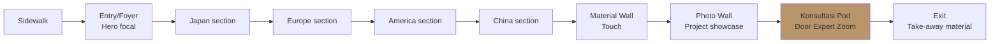

# Showroom Experience Design

Design physical customer journey di showroom: entry, curated path, touch experience, konsultasi pod, exit. Brand canon palette + sensory + emotional.

## Triggers

Primary:
- "showroom design"
- "customer experience fisik"
- "layout showroom"

Secondary:
- "store atmosphere"
- "sensory branding"

## Input Required

| Field | Type | Required | Default |
|---|---|---|---|
| location | string | yes | (Balikpapan default) |
| size_m2 | number | yes | (typical 100-150) |
| budget_buildout | number Rp | no | - |

## Output Template

```markdown
# Showroom Experience Design: {LOCATION}

**Area:** {N} m²
**Budget buildout:** Rp {amount}
**Design anchor:** Aesop + Design Within Reach (premium curated retail)

## Customer Journey Physical (5-stage)

### Stage 1: Approach (Sidewalk → Entrance)
**Goal:** Pre-frame premium curated impression
**Element:**
- Storefront signage subtle (brass nameplate + serif typography)
- Window display 1-2 hero pintu archetype (rotated weekly)
- Lighting warm 3000K (no fluorescent commercial)
- No sales banner (jangan loud)

### Stage 2: Entry (Doorway → Foyer)
**Goal:** Welcome with calm, signal "ini bukan toko bahan bangunan biasa"
**Element:**
- Hero focal point: 1 pintu brass detail framed display
- Brass + ivory palette dominant
- Subtle scent ambient (nature wood / nothing — avoid synthetic)
- Greeter MA in 2-second proximity (tidak intrusive)
- Floor: warm wood atau natural stone (no glossy commercial tile)

### Stage 3: Curated Journey (Foyer → Display)
**Goal:** Walk-through experience 4-Dunia archetype
**Element:**
- Path linear OR free-flow (depend layout) but curated
- Section per archetype:
  - **Japan section:** Tatami floor + shoji-inspired pintu + minimalist
  - **Europe section:** Art Nouveau brass detail + craftsmanship close-up
  - **America section:** Statement scale pintu + dramatic lighting
  - **China section:** Brass handle traditional + feng shui copywriting
- Material touch wall: kayu sample + brass swatch + finish texture (touch encouraged)
- Photography wall: project completed customer (anonymized)
- Soundscape: ambient calm (instrumental, jangan radio commercial)

### Stage 4: Konsultasi Pod (Display → Private)
**Goal:** Deep conversation Door Expert
**Element:**
- Semi-private booth (acoustic separated, visual transparant)
- Zoom setup: 4K webcam + HD audio + dual screen (Door Expert + product)
- Comfortable seating 2-3 person (customer + companion)
- Coffee/tea service subtle (premium hangat hospitality)
- Catalog physical + digital screen toggle
- Note-taking material untuk customer

### Stage 5: Exit (Konsultasi → Departure)
**Goal:** Leave with positive impression + next step clear
**Element:**
- Brief recap by MA
- Take-away material:
  - Curated catalog pages (printed yang spec dipertimbangkan)
  - Business card Door Expert + contact direct
  - Schedule follow-up (WhatsApp + email)
- Gift kecil opsional (kalau project commitment): sample kayu small atau pin brass
- Door open by MA (gesture hangat)

## Layout Diagram (100 m² typical)

```
┌────────────────────────────────────────────┐
│              SIDEWALK / PARKING            │
│                                            │
├─────────┬──────────────────────────────────┤
│  Window │  Entry / Foyer (10 m²)          │
│  Display│  [Hero pintu brass focal]       │
│         ├──────────────────────────────────┤
│         │                                  │
│         │  Curated Journey (40 m²)        │
│         │  ┌────┬────┬────┬────┐          │
│         │  │JPN │EUR │AME │CHN │ 4-Dunia  │
│         │  └────┴────┴────┴────┘          │
│         │  [Material wall + Photo wall]   │
│         │                                  │
├─────────┼──────────────────────────────────┤
│ Konsult │   Backend (25 m²)               │
│ Pod     │   Warehouse + Admin             │
│ (15 m²) │                                  │
└─────────┴──────────────────────────────────┘
       Total: ~100 m²
```

## Sensory Design Elements

### Visual
- Palette: Brass 10% + Charcoal 60% + Ivory 30% (consistent)
- Lighting: natural day + warm 3000K accent (NOT commercial cool 5000K)
- Typography on display: Playfair serif (display) + Inter sans (caption)
- Photography style: tight detail + natural daylight

### Auditory
- Background ambient: minimal instrumental (Aesop reference: calm, sparse)
- Volume: max 35-40 dB ambient (conversation comfortable)
- NO commercial radio, NO loud music

### Olfactory
- Subtle nature wood scent (kalau possible)
- OR neutral (avoid synthetic strong)
- Specifically: NO floral commercial, NO oud heavy

### Tactile
- Material wall: encouraged touch (kayu sample, brass swatch)
- Floor material: warm under foot (wood / natural stone)
- Konsultasi seating: comfortable premium (no cheap office chair feeling)

### Gustatory (kalau service food/beverage)
- Coffee / tea offering: premium Indonesia (kopi single origin, teh artisan)
- Tidak push, hanya offer
- Tidak ada makanan berat

## Brand Canon Strict Compliance

### Visual
- Palette strict
- Typography serif + sans matched
- Photography style consistent
- NO neon, NO gradient flashy, NO drop shadow heavy

### Verbal
- Signage: "tempat" not "rumah", "Gerai 1000 Pintu" lengkap
- Caption / placard: serif italic for accent, no em-dash
- Marketing material: premium hangat
- Anchor reference: Aesop + Design Within Reach

### Behavioral
- Staff behavior: calm refined, listen first
- Service standard: 5 Nilai applied physically (Pelayanan Nyaman demonstrated)
- No aggressive sales approach

## Buildout Budget Estimate (100 m²)

| Item | Cost Rp |
|---|---|
| Interior design + arsitek fee | 15jt |
| Construction + finishing | 80-120jt |
| Lighting custom warm | 25jt |
| Display fixture custom | 40jt |
| Konsultasi pod fitout (technology + furniture) | 25jt |
| Material wall + sample | 15jt |
| Signage brass + typography | 10jt |
| Soft furnishing (seating, accessories) | 20jt |
| Tools + workstation | 15jt |
| Plant + decoration | 5jt |
| **Total buildout** | **Rp 250-300jt** |

## Quality Standards

### Maintenance Daily
- Cleaning + dust per display surface
- Touch wall sample replenish kalau habis
- Photography wall update mingguan (1 new project)
- Material status check (brass tarnish? wood swell?)

### Refresh Quarterly
- Section archetype rotation (per quarter)
- Display product rotation (3 month max same display)
- Photography wall full refresh
- Soft furnishing assessment

### Renovation Yearly
- Major lighting update kalau perlu
- Floor + wall touch-up
- Hardware functional check

## KPI Showroom Experience

| Metric | Target |
|---|---|
| Customer dwell time | 45+ min average |
| Tour completion (all 4 archetype) | 70%+ |
| Konsultasi booking from walk-in | 40%+ |
| Customer photo posting (UGC) | 5+/week |
| Repeat visit | 20%+ within 30 day |
| CSAT showroom experience | 9/10+ |

## Risk + Mitigation

| Risk | Mitigation |
|---|---|
| Customer perceive "intimidating premium" | Train MA welcome hangat + accessible vocabulary |
| Section confusion (kalau path linear) | Clear signage + MA guide path |
| Material wall wear (frequent touch) | Replenish schedule + rotate sample |
| Konsultasi pod busy peak hour | Booking system + secondary informal area |
```

## Visual Output

Showroom layout diagram + customer journey:



Sensory matrix:

```markdown
| Sense | Element | Brand Canon |
|---|---|---|
| Visual | Brass 10%+Charcoal 60%+Ivory 30% | ✅ Timeless Foundation |
| Auditory | Ambient 35-40dB calm instrumental | ✅ Refined |
| Olfactory | Subtle wood / neutral | ✅ Natural |
| Tactile | Material touch encouraged | ✅ Premium hands-on |
| Gustatory | Premium kopi/teh subtle offer | ✅ Hospitality |
```

## Knowledge Dependency

- Brand Canon (visual identity locked)
- Anchor reference Aesop + Design Within Reach
- 6 Persona spec (untuk experience customization)
- Filosofi 4-Dunia archetype
- lean-store-design skill
- door-expert-operating-model skill

## Mode

Default: EXECUTION
Switch: DISCUSSION jika sensory choice debate (e.g., scent yes/no)

## Tools Required

- file-search
- web-search (Aesop/DWR reference inspiration)
- artifacts (layout + flowchart + sensory matrix)

## Validation Criteria

- 5-stage journey explicit (Approach → Entry → Curated → Konsultasi → Exit)
- 4-Dunia archetype section design
- Sensory dimension 5-sense covered
- Brand canon strict (palette ratio, typography, vocabulary)
- Buildout budget realistic Indonesia 2026 Balikpapan
- Maintenance + refresh + renovation cadence defined
- KPI showroom experience measurable
- Risk + mitigation min 3
- Anchor Aesop + DWR explicit

## Sample I/O

**Input:** "Showroom experience design Cabang Balikpapan 120 m² launch wave 1"

**Output summary:**
- 5-stage journey: Approach → Entry hero pintu brass → Curated 4-Dunia archetype (Japan/Europe/America/China) → Konsultasi pod Zoom Door Expert → Exit take-away
- Layout: 10% foyer, 40% curated journey, 15% konsultasi pod, 25% backend, 10% circulation
- Sensory: warm 3000K + ambient instrumental + subtle wood scent + material touch encouraged + premium kopi offer
- Buildout Rp 250-300jt (interior + lighting + fixture + pod + material wall)
- KPI: 45+ min dwell, 70%+ 4-archetype tour completion, 40%+ konsultasi conversion
- Anchor: Aesop + Design Within Reach reference
- Layout diagram + sensory matrix embedded

## Handoff

- door-expert-operating-model (integrate konsultasi pod)
- CCO Brand Strategist agent (visual direction validation)
- CFO Gerai (buildout budget approval)
- visual-summary (untuk render layout mockup detail)
