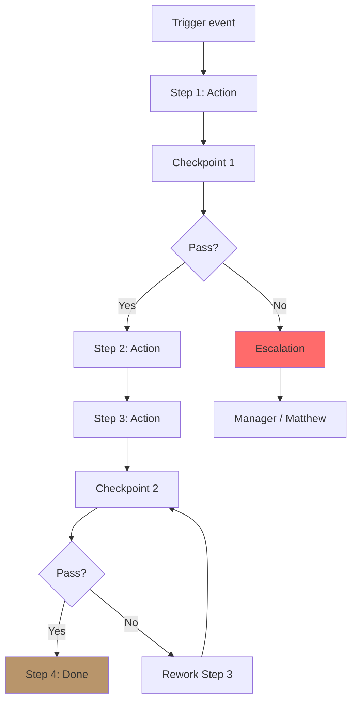
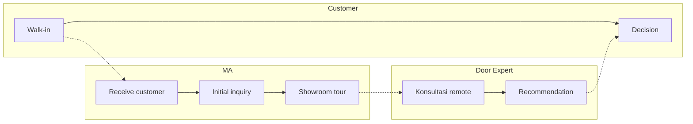

# SOP Generator (Standard Operating Procedure)

Generate SOP step-by-step untuk task operasional: action sequence, PIC, tools, checkpoint, output expected, edge case handling.

## Triggers

Primary:
- "SOP"
- "standard operating procedure"
- "prosedur untuk [X]"

Secondary:
- "playbook"
- "step-by-step process"

## Input Required

| Field | Type | Required | Default |
|---|---|---|---|
| sop_topic | string | yes | - |
| owner_role | string | yes | (e.g., MA, Door Expert, Tim Pusat) |
| frequency | enum | no | (daily/weekly/event-triggered) |

## Output Template

```markdown
# SOP: {TOPIC}

**SOP ID:** SOP-{category}-{seq}
**Version:** 1.0
**Effective date:** {date}
**Review cycle:** Quarterly
**Owner role:** {role}
**Approver:** Matthew (Founder)

## Purpose
{1-2 kalimat: kenapa SOP ini ada, outcome yang diharapkan}

## Scope
**Applicable to:** {role + situation}
**Out of scope:** {what NOT covered by this SOP}

## Pre-requisites
- [ ] Knowledge: {what staff harus tahu sebelum execute}
- [ ] Tools: {alat/system needed}
- [ ] Authorization: {kalau perlu approval Matthew/Manager}

## Step-by-Step Procedure

### Step 1: {Action name}
**Action:** {Specific action}
**PIC:** {who}
**Tools:** {what to use}
**Duration:** {time}
**Checkpoint:** {how to verify done correctly}
**Output:** {what artifact produced}

### Step 2: {Action name}
{Same structure}

### Step 3-N: {...}

## Decision Points & Branching

### Decision 1: {When this comes up}
- IF {condition} → go to Step X
- IF {condition} → escalate to {role}
- IF {condition} → reject + document reason

## Edge Cases / Exception Handling

### Exception 1: {Scenario}
**Trigger:** {what happens}
**Response:** {how to handle}
**Escalation:** {when to involve Matthew/Manager}

### Exception 2: {...}

## Quality Checkpoint
| Checkpoint | Criteria pass | Action if fail |
|---|---|---|

## Documentation
- {What to log + where}
- {Photo/screenshot requirement}
- {Sign-off needed}

## SLA / Timing
- Total expected duration: {time}
- Step-by-step time breakdown
- Maximum acceptable variance: {%}

## Tools & Templates
- {Template form / checklist link}
- {System access needed}

## Training Required
- {Skill level: beginner/intermediate/advanced}
- {Estimated training time: hours}
- {Reference material}

## Continuous Improvement
- Feedback channel: WA group + monthly retrospective
- Review trigger: 3-month cycle atau ad-hoc kalau exception >5%

## Brand Canon Compliance
- Customer-facing language: premium hangat tone
- No em-dash, "tempat" not "rumah"
- "Gerai 1000 Pintu" lengkap di semua komunikasi external
- Anchor service standard BP Latest reference
```

## Visual Output

Process flowchart:



Plus swimlane untuk multi-actor SOP:



## Knowledge Dependency

- BP Chapter 8 (Lean Store + Door Expert)
- BP Chapter 14 (Struktur Organisasi)
- Brand Canon
- 5 Nilai Gerai (Inspirasi, Keahlian, Pelayanan Nyaman, Inovasi, Aftersales)

## Mode

Default: EXECUTION
Switch: NEED_CLARIFICATION jika scope ambigu

## Tools Required

- file-search
- artifacts (flowchart + swimlane)

## Validation Criteria

- 3-7 main step (bukan 30+ micro-step)
- Decision point + branching explicit
- Edge case min 2
- PIC clear per step
- Checkpoint measurable
- SLA timing realistic
- Documentation requirement explicit
- Brand canon compliance
- Training requirement noted

## Sample I/O

**Input:** "SOP untuk Marketing Advisor (MA) welcome customer di showroom Balikpapan"

**Output summary:**
- SOP ID: SOP-SHOWROOM-001 v1.0
- 7-step: Greet → Identify intent → Showroom tour → Door Expert intro → Konsultasi book → Follow-up → Documentation
- Decision: Walk-in vs Inquiry, MA handle vs Door Expert needed
- Exception: Customer rude/agresif → escalate manager
- SLA: 30 menit avg per customer
- 5 Nilai checkpoint: Inspirasi (showcase narrative), Keahlian (Door Expert intro), Pelayanan Nyaman (service tone), Aftersales (follow-up)
- Flowchart + swimlane MA-Door Expert-Customer embedded

## Handoff

- workflow-design (kalau cross-functional)
- training-curriculum (skill needed untuk execute SOP)
- process-audit (review effectiveness setelah 3 bulan)
