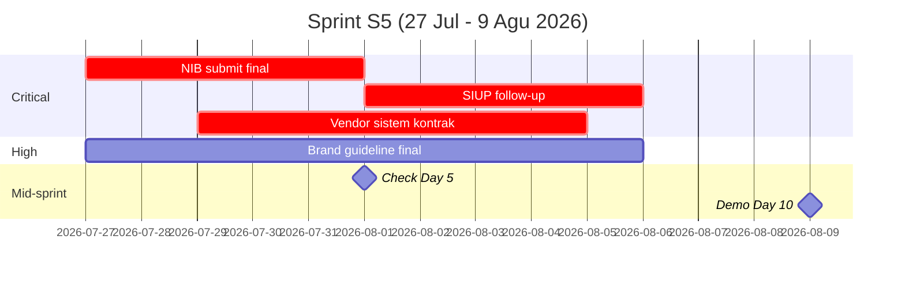
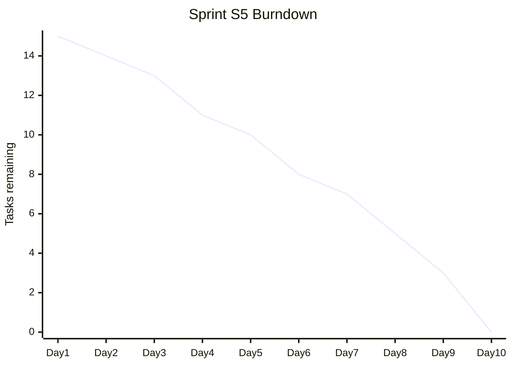

# Sprint Planner (2-week iteration)

Plan sprint structure: goal, task allocation per role/team, milestone definition, retrospective triggers.

## Triggers

Primary:
- "sprint plan"
- "iterasi 2 minggu"
- "sprint goal"

Secondary:
- "weekly sprint"
- "team velocity"

## Input Required

| Field | Type | Required | Default |
|---|---|---|---|
| sprint_number | string | yes | (S1-S12 for Gerai) |
| sprint_period | date range | yes | (2-week duration default) |
| team_capacity | object | no | (auto from capacity-planning) |
| sprint_goal | string | yes | - |

## Output Template

```markdown
# Sprint Plan: {SPRINT_NUMBER}

**Period:** {date range}
**Duration:** 2 minggu (10 working day)
**Goal:** {SMART 1 sentence}

## Sprint Goal Detail
{1-2 paragraf konteks: kenapa goal ini sekarang, alignment ke roadmap, outcome expected}

## Capacity This Sprint
| Role | Person | Available days | Allocated days | Buffer |
|---|---|---|---|---|
| COO / Ops | Matthew | 7 (rangkap) | 6 | 1 |
| Designer (FL) | TBH | 5 | 4 | 1 |
| Marketing (FL) | TBH | 4 | 3 | 1 |
| Vendor | Selaras | - | - | - |
| Developer | TBH | 10 | 9 | 1 |

## Tasks This Sprint

### Operations & Vendor (COO domain)
| Task | Effort (md) | PIC | Outcome | Dependency |
|---|---|---|---|---|
| {Task} | {N} | {who} | {what done} | {what blocked by} |

### Marketing & Brand
| Task | Effort | PIC | Outcome |
|---|---|---|---|

### Design Toko / Showroom
| Task | Effort | PIC | Outcome |
|---|---|---|---|

### Product & Supply
| Task | Effort | PIC | Outcome |
|---|---|---|---|

### Legal & Finance
| Task | Effort | PIC | Outcome |
|---|---|---|---|

## Sprint Backlog Priority
| # | Task | Priority | Sektor | Owner |
|---|---|---|---|---|
| 1 | Critical path task | 🔴 P0 | Legal | Matthew |
| 2 | Critical path task | 🔴 P0 | Operations | Matthew |
| 3 | High value task | 🟠 P1 | Marketing | FL |
| 4 | Nice-to-have | 🟢 P2 | Brand | FL |

## Milestone Definition
- **Mid-sprint check (Day 5):** Review progress, adjust kalau >20% behind
- **End-of-sprint demo (Day 10):** Showcase deliverable + retrospective
- **Done definition:**
  - Operations task: documented + handoff complete
  - Marketing task: asset produced + reviewed + scheduled
  - Brand task: locked + Editorial Reviewer approve
  - Legal task: filed + receipt collected

## Risk Watch (this sprint)
| Risk | Likelihood | Mitigation |
|---|---|---|

## Dependencies External
- **Konsultan perizinan:** waiting on document X by {date}
- **Vendor confirmation:** waiting on PO sign by {date}
- **Freelance hire:** sourcing in progress

## Retrospective Trigger
End of sprint review:
- What went well? (top 3)
- What didn't go well? (top 3)
- Action items next sprint? (top 3)
- Velocity trend: {trending up/flat/down}

## Sprint KPI
- Task completion rate: target 90%
- Critical path stay on track: target 100%
- Burnout indicator: man-day utilization <85% sustained
```

## Visual Output

Sprint Gantt + allocation chart:



Plus burndown chart:



## Knowledge Dependency

- 12 Sprint S1-S12 framework
- critical-path skill output
- capacity-planning skill output
- BP Chapter 11 (timeline)

## Mode

Default: EXECUTION
Switch: NEED_CLARIFICATION jika sprint goal ambigu

## Tools Required

- file-search
- code-interpreter (effort calculation)
- artifacts (Gantt + burndown)

## Validation Criteria

- Sprint goal SMART
- Tasks broken down per sektor (6 sektor coverage)
- Effort estimated realistic
- Priority tagged P0/P1/P2
- Done definition explicit per task category
- Risk watch min 2 risk
- Retrospective template ready
- Brand canon compliance

## Sample I/O

**Input:** "Sprint plan S5 (27 Jul - 9 Agu 2026) SEVERE overload"

**Output summary:**
- Goal: NIB final + Vendor sistem kontrak + Brand guideline final + SIUP parallel
- 5 critical task P0, 4 high P1
- Matthew SPOF 3 dari 4 milestone (FLAG escalation)
- Capacity tight: 6 demand vs 7 supply Matthew (no buffer)
- Mitigation: Pre-onboard Chief of Staff freelance Sprint S5 start
- Mid-sprint check Day 5: NIB submission status critical
- Burndown projection + Gantt embedded

## Handoff

- capacity-planning (re-allocate kalau overload)
- critical-path (validate task dependency)
- risk-register (track sprint risk)
- Atmaja CEO (escalate kalau SPOF severe)
