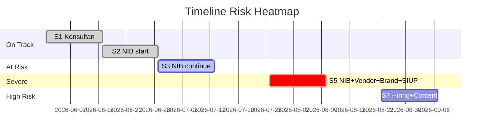
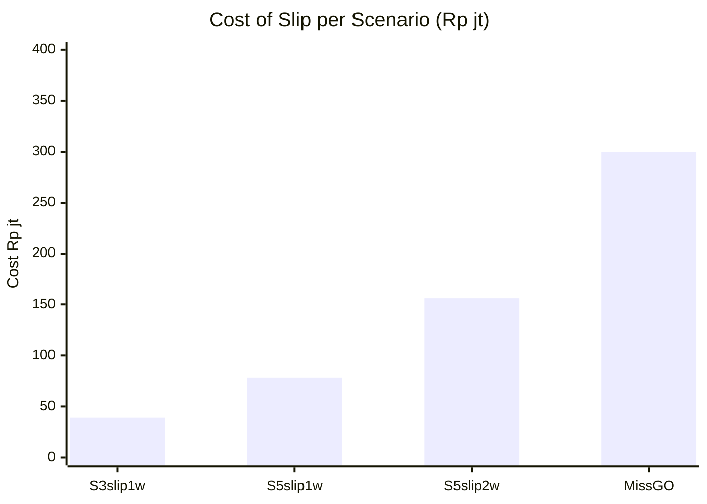

# Timeline Risk Audit

Audit timeline gap, identify slip risk per sprint, kasih early warning + mitigation recommendation.

## Triggers

Primary:
- "audit timeline"
- "slip risk"
- "timeline gap"

Secondary:
- "early warning"
- "schedule health check"

## Input Required

| Field | Type | Required | Default |
|---|---|---|---|
| project_or_sprint_range | string | yes | (e.g., "S1-S12" or "Q4 2026") |
| current_status | object | no | (auto-fetch sprint progress) |
| baseline_plan | object | no | (auto from sprint-planner output) |

## Output Template

```markdown
# Timeline Risk Audit: {RANGE}

**Audit date:** {date}
**Baseline plan:** {reference document}
**Current status:** {On track / At risk / Off track}

## Health Score
- **Overall:** 🟢/🟡/🔴 {score}/100
- **Critical path:**  on-track
- **Buffer remaining:** {N} hari

## Sprint-by-Sprint Audit

### Past Sprints (closed)
| Sprint | Plan completion | Actual | Variance | Notes |
|---|---|---|---|---|
| S1 | 100% | 95% | -5% | NIB documentation late 1 hari |
| S2 | 100% | 100% | 0 | On track |
| S3 | 100% | 80% | -20% 🟠 | Konsultan response slow |

### Current Sprint
| Sprint | Planned | Done | Progress % | Days remaining | At risk |
|---|---|---|---|---|---|
| S4 | 8 task | 5 task | 62% | 4 days | ⚠️ 1 P0 task slow |

### Upcoming Sprints
| Sprint | Critical task | Dependency satisfied? | Risk |
|---|---|---|---|
| S5 | NIB + Vendor + Brand guideline + SIUP | NIB depends S4 NIB final | 🔴 SEVERE overload |
| S6 | SIUP follow-up + Build out start | SIUP S5 must complete | 🟠 HIGH |
| S7 | Hiring + Content + Build continue | All S6 done | 🟠 HIGH |
| ... | ... | ... | ... |

## Slip Risk Detected

### 🔴 Critical Slip Risk
1. **S3 Konsultan response** — Variance -20% mengarah ke S4 spill-over
   - Impact: Delay NIB chain 3-5 hari
   - Action: Escalate ke konsultan + ready backup parallel
   - Owner: Matthew
   - Deadline: This week

2. **S5 overload SEVERE** — 4 critical task converge
   - Impact: Risk slip 1-2 minggu kalau Matthew SPOF
   - Action: Hire Chief of Staff freelance ASAP (Sprint S4)
   - Owner: Matthew (decision pending)
   - Deadline: This sprint

### 🟠 High Slip Risk
3. **S7 hiring delay** — MA + Door Expert sourcing belum mulai
   - Impact: Showroom go-live block kalau hire telat
   - Action: Open recruiting Sprint S5 (early)
   - Owner: HR System Designer + Matthew

### 🟡 Medium Slip Risk
4. **S9 payment gateway** — Xendit/Midtrans approval lead 3 minggu
   - Mitigation: Start parallel kedua di Sprint S6

## Cost of Slip Analysis

| Slip Scenario | Probability | Revenue Impact | Schedule Impact |
|---|---|---|---|
| S3 slip 1 minggu (uncompensated) | 60% | -Rp 39jt cost of delay | NIB shift 1 minggu |
| S5 slip 1 minggu | 40% | -Rp 39jt + cascade T6+T7 | Total slip 2 minggu |
| S5 slip 2 minggu | 20% | -Rp 78jt + miss Q4 stage 1 | Major rework |
| Miss Grand Opening Nov 14 | 10% | -Rp 200-400jt (miss Q4+Imlek) | Catastrophic |

## Early Warning Indicators
- 🚨 Sprint completion <80% 2 sprint consecutive → escalate
- 🚨 Matthew working >50 jam/week 2 minggu consecutive → burnout risk
- 🚨 Vendor SLA breach (lead time >25 hari) → backup activate
- 🚨 Critical task slip >3 hari from plan → contingency activate
- 🚨 Cash position <Rp 50jt → re-evaluate spending

## Recommendation Action

### Immediate (this week)
1. Escalate S3 konsultan response delay
2. Decision: hire Chief of Staff freelance Sprint S5 start
3. Open recruiting MA + Door Expert (start screening)

### Short-term (next 2-4 weeks)
4. Pre-start payment gateway Xendit + Midtrans dual parallel
5. Brand guideline final lock by S5 end
6. Soft test wave 0 plan untuk Sprint S10

### Long-term (Q4 visibility)
7. Quarterly schedule review Sprint S6
8. Mitigation drill: backup vendor activation simulation
9. Risk register quarterly update

## Decisions Required dari Matthew (this week)
1. ✅/⚠️/❌ Hire Chief of Staff freelance (Rp 75-100jt 5 bulan)
2. ✅/⚠️/❌ Pre-hire MA + Door Expert (Rp 75jt 3 bulan)
3. ✅/⚠️/❌ Compress sistem scope 4→3 (defer 1 ke Q1)
```

## Visual Output

Health score gauge + sprint risk heatmap:



Plus cost of slip visualization:



## Knowledge Dependency

- 12 Sprint S1-S12 framework
- critical-path skill output
- capacity-planning skill output
- Cost of Delay framework
- BP Chapter 11 (timeline)

## Mode

Default: EXECUTION (audit data-driven)
Switch: DISCUSSION jika multiple critical path scenario debate

## Tools Required

- file-search
- code-interpreter (variance calculation)
- artifacts (heatmap + chart)

## Validation Criteria

- Health score quantified (0-100)
- Sprint-by-sprint variance documented
- Slip risk tier-tagged (🔴🟠🟡)
- Cost of slip per scenario quantified
- Early warning indicator explicit
- Decision required tabular ke Matthew
- Brand canon compliance

## Sample I/O

**Input:** "Audit timeline S1-S12 sampai sprint sekarang"

**Output summary:**
- Health 72/100 🟡 At risk
- 3 sprint past: S1 95%, S2 100%, S3 80% (Konsultan delay)
- Critical slip: S3 cascade S4-S5, S5 SEVERE overload
- Cost of slip: S5 1 minggu = Rp 39jt, 2 minggu = Rp 78jt
- 3 decision required Matthew: hire Chief of Staff, pre-hire MA+DE, compress sistem
- Heatmap timeline + cost chart embedded

## Handoff

- contingency-plan (kalau slip materialize)
- capacity-planning (re-allocate kalau decision approved)
- hiring-plan (kalau hire approved)
- Atmaja CEO (escalate decision needed)
