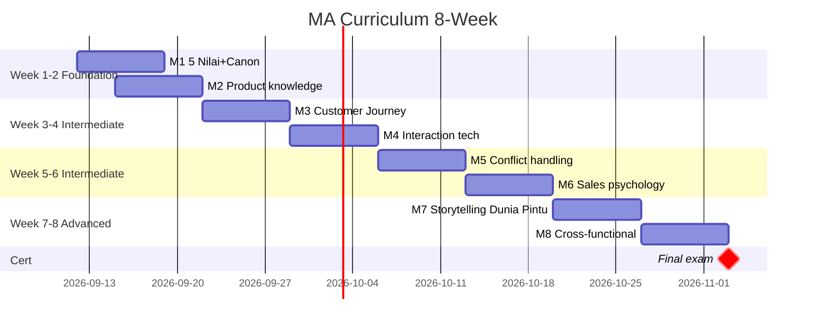

# Training Curriculum Design

Design skill development curriculum per role: module breakdown, learning objective, delivery format, assessment, certification path.

## Triggers

Primary:
- "training curriculum"
- "skill development plan"
- "training module"

Secondary:
- "learning path"
- "skill matrix"

## Input Required

| Field | Type | Required | Default |
|---|---|---|---|
| role | string | yes | - |
| skill_area | string | yes | (e.g., customer service, product knowledge) |
| duration | string | no | (e.g., "1 week intensive" or "8 weeks part-time") |
| level | enum | no | (foundational/intermediate/advanced) |

## Output Template

```markdown
# Training Curriculum: {ROLE} — {SKILL AREA}

**Total duration:** {N} hours over {N} weeks
**Level:** {Foundational / Intermediate / Advanced}
**Delivery mode:** {Onsite / Remote / Hybrid}

## Learning Objectives

### Knowledge (what staff WILL KNOW)
- {Knowledge 1}
- {Knowledge 2}

### Skills (what staff WILL BE ABLE TO DO)
- {Skill 1 measurable}
- {Skill 2 measurable}

### Behavior (what staff WILL CONSISTENTLY DO)
- {Behavior 1 demonstrating 5 Nilai}
- {Behavior 2}

## Module Structure

### Module 1: Foundation (2 hours)
**Topic:** {Topic name}
**Learning outcome:** {What achieved by end}
**Delivery:**
- Lecture: {time}
- Demo: {time}
- Practice: {time}

**Material:**
- Reading: {assigned material}
- Video: {kalau ada}
- Reference: {brand canon section/BP chapter}

**Assessment:**
- Quiz: {questions count + format}
- Practical exercise: {scenario}
- Pass criteria: {threshold}

### Module 2: {Topic}
{Same structure}

### Module 3-N: ...

## Curriculum Roadmap by Role

### Marketing Advisor (MA)
| Week | Module | Focus |
|---|---|---|
| 1 | M1 5 Nilai + Brand Canon | Foundation |
| 1 | M2 Product Knowledge AMK | Foundation |
| 2 | M3 Customer Journey + Persona | Foundation |
| 3 | M4 Customer interaction technique | Intermediate |
| 4 | M5 Conflict + edge case handling | Intermediate |
| 5 | M6 Sales psychology basics | Intermediate |
| 6 | M7 Advanced storytelling Dunia Pintu | Advanced |
| 7 | M8 Cross-functional handoff | Advanced |
| 8 | Certification exam | Advanced |

### Door Expert
| Week | Module | Focus |
|---|---|---|
| 1 | M1 5 Nilai + Brand Canon + Filosofi Dunia Pintu (4-negara cultural context) deep | Foundation |
| 1 | M2 Product Knowledge AMK + competitive catalog | Foundation |
| 2 | M3 Industri konstruksi + arsitektur basics | Foundation |
| 3 | M4 Indonesia + feng shui foundation | Intermediate |
| 4 | M5 Customer consultation framework | Intermediate |
| 5 | M6 Soft skills + communication mastery | Intermediate |
| 6 | M7 Aftersales workflow | Advanced |
| 8 | M8 Senior consultation scenarios | Advanced |
| 10 | M9 Train-the-trainer (mentor MA) | Master |
| 12 | Certification + ongoing development plan | Advanced |

### Tim Pusat (Marketing, Operations, dll)
{Role-specific curriculum, more flexible}

## Delivery Format Options

### Format 1: Onsite Intensive (2 minggu bootcamp)
- Pro: Fast ramp, immersive
- Con: Cost (instructor), staff offline
- Best for: Foundation Week 1-2

### Format 2: Remote Self-paced (8 minggu)
- Pro: Flexible, scalable
- Con: Discipline, no peer interaction
- Best for: Knowledge module

### Format 3: Hybrid (8-12 minggu)
- Pro: Balance flexibility + immersion
- Con: Coordination effort
- Best for: Most curriculum, especially Door Expert

### Format 4: On-the-job Mentor
- Pro: Real context, just-in-time learning
- Con: Quality variable, mentor capacity
- Best for: Ongoing post-cert

## Material Library

### Mandatory
- BP Chapter 1-8 (positioning + brand + Lean Store)
- Brand Canon full
- Editorial Rules (7 rules)
- 5 Nilai Gerai material
- AMK Premium spec catalog
- Filosofi Dunia Pintu (4-negara cultural context) full

### Recommended Reading
- BP Latest brand book reference
- BP Latest style guide
- Indonesian retail premium case studies
- Customer service classic (Setting the Table, Unreasonable Hospitality)

### Practical Resources
- Role-play scripts (10 scenario per role)
- Customer interaction recordings (best + worst case)
- Door Expert konsultasi transcript reference

## Assessment Framework

### Knowledge Assessment
- Multiple choice quiz per module (10-15 question)
- Pass: 80%+

### Skill Assessment
- Practical exercise scenarios (role-play observed)
- Pass: Mentor + peer review consensus

### Behavior Assessment
- 5 Nilai demonstrated checkpoint per week
- Customer feedback aggregation
- Pass: 4.5/5 average sustained

### Final Certification
- Comprehensive exam (knowledge + skill + behavior)
- Recertification: every 12 months
- Levels: Basic → Intermediate → Senior → Master

## Continuous Development Post-Cert

### Quarterly
- New product training
- Trend update
- Skill refresher

### Annually
- Recertification
- External course (Rp 2jt budget)
- Career conversation

### Master Path
- Become trainer for new staff
- Lead specialty area
- Consultant for Phase 2 brand expansion

## KPI Curriculum Effectiveness
- Onboarding ramp time: Day 90 to full productivity (target 80% achieve)
- Customer satisfaction post-cert: 8.5/10+ sustained
- Staff retention: 80% 12-month, 60% 24-month
- Internal promotion rate: 30% within 18 months

## Budget per Curriculum
| Role | Cost per hire | Annual ongoing |
|---|---|---|
| MA (8 weeks) | Rp 3-5jt | Rp 2jt |
| Door Expert (12 weeks) | Rp 8-12jt | Rp 3jt |
| Marketing Lead (4 weeks) | Rp 5jt | Rp 4jt |

## Brand Canon Integration
- Curriculum tone premium hangat (instructor demonstrate, not just lecture)
- All material follow brand canon (no em-dash, etc.)
- 5 Nilai applied di every module (not standalone)
- Filosofi Dunia Pintu (4-negara cultural context) integrated kalau relevant
```

## Visual Output

Curriculum roadmap + skill matrix:



Plus skill matrix:

```markdown
| Skill \ Level | Foundation | Intermediate | Advanced | Master |
|---|---|---|---|---|
| Product knowledge | ✅ M2 | M6 (refresher) | M7 deep | Trainer |
| Customer service | ✅ M3 | ✅ M4 | M7 | Mentor |
| 5 Nilai application | ✅ M1 | Practiced M4 | Modeled M7 | Trainer M9 |
| Communication | ✅ M3 | ✅ M4-M5 | M7 | Master M9 |
```

## Knowledge Dependency

- 5 Nilai Gerai
- BP Chapter 8 (Door Expert 5 kompetensi)
- Brand Canon
- onboarding-roadmap skill
- hiring-plan skill output

## Mode

Default: EXECUTION
Switch: NEED_CLARIFICATION jika role complexity ambigu

## Tools Required

- file-search
- artifacts (Gantt + skill matrix)

## Validation Criteria

- Module structure clear (objective + delivery + assessment)
- Pass criteria measurable per module
- Curriculum aligned 5 Nilai
- Material categorized (mandatory + optional)
- Assessment 3-dimensional (knowledge + skill + behavior)
- Continuous development post-cert defined
- Budget realistic
- Brand canon integration explicit

## Sample I/O

**Input:** "Training curriculum untuk Door Expert 12 minggu"

**Output summary:**
- 12-week curriculum: Week 1-2 Foundation (5 Nilai + Product), Week 3-5 Intermediate (Industry + Indonesia/Feng Shui), Week 6-8 Konsultasi mastery, Week 10-12 Mentor + Cert
- 5 kompetensi Door Expert: katalog, industri, Indonesia+feng shui, soft skills, aftersales
- Hybrid delivery (60% onsite + 40% remote)
- Assessment 3-dimension knowledge+skill+behavior, pass 80%+
- Budget Rp 8-12jt per hire + Rp 3jt annual ongoing
- Curriculum Gantt + skill matrix embedded

## Handoff

- onboarding-roadmap (integrate dengan 90-day plan)
- performance-review-framework (post-cert assessment)
- hiring-plan (validate skill expectation match JD)
