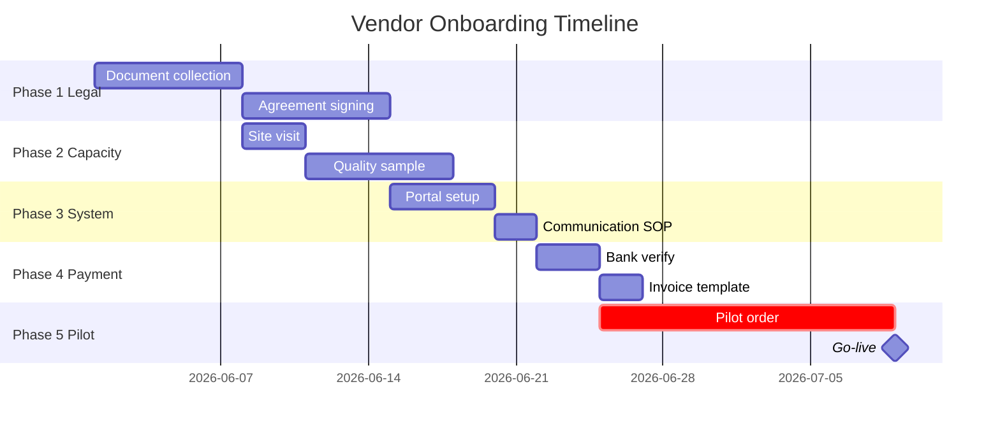

# Vendor Onboarding Process

Generate onboarding workflow untuk vendor baru: legal docs, capacity verification, quality baseline, integration system, payment setup.

## Triggers

Primary:
- "vendor onboarding"
- "setup vendor baru"
- "new vendor process"

Secondary:
- "vendor integration"
- "supplier registration"

## Input Required

| Field | Type | Required | Default |
|---|---|---|---|
| vendor_name | string | yes | - |
| product_category | string | yes | - |
| volume_initial | number | yes | - |
| go_live_target | date | yes | - |

## Output Template

```markdown
# Vendor Onboarding: {VENDOR_NAME}

**Product category:** {category}
**Initial volume:** {N} unit/bulan
**Go-live target:** {date}
**Onboarding lead time:** {days} (typical 30-45 days)

## Phase 1: Legal & Compliance (Week 1-2)

### Required Documents
- [ ] NIB vendor
- [ ] SIUP/NPWP
- [ ] Akta Pendirian + Perubahan
- [ ] Profil perusahaan + portfolio
- [ ] Sample produk (kalau physical)
- [ ] Sertifikat quality (kalau ada: SNI, ISO)

### Agreement
- [ ] NDA (kalau exchange sensitive info)
- [ ] Master Supply Agreement (MSA)
- [ ] Service Level Agreement (SLA): lead time + quality threshold + penalty
- [ ] Payment Terms Document (NET 30 default)

## Phase 2: Capacity & Quality Verification (Week 2-3)

### Capacity audit
- Site visit ke production facility
- Verify capacity ceiling
- Production lead time test (small batch)
- Capacity ramp commitment Q1-Q4

### Quality baseline
- Sample produk: review terhadap brand canon (premium curated)
- QC checklist: material spec, finishing, dimension tolerance
- Defect rate baseline: max 2% acceptable
- Return policy alignment

## Phase 3: System Integration (Week 3-4)

### Tech integration
- Vendor portal access (kalau ada CRM B2B nanti)
- ERP/Inventory system feed
- PO submission protocol (email/portal/API)
- Invoice format standardization

### Communication channel
- Primary contact person (escalation order)
- Response SLA (max 24 hour weekday)
- Quarterly business review schedule

## Phase 4: Payment Setup (Week 4)

### Bank & invoice
- Bank account verification
- Invoice template + numbering
- Tax invoice (Faktur Pajak) compliance
- Payment trigger event (PO received vs delivered)

## Phase 5: Pilot Order & Go-Live (Week 4-5)

### Pilot batch
- Small order (10-20 unit) untuk validate full cycle
- Track every checkpoint: PO → confirm → produce → ship → receive → QC → invoice → payment
- Document timeline actual vs commitment
- Adjust SLA kalau perlu

### Go-live
- First production order full scale
- Daily check first week
- Weekly review month 1
- Quarterly review onwards

## Onboarding Checklist Summary
| Phase | Activity | Status | Owner | Deadline |
|---|---|---|---|---|

## Risk + Mitigation
| Risk | Mitigation |
|---|---|
| Vendor underperform SLA pilot | Backup vendor parallel + extended pilot |
| Document delay (NIB issue, dll) | Dual-track legal review + clear deadline |
| Quality sample below spec | Reject + request remediation + re-sample |

## KPI Vendor Performance (post go-live)
- Lead time adherence: target 95% on-time
- Quality defect rate: target <2%
- Communication responsiveness: target 24-hour SLA
- Invoice accuracy: target 100%
```

## Visual Output

Onboarding timeline Gantt:



## Knowledge Dependency

- BP Chapter 7 (Supply Chain spec)
- vendor-scorecard skill output
- Legal compliance Indonesia framework
- Lean Store operating model

## Mode

Default: EXECUTION
Switch: NEED_CLARIFICATION jika vendor profil tidak lengkap

## Tools Required

- file-search
- web-search (legal Indonesia update, e.g., NIB online)
- artifacts (Gantt + checklist visualization)

## Validation Criteria

- 5 phase complete (Legal → Capacity → System → Payment → Pilot)
- Document checklist Indonesia-compliant
- SLA explicit (lead time + quality + communication)
- Risk + mitigation min 3
- KPI tracking setup
- Brand canon compliance (vendor product alignment)

## Sample I/O

**Input:** "Vendor onboarding untuk vendor pintu Vietnam wave 2 expansion, initial 50 unit/bulan, go-live Q1 2027"

**Output summary:**
- 5-week onboarding timeline (legal → capacity → system → payment → pilot)
- Document checklist Indonesia + import compliance (BC 4.1 untuk Vietnam)
- SLA: lead time 35 hari + ocean freight buffer 10 hari, quality defect <2%, comms 24-hour
- Pilot batch 20 unit di Q4 2026, go-live full Q1 2027
- Risk: import customs delay (mitigation: forwarder partner + buffer 14 hari)
- Gantt onboarding embedded

## Handoff

- vendor-scorecard (re-score post pilot)
- po-management (untuk pilot order)
- CFO Gerai (validate payment terms cashflow)
- contingency-plan (kalau vendor critical)
