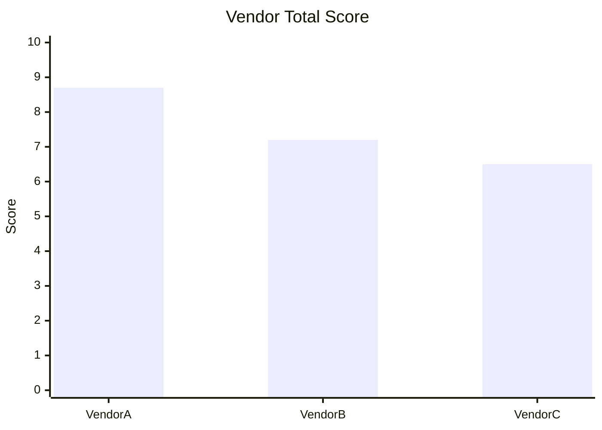

# Vendor Scorecard & Selection

Compare vendor multiple criteria (lead time, price, quality, payment terms, capacity, risk) dalam matrix scoring untuk decision selection atau re-evaluation.

## Triggers

Primary:
- "vendor compare"
- "evaluasi vendor"
- "scoring supplier"

Secondary:
- "pilih vendor [X]"
- "vendor selection"

## Input Required

| Field | Type | Required | Default |
|---|---|---|---|
| vendor_candidates | array | yes | min 2 |
| criteria_weight | object | no | (default weighting) |
| product_category | string | yes | - |

## Output Template

```markdown
# Vendor Scorecard: {PRODUCT CATEGORY}

**Evaluation date:** {date}
**Decision deadline:** {date}

## Criteria Weighting
| Criteria | Weight % | Justification |
|---|---|---|
| Lead time | 25% | Critical untuk grand opening November |
| Price (per unit) | 20% | Margin protection 38% GM target |
| Quality consistency | 20% | Brand canon premium curated |
| Payment terms | 15% | Cashflow Q4 |
| Capacity (volume) | 10% | Wave 1 baseline + buffer 20% |
| Risk (geographic, financial, operational) | 10% | Single-source dependency avoidance |

## Vendor Matrix
| Vendor | Lead time | Price | Quality | Payment | Capacity | Risk | Total Score | Recommend |
|---|---|---|---|---|---|---|---|---|
| Vendor A (PT Selaras Lawang Sewu) | 21 hari ✅ | Premium | High | NET 30 ✅ | 200 unit/bulan | Low | 8.7/10 | ✅ Primary |
| Vendor B | 35 hari ⚠️ | Mid | Med-high | NET 45 | 150 | Med | 7.2/10 | Backup |
| Vendor C | 14 hari ✅ | High | Mid | NET 14 | 50 | Med | 6.5/10 | Reject |

## Detailed Assessment per Vendor

### Vendor A: PT Selaras Lawang Sewu
**Strengths:**
- Lead time 21 hari ideal untuk wave 1 sprint
- NET 30 align dengan cashflow projection
- Brand fit kuat (premium curated standard)

**Weaknesses:**
- Single source dependency
- Capacity ceiling 200/bulan, butuh contingency Q1 2027

**Risk:** Operational risk supply disruption (mitigation: backup Vendor B parallel)

### Vendor B
{Same structure}

### Vendor C
{Same structure}

## Recommendation
**Primary:** Vendor A (PT Selaras Lawang Sewu) — anchor 70% volume
**Backup:** Vendor B — 30% volume + parallel ramp untuk redundancy
**Reject:** Vendor C (capacity insufficient + brand mid-tier mismatch)

## Negotiation Leverage
| Lever | Apply to |
|---|---|
| Multi-year commitment | Vendor A → unlock NET 45 |
| Volume guarantee | Vendor A → -5% per unit |
| Co-marketing offer | Vendor A → free showroom display rotation |

## Next Action
| Step | Owner | Deadline |
|---|---|---|
| Send LOI Vendor A | Matthew | {date} |
| Backup MoU Vendor B | Procurement Lead | {date} |
| Quarterly review setup | COO | {date+90d} |
```

## Visual Output

Vendor comparison radar chart + scoring bar:



Plus heatmap matrix per criteria:

```markdown
| Vendor \ Criteria | Lead time | Price | Quality | Payment | Capacity | Risk |
|---|---|---|---|---|---|---|
| Vendor A | 🟢 9/10 | 🟡 7/10 | 🟢 9/10 | 🟢 9/10 | 🟡 7/10 | 🟢 9/10 |
| Vendor B | 🟡 7/10 | 🟢 8/10 | 🟢 8/10 | 🟡 7/10 | 🟡 7/10 | 🟡 7/10 |
| Vendor C | 🟢 9/10 | 🔴 5/10 | 🟡 7/10 | 🔴 5/10 | 🔴 4/10 | 🟡 7/10 |
```

## Knowledge Dependency

- BP Chapter 7 (Product & Supply Chain section)
- Lean Store operating model (Bab 8)
- Cost of Delay framework
- Unit Economics Q4 2026

## Mode

Default: EXECUTION (data-driven scoring)
Switch: DISCUSSION jika criteria weighting debate

## Tools Required

- file-search
- web-search (vendor research, market price benchmark)
- artifacts (radar chart + heatmap)
- code-interpreter (weighted scoring)

## Validation Criteria

- Minimum 2 vendor candidate
- Criteria weight sum = 100%
- Score per criteria justified (bukan subjective)
- Recommendation explicit (Primary + Backup + Reject)
- Risk + mitigation per vendor
- Negotiation leverage actionable
- Brand canon compliance

## Sample I/O

**Input:** "Vendor scorecard untuk pintu kayu premium wave 1, kompare PT Selaras Lawang Sewu vs 2 vendor alternative"

**Output summary:**
- 3 vendor evaluated dengan 6 criteria weighted
- Vendor A (Selaras) score 8.7/10 ✅ Primary
- Vendor B score 7.2/10 → Backup parallel 30%
- Vendor C score 6.5/10 ❌ Reject (capacity + price)
- Negotiation lever: Multi-year commit → unlock NET 45 ke Vendor A
- Radar chart + heatmap embedded

## Handoff

- vendor-onboarding (kalau new vendor selected)
- po-management (untuk PO generation post-LOI)
- CFO Gerai (validate budget impact)
- contingency-plan (kalau primary vendor at risk)
