# Visual Summary (Universal Visualization Skill)

Convert any COO/CMO/CCO/CFO output into visual format: Mermaid diagram, chart, table, mindmap, journey, quadrant. Universal skill yang setiap agent dapat invoke untuk render data ke visual.

## Triggers

Primary:
- "visual summary"
- "buat diagram"
- "render visual"
- "visualisasi"

Secondary:
- "mindmap"
- "flowchart"
- "gantt"
- "chart data"

## Input Required

| Field | Type | Required | Default |
|---|---|---|---|
| data | string/json | yes | (data to visualize) |
| visual_type | enum | yes | (flowchart/gantt/mindmap/quadrant/journey/chart/table/timeline) |
| context | string | no | (purpose of visualization) |
| style | enum | no | (default brand canon palette) |

## Visual Type Library

### 1. Flowchart (Process / Decision Tree)

**Best for:** Workflow, decision logic, swimlane, system architecture

**Template:**
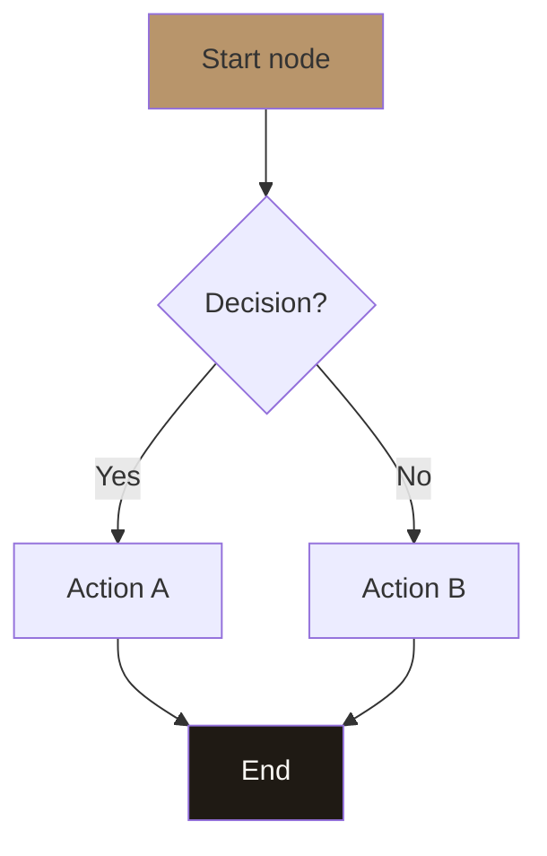

**Brand canon:**
- Primary node: Brass #B8956B
- End node: Charcoal #1F1A14 + Ivory text
- Decision node: rhombus default
- Connector: solid line preferred

### 2. Gantt Chart (Timeline)

**Best for:** Sprint plan, project timeline, marketing calendar

**Template:**
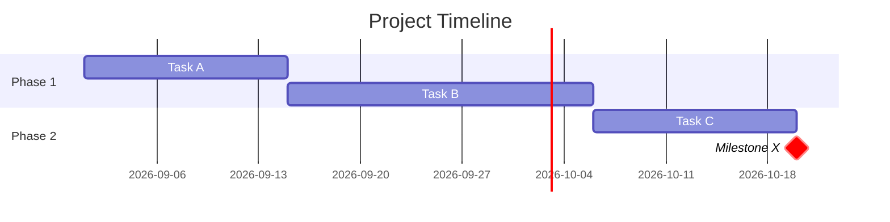

**Brand canon:**
- Use `crit` for critical milestone
- Date format consistent
- Section grouping logical

### 3. Mindmap (Brainstorm / Hierarchy)

**Best for:** Strategy decomposition, persona breakdown, feature ideation

**Template:**
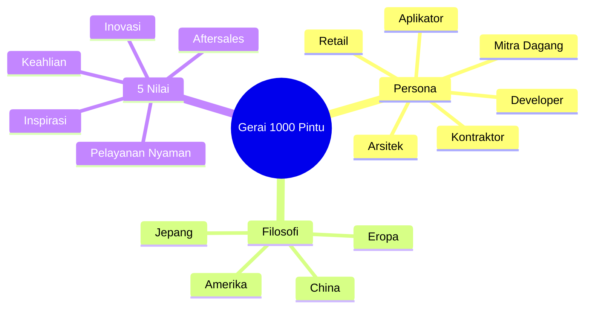

**Brand canon:**
- Root double-paren `((...))`
- Depth max 3 level (readability)
- Branch logical grouping

### 4. Quadrant Chart (Positioning / Matrix)

**Best for:** Risk matrix, competitor positioning, persona priority, feature prioritization

**Template:**
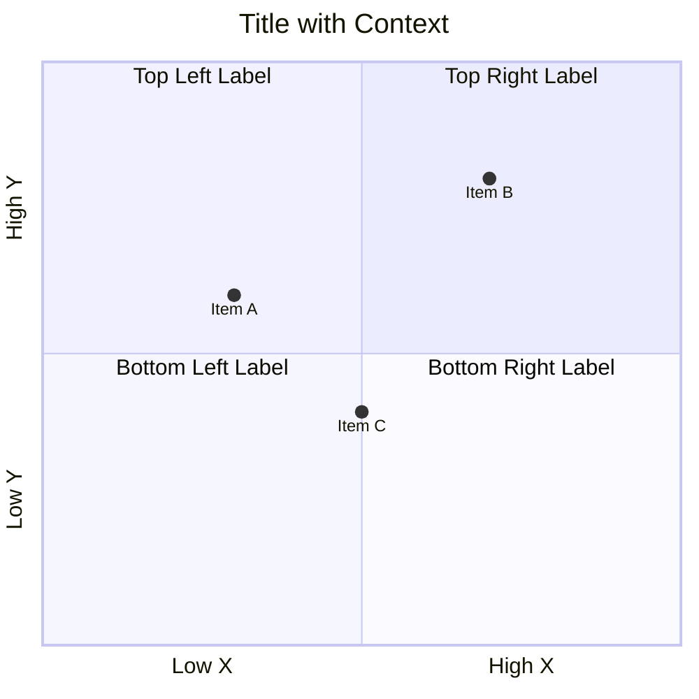

**Brand canon:**
- Quadrant labels descriptive (not just "Q1/Q2")
- Item coordinate 0-1 range
- Context-rich title

### 5. Customer Journey (Experience Map)

**Best for:** Customer journey, employee journey, touchpoint mapping

**Template:**
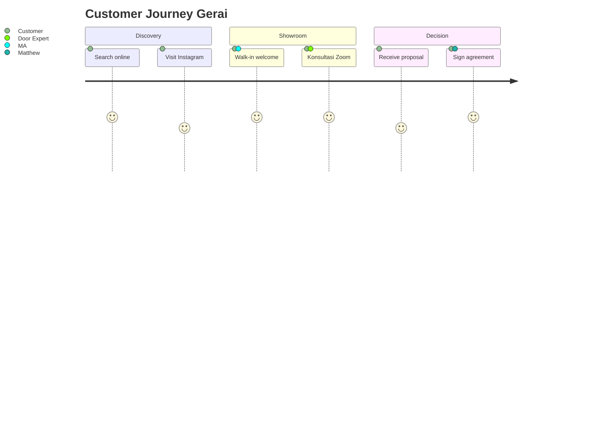

**Brand canon:**
- Score 1-5 (5 = excellent)
- Section logical phase
- Actor explicit per step

### 6. XY Chart (Quantitative Data)

**Best for:** Performance trend, capacity planning, revenue forecast

**Template:**
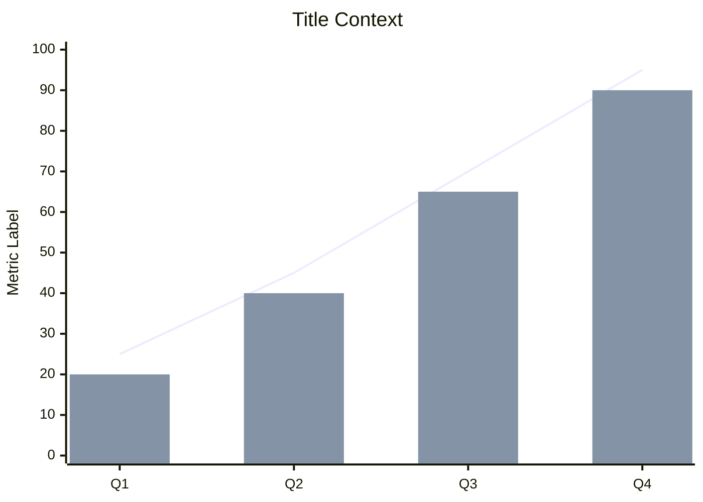

**Brand canon:**
- Title explicit context
- Y-axis label dengan unit
- Line + bar combo OK

### 7. Sequence Diagram (Interaction Flow)

**Best for:** API call flow, customer-staff interaction, system integration

**Template:**
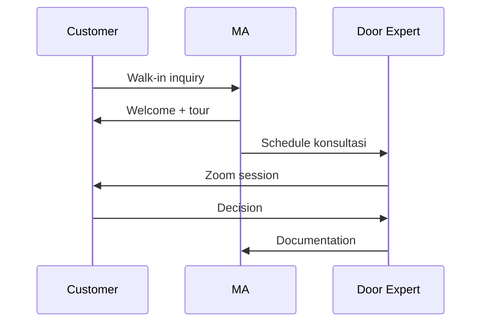

**Brand canon:**
- Participant alias clear
- Arrow types: `->>` (sync), `--)` (async), `-x` (failed)

### 8. State Diagram (Status Flow)

**Best for:** Order state, project lifecycle, customer status

**Template:**
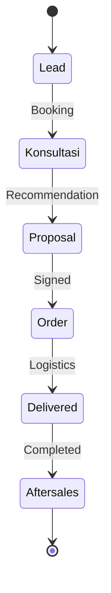

### 9. Pie Chart (Composition)

**Best for:** Budget breakdown, persona distribution, channel allocation

**Template:**
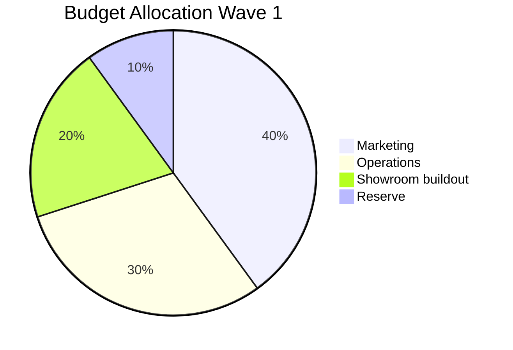

**Brand canon:**
- Sum 100
- Label descriptive

### 10. Table (Structured Data)

**Best for:** Comparison, KPI scorecard, checklist

**Template:**
```markdown
| Column 1 | Column 2 | Column 3 |
|---|---|---|
| Row 1A | Row 1B | Row 1C |
| Row 2A | Row 2B | Row 2C |
```

**Brand canon:**
- Header bold via `|---|` alignment
- Cell concise
- Sort logical order

## Style Guide Universal

### Color Palette (Brand Canon Locked)
- **Primary brass:** `#B8956B` (focal point, key element)
- **Charcoal:** `#1F1A14` (text dominant, depth)
- **Ivory:** `#FAF8F4` (background, breathing space)
- **Warm tan:** `#D4B895` (secondary accent)
- **Sage:** `#7A8B5C` (positive signal)
- **Rust:** `#A0522D` (warning / attention)

### Typography di Visual
- Title: Playfair serif (italic kalau accent)
- Label: Inter sans-serif
- Caption: Inter sans-serif smaller
- Number: Inter tabular

### Layout Principle
- White space generous (50%+ visual area)
- Focal hierarchy clear (1 hero element per visual)
- Comparison aligned (sama axis kalau multiple)
- Annotation contextual (helpful, not noisy)

### Anti-pattern (jangan)
- ❌ Color rainbow chaotic
- ❌ 3D effect (flat preferred)
- ❌ Drop shadow heavy
- ❌ Gradient ramai
- ❌ Emoji overload (≤2 per visual max)
- ❌ Capitalize ALL CAPS (kecuali label single word)

## Universal Invocation Pattern

### Any agent dapat call dengan format:

```
visual-summary {
  type: "flowchart",
  data: {
    nodes: [...],
    edges: [...]
  },
  context: "Customer journey Wave 1"
}
```

### Output format

Render Mermaid block langsung yang bisa di-display di:
- Markdown viewer
- LibreChat artifacts
- gerai.mahewwork.com app
- PDF / presentation

## Sample Use Cases per Agent

### CMO usage
- Marketing funnel: flowchart
- Campaign calendar: gantt
- Persona priority matrix: quadrant
- Channel performance: xy chart
- Customer journey: journey diagram

### COO usage
- Operations workflow: flowchart + swimlane
- Sprint plan: gantt
- Risk matrix: quadrant
- Capacity trend: xy chart
- Org structure: mindmap

### CCO usage
- Brand canon hierarchy: mindmap
- Visual identity components: tree
- Editorial workflow: flowchart
- Audience emotional journey: journey

### CFO usage
- Budget breakdown: pie
- Revenue forecast: xy chart line
- Cost structure: bar chart
- Cash flow timeline: gantt

### Atmaja CEO usage
- Strategy decomposition: mindmap
- Decision tree: flowchart
- Stakeholder map: quadrant
- Roadmap overview: gantt summary

## Best Practice per Visual Type

### Choose right visual

| Goal | Best visual |
|---|---|
| Show process | Flowchart |
| Show timeline | Gantt |
| Show breakdown | Mindmap / Pie |
| Show positioning | Quadrant |
| Show interaction | Sequence |
| Show trend | XY chart line |
| Show comparison | XY chart bar / table |
| Show experience | Journey |
| Show composition | Pie / Stacked bar |

### Avoid common mistake

| Mistake | Better |
|---|---|
| Too many node (>15) | Group / abstract |
| Tiny label | Larger / wrap |
| Color clash | Brand palette stick |
| Diagram without title | Always title contextual |
| Static when dynamic better | Use journey / sequence |

## Quality Standards

### Per visual checklist
- [ ] Title contextual (jelas apa yang divisualisasi)
- [ ] Axis / label clear
- [ ] Brand palette compliance
- [ ] Hierarchy visual (1 focal)
- [ ] Annotation kalau perlu
- [ ] Readable di screen + print
- [ ] Mermaid syntax valid (render-able)

### Editorial review
- No em-dash (universal canon)
- "tempat" not "rumah" kalau ada label
- "Gerai 1000 Pintu" lengkap

## Visual Output

Visual type decision matrix:

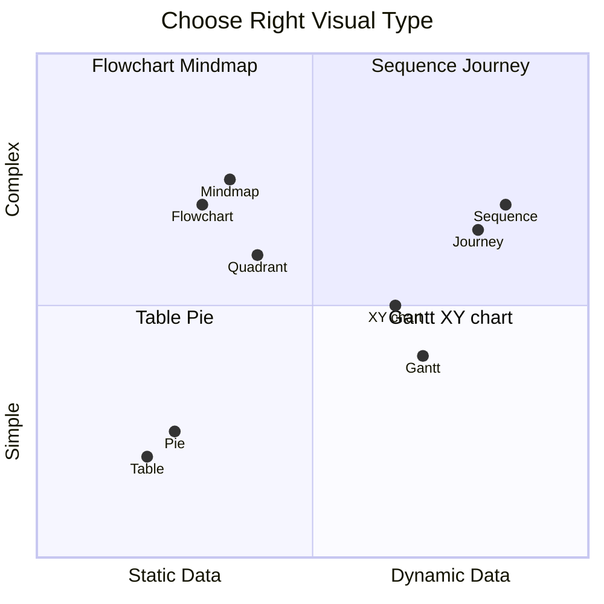

Visual style canvas:

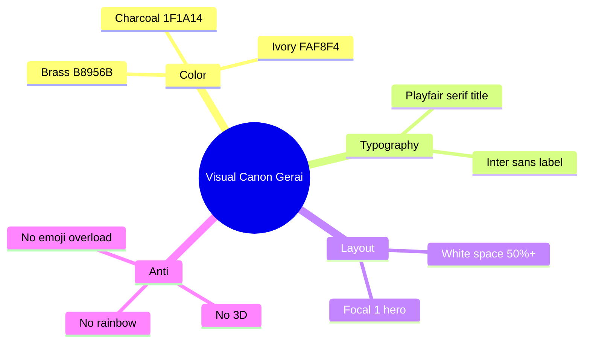

## Knowledge Dependency

- Brand Canon (palette + typography locked)
- All C-Level skill output (input source)
- Mermaid syntax library

## Mode

Default: EXECUTION (render immediately)
Switch: NEED_CLARIFICATION jika data input tidak structured

## Tools Required

- artifacts (primary)
- file-search (kalau reference brand canon)

## Validation Criteria

- 10 visual type library covered
- Brand canon palette compliance strict
- Each type: template + best for + anti-pattern
- Universal invocation pattern (callable any agent)
- Quality checklist per visual
- Sample use case per agent role
- Decision matrix kapan pakai apa

## Sample I/O

**Input:** "Visual summary risk register Wave 1 sebagai quadrant matrix"

**Output:** 
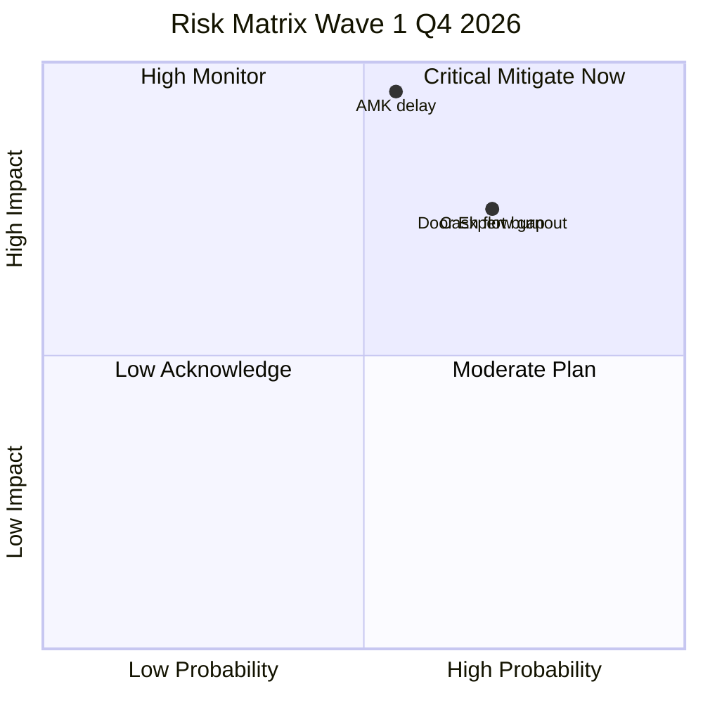

## Handoff

- Any agent (universal callable)
- artifacts rendering
- Specific design tool integration (Canva via MCP kalau needed)
