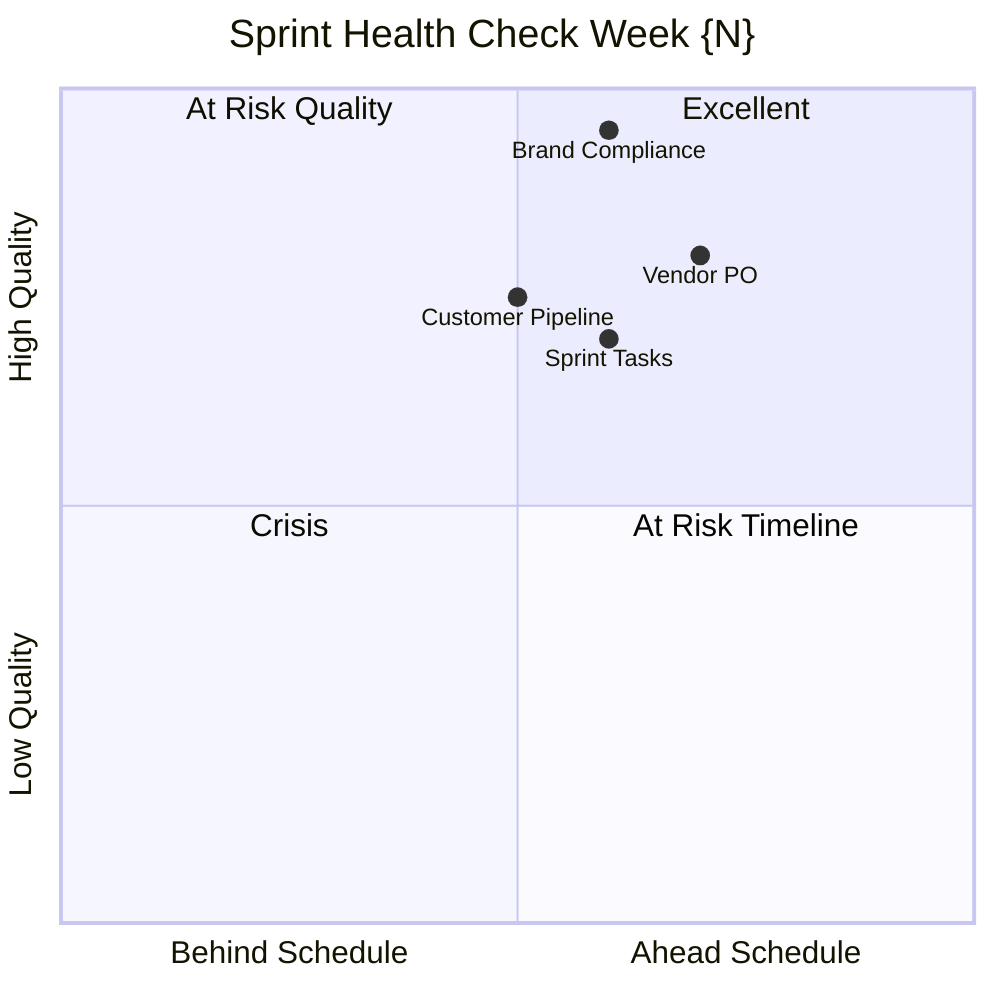
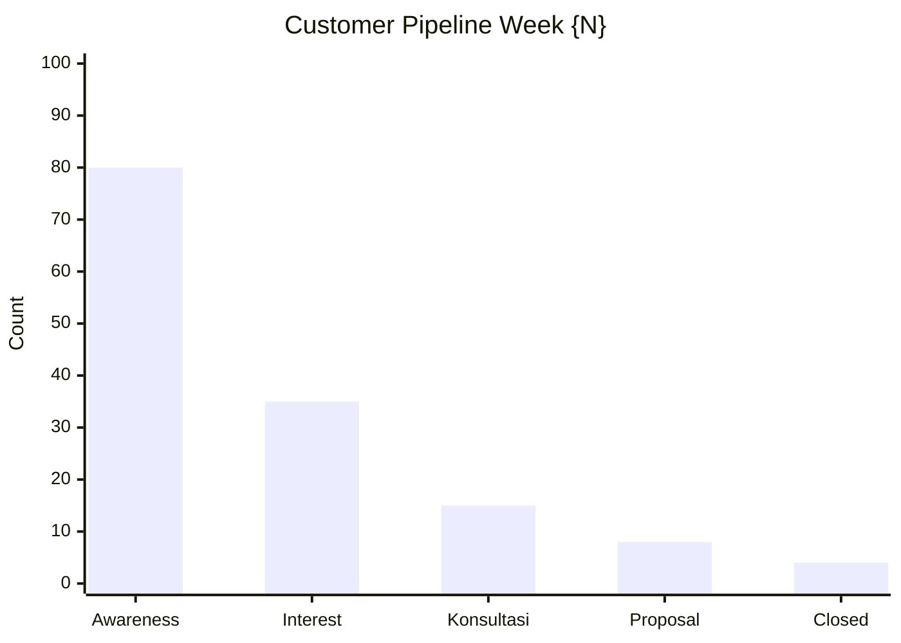
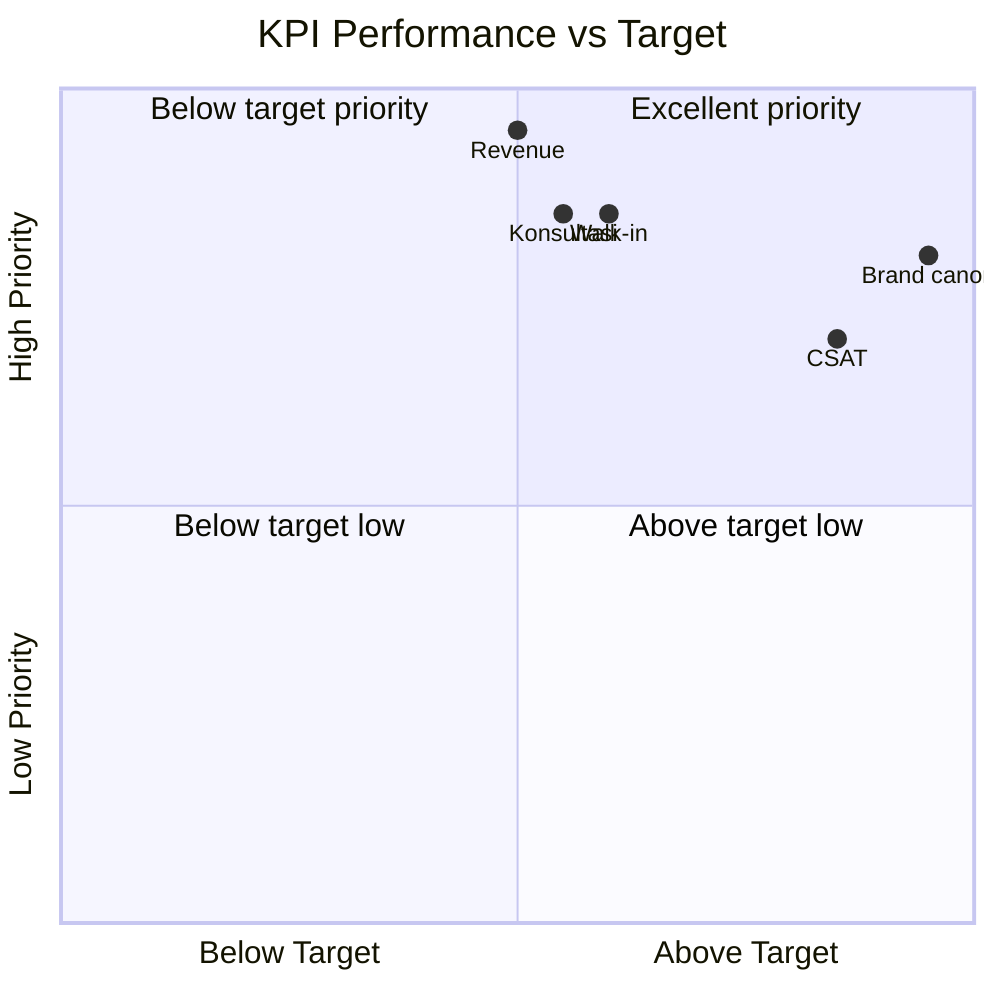

# Weekly Ops Report

Generate weekly operations report Gerai 1000 Pintu: KPI dashboard, sprint progress, vendor status, risk surveillance, customer pipeline, next-week priority. Format ringkas + visual.

## Triggers

Primary:
- "weekly ops report"
- "laporan mingguan operasi"
- "ops dashboard"

Secondary:
- "weekly summary"
- "weekly check-in"

## Input Required

| Field | Type | Required | Default |
|---|---|---|---|
| week_number | string | yes | (e.g., "Week 3 Sprint 7" or "W22 2026") |
| sprint_active | string | no | (e.g., "S7 Procurement") |
| data_source | array | no | (default: CRM + Inventory + Notion + WA group) |

## Output Template

```markdown
# Weekly Ops Report — Week {N} | {Date range}

**Sprint active:** {S-name}
**Reporting period:** {Date - Date}
**Generated:** {Date}
**Distribution:** Matthew + Tim Pusat

## Executive Snapshot (30-second read)

🟢 / 🟡 / 🔴 status

- **Sprint goal:** {On track / At risk / Behind} — {1-line context}
- **Pipeline:** {N} lead, {N} konsultasi, {N} closing
- **Top win:** {1 key achievement}
- **Top concern:** {1 critical issue}
- **Next week priority:** {1 main focus}

## KPI Dashboard

### Customer & Sales
| KPI | Target | Actual | Status |
|---|---|---|---|
| Walk-in count | {N} | {N} | 🟢/🟡/🔴 |
| Konsultasi booking | {N} | {N} | - |
| Konsultasi → order conv | 50%+ | {%} | - |
| Revenue (week) | Rp {N}jt | Rp {N}jt | - |
| CSAT average | 8.5+ | {N} | - |

### Operations
| KPI | Target | Actual | Status |
|---|---|---|---|
| MA capacity utilization | 70-85% | {%} | - |
| Door Expert konsultasi | {N} | {N} | - |
| Inventory stock-out | 0 critical | {N} | - |
| PO on-time delivery | 90%+ | {%} | - |

### Brand & Marketing
| KPI | Target | Actual | Status |
|---|---|---|---|
| Brand canon pass rate | 100% | {%} | - |
| Content published | {N} | {N} | - |
| Social engagement | {N} | {N} | - |
| Marketing spend vs budget | ±5% |  |
| {Task 3} | 🔴 Blocked | {role} | {blocker detail} |

#### Blocker requiring decision
1. {Blocker 1 — owner + decision needed}
2. {Blocker 2 — owner + decision needed}

## Vendor & Supply Status

| Vendor | PO Status | ETA | Risk |
|---|---|---|---|
| AMK Premium | {On track / Delay} | {Date} | 🟢/🟡 |
| Sample brass | {Status} | {Date} | - |
| Logistics Jakarta-Balikpapan | {Status} | {Date} | - |
| Showroom buildout | {Status} | {Date} | - |

### Vendor Performance (cumulative quarter)
- On-time delivery: 
- Issue count this week: {N}

## Customer Pipeline

### Lead Funnel (Week {N})
```
Awareness: {N} touch
Interest: {N} lead
Konsultasi: {N} session
Proposal: {N} sent
Close: {N} won
```

### Persona Mix
| Persona | Lead | Konsultasi | Closed |
|---|---|---|---|
| Retail | {N} | {N} | {N} |
| Mitra Dagang | {N} | {N} | {N} |
| Developer | {N} | {N} | {N} |
| Arsitek | {N} | {N} | {N} |
| Kontraktor | {N} | {N} | {N} |
| Aplikator | {N} | {N} | {N} |

### Top 3 active opportunities
1. **{Customer name}** — {Project + value + next step + ETA close}
2. **{Customer name}** — {detail}
3. **{Customer name}** — {detail}

## Team & People

### MA + Door Expert
- MA #1: {Status, capacity %, satisfaction}
- MA #2: {Status, capacity %, satisfaction}
- Door Expert: {Konsultasi count, satisfaction, signal}

### Tim Pusat
- Marketing: {Activity highlight}
- Brand: {Activity highlight}
- Operations: {Activity highlight}

### People Issue
- {Issue + action + owner} (kalau ada)

## Risk Surveillance

### Active risk this week
| Risk ID | Risk | Score | Status |
|---|---|---|---|
| {ID} | {description} | {score} | {Active / Mitigated} |

### New risk emerge
- {Description + assessment + immediate action}

### Resolved risk
- {Description + outcome}

## Brand Canon Compliance

### This week audit sample
- Customer interaction sample: {N} reviewed
- Brand canon pass rate: {%}
- Issue identified: {N}

### Corrective action
- {Issue + correction + owner}

## Marketing & Content

### Content shipped
| Channel | Content | Engagement | Note |
|---|---|---|---|
| Instagram | {N posts} | {engagement} | - |
| Website blog | {N articles} | {traffic} | - |
| YouTube | {N videos} | {views} | - |
| WhatsApp broadcast | {N messages} | {open rate} | - |

### Campaign active
- {Campaign 1: status + metric}
- {Campaign 2: status + metric}

## Financial Snapshot

### Cash position
- Current cash: Rp {N}jt
- Burn rate this week: Rp {N}jt
- Runway remaining: {N} month

### Major expense this week
- {Expense 1: amount + purpose}
- {Expense 2: amount + purpose}

### Revenue this week
- Total: Rp {N}jt
- By persona: {breakdown}

## Issue Log

### Open issue
| ID | Issue | Owner | ETA close |
|---|---|---|---|
| {ID} | {description} | {role} | {date} |

### Closed this week
- {Issue + outcome}

## Next Week Priority

### Sprint goal next week
{Specific outcome target}

### Top 3 action
1. {Action 1 + owner}
2. {Action 2 + owner}
3. {Action 3 + owner}

### Decision needed by Matthew
1. {Decision 1 + context + recommendation}
2. {Decision 2 + context + recommendation}

## Wins to Celebrate

🎉 {Win 1: detail + person credit}
🎉 {Win 2: detail + person credit}
🎉 {Win 3: detail + person credit}

## Learning of the Week

💡 {Insight 1: pattern observed + implication}
💡 {Insight 2: customer feedback + action}
```

## Visual Output

Weekly dashboard composite:



Pipeline funnel:



Sprint velocity trend (last 4 weeks):

```mermaid
xychart-beta
    title "Sprint Velocity Trend"
    x-axis [W-3, W-2, W-1, W-current]
    y-axis "Story points" 0 --> 50
    line [25, 32, 28, 35]
```

KPI heatmap:



## Report Distribution Cadence

### Weekly (Friday afternoon)
- Full report PDF + WhatsApp summary
- Distribution: Matthew + Tim Pusat
- Format: Markdown converted PDF + 3-bullet WA

### Daily ops snapshot (mini-version)
- 5-line summary di WA group Operations
- Format: Status + Win + Concern + Action

### Monthly rollup
- 4 weekly reports synthesized
- Trend chart + insight
- Distribution: + investor brief

## Brand Canon Integration

- Tone: factual + premium hangat (no aggressive sales lingo)
- "tempat" not "rumah"
- "Gerai 1000 Pintu" lengkap kalau external reference
- No em-dash di body
- Anchor reference BP Latest reference di insight section

## Knowledge Dependency

- All KPI from individual role skills
- visual-summary skill (rendering)
- risk-register skill (surveillance section)
- sprint-planner skill (sprint status section)
- Brand Canon

## Mode

Default: EXECUTION (generate report dengan data input)
Switch: NEED_CLARIFICATION jika data source ambigu

## Tools Required

- file-search (data sources)
- artifacts (dashboard render)

## Validation Criteria

- Executive snapshot 30-sec readable
- KPI 3-category covered (customer/sales, operations, brand/marketing)
- Sprint progress detail
- Vendor status table
- Pipeline funnel + persona mix
- Risk surveillance
- Brand canon audit
- Marketing + content shipping
- Financial snapshot
- Next week priority + decision needed
- Wins + learning section
- 3+ visual embedded (quadrant + xy + funnel)

## Sample I/O

**Input:** "Weekly ops report Week 3 Sprint 7 Procurement, period 4-10 Oktober 2026"

**Output summary:**
- Executive snapshot: Sprint 7 🟢 on track, 12 lead 5 konsultasi 2 close, top win AMK PO confirmed, top concern logistik delay, next week priority showroom buildout start
- KPI dashboard: Walk-in 35 vs target 30 🟢, konsultasi 12 vs 10 🟢, revenue Rp 85jt vs Rp 80jt 🟢, CSAT 8.7 🟢
- Sprint S7 status: 11/14 tasks done, 2 in progress, 1 blocked (logistic vendor TBD)
- Vendor: AMK on track ETA 25 Oct, logistik partner finalizing, showroom contractor confirmed
- Pipeline: 80 awareness → 35 interest → 15 konsultasi → 8 proposal → 4 closed (5% conversion)
- Persona top: Retail 15 + Arsitek 8 + Mitra Dagang 6 leading
- Risk: AMK delay risk 🟡 mitigated via backup vendor, logistik 🟢 secured
- Brand canon: 100% pass audit sample 10 interaction
- Wins: Customer testimonial Mr Anton (Project Cluster Borneo)
- Decision needed: Logistik partner final by Wednesday
- Dashboard 4 chart + funnel embedded

## Handoff

- Matthew direct (weekly distribution)
- CFO Gerai (financial section coordination)
- visual-summary (rendering)
- Sprint planning next week
