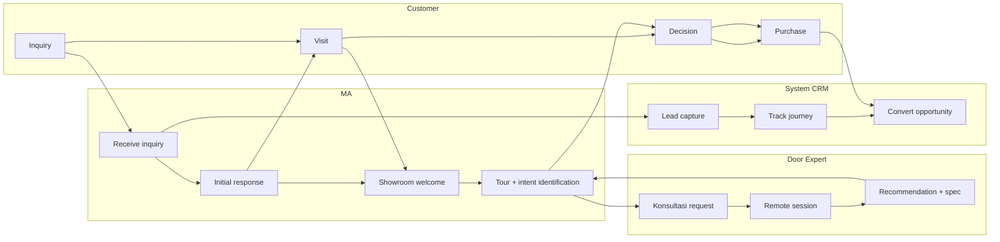

# Workflow Design (Cross-Functional)

Design workflow yang involve multiple role/team/system. Output: swimlane diagram + handoff protocol + SLA per stage.

## Triggers

Primary:
- "workflow design"
- "cross-functional process"
- "alur kerja [X]"

Secondary:
- "end-to-end process"
- "multi-team workflow"

## Input Required

| Field | Type | Required | Default |
|---|---|---|---|
| workflow_topic | string | yes | - |
| actors | array | yes | (role/team/system involved) |
| trigger_event | string | yes | (what starts workflow) |
| outcome | string | yes | (what success looks like) |

## Output Template

```markdown
# Workflow: {TOPIC}

**Trigger:** {event yang start workflow}
**Outcome:** {success state}
**Actors:** {list of role/team/system}

## Workflow Overview
{1 paragraf: high-level flow + key handoff}

## Detailed Stage Sequence

### Stage 1: {Stage name}
**Actor:** {who}
**Input:** {what received}
**Action:** {what done}
**Output:** {what produced}
**Handoff to:** {next stage / actor}
**SLA:** {time}

### Stage 2: {Stage name}
{Same structure}

### Stage N: ...

## Handoff Protocol

### Handoff 1: {Stage X → Stage Y}
**From:** {actor}
**To:** {actor}
**Artifact:** {what passed: document/data/physical}
**Channel:** {WhatsApp/email/system/in-person}
**Acknowledgment SLA:** {time}
**Failure mode:** {what if no ack}

### Handoff 2: ...

## RACI Matrix
| Stage | Responsible | Accountable | Consulted | Informed |
|---|---|---|---|---|

R = Does the work
A = Owns the outcome
C = Provides input
I = Kept aware

## Decision Points

### Decision 1: {description}
- IF {criteria} → branch A
- IF {criteria} → branch B
- DEFAULT → branch C

## Error Recovery

### Error 1: {error type}
**Detection:** {how detected}
**Recovery action:** {what to do}
**Escalation:** {when to involve Matthew}

## KPI per Stage
| Stage | Metric | Target | Tracking source |
|---|---|---|---|

## Tools / System Integration
- {Tool 1}: used by {actor} for {action}
- {Tool 2}: ...

## Brand Canon Compliance
- Customer touchpoint tone calm refined premium
- Internal communication efficient but human
- No em-dash, "tempat" not "rumah"
- Documentation lengkap (no shortcut)
```

## Visual Output

Swimlane diagram primary visual:



## Knowledge Dependency

- BP Chapter 8 (Lean Store + Door Expert)
- BP Chapter 14 (Struktur Organisasi)
- sop-generator skill (per-stage SOP)
- Customer Journey 5-stage (CMO domain alignment)

## Mode

Default: EXECUTION
Switch: NEED_CLARIFICATION jika actor scope ambigu

## Tools Required

- file-search
- artifacts (swimlane diagram)

## Validation Criteria

- 3-7 stage (bukan 20+ micro-step)
- RACI matrix lengkap (no gap)
- Handoff protocol explicit
- SLA per stage measurable
- Decision point + error recovery
- KPI tracking setup
- Brand canon compliance
- Cross-system integration noted

## Sample I/O

**Input:** "Workflow design end-to-end customer journey dari inquiry online sampai purchase + aftersales"

**Output summary:**
- 7-stage: Inquiry online → MA initial response → Showroom welcome → Door Expert konsultasi → Recommendation → Purchase → Aftersales follow-up
- 4 actor: Customer + MA + Door Expert + System CRM
- 6 handoff protocol explicit dengan SLA
- RACI: MA R most stage, Door Expert A konsultasi, Matthew C only escalation
- KPI per stage: response time inquiry <2h, konsultasi conversion 60%, purchase decision <14 hari
- Swimlane diagram 4-lane embedded

## Handoff

- sop-generator (untuk SOP per stage)
- training-curriculum (skill needed per actor)
- CRM integration spec (kalau system-heavy)
- process-audit (review effectiveness)
